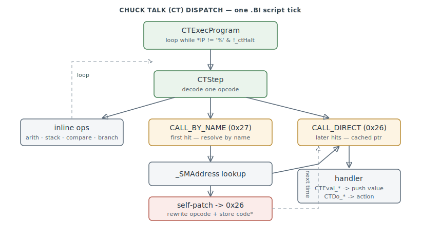

# AI Interpreter — "Chuck Talk" (CT)

The bytecode virtual machine that runs the game's `.AI` behaviour scripts. `CT` is not
"control/tactics" — the interpreter's own error path prints **"Chuck Talk error: %s,
line %u"**, so `CT` = **Chuck Talk**, the internal name of the `.AI` scripting language.
The VM lives at `0x464C60–0x467110`; it runs the compiled `.BI` bytecode
([BI.md](formats/BI.md)) that `.AI` source ([AI.md](formats/AI.md)) compiles to.

> **Provenance:** Ghidra static analysis of the game executable with [FA.SMS](formats/SMS.md) symbols
> applied; every symbol here is recorded in the
> [symbol database](https://github.com/jomkz/fighters-codex/blob/main/db/symbols/ai.csv)
> and applied to the Ghidra project (the ~95 `CTEval_*`/`CTDo_*` handlers are label-only
> in FA.SMS and are materialised as functions on apply). Progress is tracked in the
> [reconstruction matrix](reconstruction.md). Confidence markers follow
> [spec-authoring.md](../spec-authoring.md): confirmed · inferred · unknown.

## Two-tier dispatch with a JIT inline cache

`CTExecProgram` (`0x466970`) is the entry and loop. It is called with an **event
priority**; a running lower-priority script is preempted when a higher-priority event
arrives (`_PLANEEventProc`/`_GVEventProc` call it with `5` for a hit/threat down to `0`
for the default-waypoint behaviour). Per call it restores the saved state, reloads the
program if the incoming priority beats the saved one, then runs
`while (*IP != '%' && !_ctHalt)` stepping one opcode at a time (capped at 5000/tick).

`CTStep` (`0x466A80`) decodes one opcode and dispatches through a C `switch` (a jump
table) over `0x00–0x28` — arithmetic, compare, stack, and control-flow are inline
(matching [BI.md](formats/BI.md)'s opcode table). The condition and action handlers are
reached through two **call** opcodes that form an inline cache:

- `CALL_BY_NAME` (`0x27`) resolves the inline handler name via `_SMAddress` (the Phar Lap
  symbol manager), calls it, then **self-patches** the bytecode: the opcode is rewritten
  to `CALL_DIRECT` (`0x26`) with the resolved `code*` stored inline. First hit resolves
  by name; every later hit is a direct call.

This is the game-executable-resident-handler / BI-supplies-bytecode split — the same architecture
as the SH interpreter ([shape-selection.md](shape-selection.md) / SH.md), differing only
in that CT resolves handlers by name-and-self-patch rather than a fixed vector table.

## Conditions, actions, and state

The call targets are two families: **`CTEval_*`** stateless condition/attribute readers
(`CTEval_tgt`, `CTEval_disttotgt`, `CTEval_ir`, …) that read the actor's live entity
fields and push a value, and **`CTDo_*`** actions (`CTDo_turn`, `CTDo_move`,
`CTDo_wm_formation`, …) that pop typed arguments through the readers (`CTReadHeading`,
`CTReadSpeed`, … — all normalising to binary degrees ×182 and clamping to the aircraft's
limits) and drive the maneuver engine. The `*diff` conditions are all built on
`CTVarDiff`, which evaluates the same attribute twice — for the actor and, via
`Push/PopCurObj`, for the compared object — and subtracts.

There is **one shared** interpreter context: the `0x80`-byte `_ctState` block (script
variables, a ~20-deep eval stack, the instruction pointer, the loaded program base and
name, the current line and priority). Per-object continuity comes from **checkpointing**:
`CTSaveState` copies the live block to a heap checkpoint and zeroes it; `CTRestoreState`
copies it back. So per-object AI is objects' entity fields feeding stateless evaluators,
over a single preemptible, checkpointed VM.

## Functions

Representative subset; the full record (incl. all `CTEval_*`/`CTDo_*` handlers) is in
[`db/symbols/ai.csv`](https://github.com/jomkz/fighters-codex/blob/main/db/symbols/ai.csv).

| VA | Symbol | Role |
|----|--------|------|
| `0x464C60` | `CTInit` | zero the interpreter state |
| `0x466970` | `CTExecProgram` | interpreter entry/loop; priority-preemptible |
| `0x466A80` | `CTStep` | decode + dispatch one opcode; the `CALL_BY_NAME`→`CALL_DIRECT` cache |
| `0x464CD0` | `CTLoadProgram` | load/switch the `.BI` CODE resource by name |
| `0x464DB0` | `CTResetPC` | reset the instruction pointer to the program base |
| `0x466920` | `CTSaveState` | checkpoint `_ctState` to the heap |
| `0x4668F0` | `CTRestoreState` | restore `_ctState` from the checkpoint |
| `0x466290` | `CTPush` | eval-stack push (overflow → `CTError(5)`) |
| `0x465AD0` | `CTPop` | eval-stack pop (underflow → `CTError(4)`) |
| `0x4670E0` | `CTVarPtr` | resolve a script variable slot (0–4) |
| `0x466820` | `CTError` | raise a "Chuck Talk error" and exit |
| `0x465C90` | `CTReadAngle` | pop + clamp to ±90° in binary degrees |
| `0x465E00` | `CTReadSpeed` | pop + clamp to the aircraft's speed envelope |
| `0x464DE0` | `CTVarDiff` | evaluate an attribute for actor vs compared object and subtract |
| `0x464F10` | `CTEval_tgt` | condition: does the actor have a target |
| `0x465220` | `CTEval_disttotgt` | condition: distance to target |
| `0x465EA0` | `CTDo_turn` | action: turn to a heading |
| `0x465CC0` | `CTDo_move` | action: move toward a point |
| `0x464C90` | `CTRespondToCancelCmdBuf` | re-enter the script after a command-buffer cancel |

## Open Questions

### 1. Who writes `_ctCheckPass` (`0x546C8C`)? — resolved

**Nobody, in the game executable.** A whole-program scan of the decompile finds all 11 references to
`_ctCheckPass` are **reads** (`== '\0'` / `!= '\0'` gates); there is no write, address-of, or
bulk initialiser anywhere in the image. So at runtime it is a constant `0`, and every branch it
guards (the validate/dry-run path unlocking the syntax-error / expecting-var / stack-imbalance
`CTError` diagnostics) is **dormant in the shipped game**. This confirms the read: the CT core
doubles as the `.AI`→`.BI` compiler's validator, and the flag's *setter lives in that offline
compiler tool*, which is not linked into the game executable — the game executable ships only the interpreter, so it never
runs the load-time verification pass.

*Status: resolved — re-static (no writer in the game executable; validator dormant).*

### 2. `_ctState + 0x7c/0x7e` (FRAME) semantics — characterized

The two `s16` at the tail of `_ctState` are touched **only** by the bulk `CTSaveState`
(`0x466920`) / `CTRestoreState` (`0x4668F0`) snapshot copy — there is no scalar read or write
anywhere in the game executable. Statically that is all that can be established: they are opaque
saved-and-restored interpreter state with no in-binary accessor, so their runtime meaning (the
suspected maneuver-frame / animation-phase stamp) cannot be pinned by static RE alone — it would
need the running game or the `.AI` compiler. Documented as characterized rather than left open,
since a further static pass cannot resolve it.

*Status: resolved (characterized) — no scalar accessor in the game executable; runtime meaning needs [#56](https://github.com/jomkz/fighters-codex/issues/56).*

## Related

- [formats/AI.md](formats/AI.md) / [formats/BI.md](formats/BI.md) — the Chuck Talk source
  and compiled-bytecode formats this VM runs.
- [objects.md](objects.md) — the entity mirror whose fields the `CTEval_*` readers sample.
- The WNG/GRP formation engine the `CTDo_wm_*` actions drive
  ([#217](https://github.com/jomkz/fighters-codex/issues/217), forthcoming).
- [shape-selection.md](shape-selection.md) — the sibling SH bytecode interpreter.
