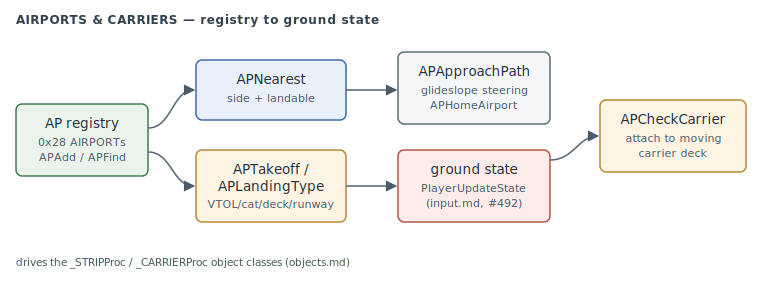

# Airports & Carriers

The airfield model (`AP*`): a small registry of airports and carriers, the takeoff/landing
classification that drives the player and AI ground state machines, parking-spot
assignment, the ILS-style approach path, free-flight teleport, and the carrier-deck
attachment that makes a parked aircraft ride a moving ship. This is the behaviour behind the
`_STRIPProc` (runway) and `_CARRIERProc` (carrier) object classes that
[objects.md](objects.md) names.

> **Provenance:** Ghidra static analysis of the game executable with [FA.SMS](formats/SMS.md) symbols applied; recorded in the [symbol database](https://github.com/jomkz/fighters-codex/blob/main/db/symbols/airports.csv) and applied to the Ghidra project. Progress: [reconstruction matrix](reconstruction.md). Markers follow [spec-authoring.md](../spec-authoring.md): confirmed · inferred · unknown.

## The registry (#493)

`APInit`/`APAdd`/`APDelete`/`APFind` maintain up to `0x28` **AIRPORT** records (`0x134`
bytes each, at `_airports`), keyed on the backing object id (`+0xE6`). The airport object
carries the runway/deck geometry the rest of the system reads: touchdown point (`+0xAA`),
runway heading (`+0xDA`), glideslope (`+0x10D`), and the parking-spot array (`+0x111`,
count at `+0xE0`). `APNearest` is the core query — nearest airport to a point, filtered by
side (friendly-only for `AI` recovery), the landable class flag (object type `+9` bit
`0x8000`), and optionally a valid landing type or a live-and-owned test. confirmed

## Takeoff & landing classification

`APTakeoffType` and `APLandingType` map a *plane + airport* pair to a state the flight
state machine enters, reading the plane's capability bits (class `+0xBA`: VTOL `0x8`,
catapult `0x2`, carrier `0x20`) against the airport's facility bytes (`+0xE8`..`+0xEC`):
confirmed

| result | takeoff | landing |
|---|---|---|
| vertical (VTOL) | `10` | `0x18` |
| catapult launch | `7` | — |
| carrier deck | `0xD` (taxi) | `0x18` |
| arrested | — | `0x16` |
| conventional runway | `0x11` | `0x17` |

These are the exact states `PlayerUpdateState`
([input.md § ServicePlayer](input.md#serviceplayer--the-per-frame-player-service), #492)
and the AI recovery logic transition into. `APOnCatapult` is the "am I on the cat spot"
test that gates the catapult launch. confirmed

## Parking & traffic

Each airport owns a fixed set of parking spots; `APAssignPark`/`APGetPark`/`APUnassignPark`/
`APClearParks` hand them out to `_curId` and release them (a plane holds at most one spot,
across all airports). `APStripFree` sequences runway traffic — it asks every other plane
controlled by the same airport (via that plane's class proc call `8`) whether the strip is
clear before a takeoff or landing roll begins. confirmed

## Approach & teleport

`APApproachPath` computes the glideslope steering to the home field: the cross-track and
vertical offsets from the touchdown point, rotated into the runway heading, plus a
range-scaled throttle and gear cue — the numbers an ILS needle or an AI final-approach
controller consumes. `APHomeAirport` selects the destination (the last flight-plan waypoint
if one exists, else the nearest landable friendly field). `APTeleport` is the free-flight
convenience jump to the nearest airport — on the runway (0), short final with the hook down
(1), or airborne at 10k/40k (2/3) — each re-seeding the flight model via `FMInitPlane`.
confirmed

## Carrier decks

A carrier is an airport that moves, so a parked aircraft must ride it. `APCheckCarrier`
(called each frame from `ServicePlayer`) tests whether the player is stopped on a carrier
deck (`APOnDeck` — a downward collision probe inside the ship's bounding box) and, if so,
attaches it via `APAddToCarrier`: `APSetOffset` records the aircraft's position *relative*
to the deck (rotated offset + heading delta) in an `OBJ_ON_CARRIER` slot (occupancy table
at `0x58E870`), so each frame the aircraft is carried with the ship. `APRemoveFromCarrier`
detaches on rollout, and `APObjOnShip` answers "is object N currently riding a carrier, and
which one". confirmed

## Functions

Full record: [`db/symbols/airports.csv`](https://github.com/jomkz/fighters-codex/blob/main/db/symbols/airports.csv).

| VA | Symbol | Role |
|----|--------|------|
| `0x4BA8E0` | `APNearest` | nearest airport to a point, side/landable filtered |
| `0x4BAA10` | `APTakeoffType` | classify takeoff (VTOL/catapult/deck/runway) |
| `0x4BAAC0` | `APLandingType` | classify landing (vertical/arrested/runway) |
| `0x4BAC70` | `APStripFree` | is the runway clear of other AI traffic |
| `0x4BE6A0` | `APApproachPath` | glideslope steering to the home field |
| `0x4BE8E0` | `APTeleport` | free-flight jump to the nearest airport |
| `0x4BEB90` | `APCheckCarrier` | attach/detach a parked aircraft to a carrier deck |

## Open Questions

### 1. The AIRPORT and OBJ_ON_CARRIER record layouts

The `0x134`-byte AIRPORT record and the `0x18`-byte `OBJ_ON_CARRIER` slot are read
field-by-field here (touchdown `+0xAA`, heading `+0xDA`, glideslope `+0x10D`, parking array
`+0x111`), but neither is a declared struct in `db/types/`. A full layout — and confirming
which fields come from the `.NT`/`.OT` object-type files versus runtime — would let the
[objects.md](objects.md) `_STRIPProc`/`_CARRIERProc` rows point at a struct.

*Status: open — re-static (map the AIRPORT / OBJ_ON_CARRIER records into `db/types/`).*

## Related

- [objects.md](objects.md) — the `_STRIPProc` / `_CARRIERProc` object classes this drives.
- [input.md](input.md) — `PlayerUpdateState` / `ServicePlayer` consume the takeoff/landing states and call `APCheckCarrier`.
- [campaign.md](campaign.md) — `APTeleport` and `APHomeAirport` serve the free-flight and recovery flows.
- [physics.md](physics.md) — `FMInitPlane`, which `APTeleport` re-seeds.
