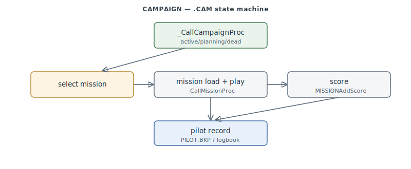

# FA.EXE Campaign / Mission / Pilot

The single-player meta-game: the theater **mission map** screen, the scripted **ZONE**
threats, **pilot** save/logbook, and the **.CAM** campaign state machine that strings
missions together with scoring. Re-carved from a grab-bag nominal range into its true
clusters (the mission-map editor `0x421C70–0x42B800` plus pilot/campaign/mission cores in
`0x467110–0x490000`).

> **Provenance:** Ghidra static analysis of FA.EXE with [FA.SMS](formats/SMS.md) symbols applied; recorded in the [symbol database](https://github.com/jomkz/fighters-codex/blob/main/db/symbols/campaign.csv) and applied to the Ghidra project. Progress: [reconstruction matrix](reconstruction.md). Markers follow [spec-authoring.md](../spec-authoring.md): confirmed · inferred · unknown.

## The pieces

- **Mission map** (`MAP*`, `0x421C70–0x42B800`): the theater-map screen — world↔screen
  coordinate transforms (`MAPScreenToWorld`), background/grid/icon/path drawing, waypoint
  editing (`MAPWPListBounds`), and the object placement the mission builder uses.
- **ZONE threats**: scripted threat zones that fire projectiles/explosions on a time
  schedule — `ZONEActive` (active-window test), `ZONEServiceRange`, `ZONEPickTarget`.
- **Pilot** (`PLT*`, `0x467180–0x468FD0`): the pilot save (`PILOT.BKP`), sorted rosters,
  and the logbook / "paper" record builder.
- **Campaign** (`.CAM` state machine, `0x480750–0x4869A0`): `_CallCampaignProc` drives the
  `_campaignState` (active → dead/fail → planning); mission load runs through
  `_CallMissionProc` + `_MISSIONInit2`, and scoring accumulates via `_MISSIONAddScore`.

## Functions

Full record: [`db/symbols/campaign.csv`](https://github.com/jomkz/fighters-codex/blob/main/db/symbols/campaign.csv).

| VA | Symbol | Role |
|----|--------|------|
| `0x4224B3` | `MAPScreenToWorld` | inverse map projection (screen → world) |
| `0x42256A` | `MAPLoadBG` | load the theater-map background |
| `0x421D40` | `ZONEActive` | scripted-threat active-window test |
| `0x422120` | `ZONEPickTarget` | pick a target plane for a zone |
| `0x422190` | `MAPWPListBounds` | walk a waypoint list |

## Open Questions

### 1. TIME/FPS utility block

`0x4869A0–0x486E60` (a game-clock/FPS utility) sits adjacent to the campaign core but is
claimed by no other subsystem; trimmed from campaign here — revisit whether it wants its own
home or annexation.

*Status: open — re-static.*

## Related

- [formats/CAM.md](formats/CAM.md) / [formats/P.md](formats/P.md) — the campaign and pilot save formats.
- [objects.md](objects.md) — mission objects are entities; scoring reads the mirror.
- [network.md](network.md) — multiplayer missions share the mission-load path.
