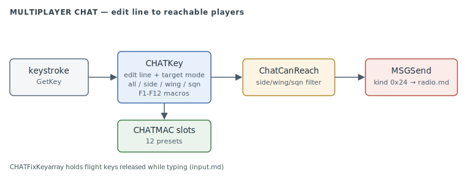

# Multiplayer Chat

The human-to-human text channel in multiplayer: a small edit-line handler (`CHAT*`) that
captures keystrokes, targets a recipient set (all / side / wing / squadron), supports
12 preset macros loaded from a file, and sends each line over the same
[`MSGSend`](radio.md) path the AI radio uses.

> **Provenance:** Ghidra static analysis of the game executable with [FA.SMS](formats/SMS.md) symbols applied; recorded in the [symbol database](https://github.com/jomkz/fighters-codex/blob/main/db/symbols/chat.csv) and applied to the Ghidra project. Progress: [reconstruction matrix](reconstruction.md). Markers follow [spec-authoring.md](../spec-authoring.md): confirmed · inferred · unknown.

## The chat handler (#493)

`CHATInit` (`0x413120`) resets the edit state and loads the **`CHATMAC`** macro resource
(`0x4EE2A0`) into 12 preset slots. Each macro line is parsed
`[\recipient\]text[\soundfile]` into three parallel arrays: a destination-mode index
(`0x522940`), a text string (`0x522970`, stride `0x33`), and an optional `.5K` sound name
(`0x522720`, stride `0x29`). confirmed

`CHATKey` (`0x4133C0`) is the whole interactive surface — it returns `0` when it consumes a
key, otherwise passes it through to the game: confirmed

- **Open an edit line** — `` ` `` / `~` / Alt+Enter start editing with a target mode of
  **all** (0), **side** (1/2), **wing** (3), or **squadron** (4). `CanChatMode` gates which
  modes are usable (side/wing require sides to have been chosen; in-flight vs pre-mission is
  the `_curScreen == 0x10` test).
- **While editing** — printable keys append to the buffer, Tab / Shift+Tab cycle the target
  mode, F1–F12 fire a macro (its text + sound go to the mode's recipients immediately),
  Enter sends the typed line, Esc / `` ` `` cancels.
- **Send** — the line goes to every reachable player via `MSGSend(kind 0x24)`, addressed
  `0x8003 + station`. `ChatCanReach` decides who is in range for the chosen mode by testing
  same-side / same-wing / same-squadron over `_objControlledBy` and `_humanChoseSide`.

`CHATGetEditLine` formats the in-progress line ("`SEND TO ALL: text_`" with a blinking
cursor) for the HUD overlay, and `CHATFixKeyarray` — called from the keyboard hook
([`KEYEvent`](input.md#the-keyboard-model-492)) — forces the flight-control keys in
`_keyarray` to *released* while a line is being edited, so typing a message never also flies
the plane. `CHATEndMission` resets the channel between missions. confirmed

## Functions

Full record: [`db/symbols/chat.csv`](https://github.com/jomkz/fighters-codex/blob/main/db/symbols/chat.csv).

| VA | Symbol | Role |
|----|--------|------|
| `0x413120` | `CHATInit` | reset state + load the `CHATMAC` macro slots |
| `0x4133C0` | `CHATKey` | the edit-line / macro / send key handler |
| `0x413960` | `ChatCanReach` | can chat mode M reach player P (side/wing/squadron) |
| `0x413B60` | `CHATGetEditLine` | format the in-progress line for the HUD |
| `0x413C20` | `CHATFixKeyarray` | suppress flight keys while typing |

## Open Questions

### 1. The `CHATMAC` macro-file format

`CHATInit` parses `CHATMAC` as `[\recipient\]text[\soundfile]` lines into 12 slots, but the
retail file itself has not been examined. Reading it (an asset task, needs `FX_FA_ROOT`)
would confirm the recipient tokens (`SEND TO ALL`, …) and give a worked example for a
format note.

*Status: open — re-asset (dump the retail `CHATMAC` and cross-check the parse).*

## Related

- [radio.md](radio.md) — the `MSGSend` queue chat sends through.
- [input.md](input.md) — the key-code space and `KEYEvent`, which calls `CHATFixKeyarray`.
- [network.md](network.md) — the multiplayer session that populates `_humanChoseSide`.
