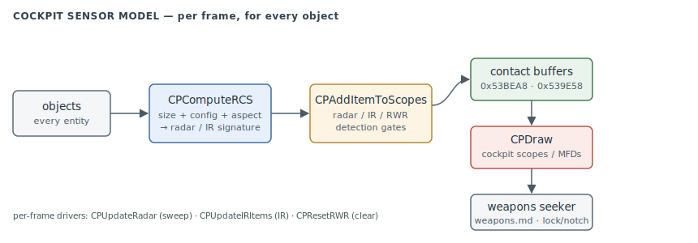

# Cockpit sensors — radar / IR / RWR

The **sensor simulation**: what the player is allowed to see. Every frame the engine scores
every object into a radar and an infra-red signature, decides which sensors can detect it, and
files the survivors into the scope buffers the cockpit MFDs draw from. This is the *producer*
of the [HUD](hud.md) symbology and the *input* to the [weapons](weapons.md) seeker/lock model —
both of which were documented while the model that feeds them was not (#486).

> **Provenance:** Ghidra static analysis of the game executable with [FA.SMS](formats/SMS.md)
> symbols applied; the `CP*` functions are recorded in the
> [symbol database](https://github.com/jomkz/fighters-codex/blob/main/db/symbols/cockpit-sensors.csv)
> and applied to the Ghidra project. This subsystem is **active** — the named entry points and the
> RCS model are traced; the `FUN_`-only scope-scan and detection-test helpers are not yet.
> Confidence markers follow [spec-authoring.md](../spec-authoring.md): confirmed · inferred · unknown.

## The model

**1. Signature — `_CPComputeRCS@8` (`0x43E8C0`).** `CPComputeRCS(entity *target, int mode)`
returns the target's radar signature and computes its IR signature alongside, summing
contributions from:

- **base size** — read from the target's type record (`entity+5` → type field `+0x45`), bucketed
  into small / medium / large;
- **configuration** — the `+0x16F` HUD/state flags: gear down (`0x40`), weapon-bay open (`0x200`),
  and the afterburner/heat bit (`0x80`) each add to both signatures;
- **aspect** — pitch (`entity+0x1F`) and bank (`entity+0x21`) shift the signature with viewing angle;
- **damage** — a damaged airframe (`entity+0x10 & 0x80`, past half damage) is louder on both bands;
- **class extension** — `entity+0xDE & 0x10` (the per-class extension, #476) adds a fixed increment.

**2. Detection gate — `@CPAddItemToScopes@4` (`0x43DEE0`).** Per candidate object it runs three
independent detection tests (radar, IR, RWR) and inserts each pass into the matching contact buffer
via a shared insert routine. Two buffers hold the results: the radar+IR scope list at `0x53BEA8`
and the RWR list at `0x539E58` (each `0x6D6` = 1750 dwords).

**3. Per-frame drivers.** `_CPUpdateRadar@0` (`0x43E810`) timestamps the sweep and clears the
accumulator; `?CPUpdateIRItems` (`0x440FE0`) refreshes the IR-seeker contact list;
`_CPResetRWR@0` (`0x43E830`) zeroes both buffers and re-arms the scan timers.

**4. Presentation — `_CPDraw@8` (`0x439220`).** Renders the radar/IR/RWR scopes and the cockpit
MFDs from the contact buffers. (Its 15.9 KB of static layout data make it as much a HUD concern as
a sensor one — see Open Questions.)

## Functions

Full record: [`db/symbols/cockpit-sensors.csv`](https://github.com/jomkz/fighters-codex/blob/main/db/symbols/cockpit-sensors.csv).

| VA | Symbol | Role |
|----|--------|------|
| `0x43E8C0` | `CPComputeRCS` | radar-cross-section + IR-signature model |
| `0x43DEE0` | `CPAddItemToScopes` | radar/IR/RWR detection gate → contact buffers |
| `0x43E780` | `CPRemoveItemFromScopes` | drop a contact from the scopes |
| `0x43E810` | `CPUpdateRadar` | per-frame radar sweep state |
| `0x440FE0` | `CPUpdateIRItems` | per-frame IR-contact refresh |
| `0x43E830` | `CPResetRWR` | clear the scope + RWR buffers, re-arm timers |
| `0x439220` | `CPDraw` | render the scopes / cockpit MFDs |
| `0x438B70` | `CPInit` | allocate buffers, reset the scopes |
| `0x43DDD0` | `CPRadarRange` | current radar range setting |
| `0x43E7E0` | `CPBombRange` | current bomb-range / CCIP setting |
| `0x43DE10` | `UsingSuppRadar` | is the supplementary radar in use |
| `0x43DE90` | `CPSetSkill` | radar/AI skill level |
| `0x438520` | `CPSetMissile` | set the selected missile on the scope |

## Open Questions

### 1. `CPDraw` home — sensor or HUD?

`_CPDraw@8` (`0x439220`) and its ~15.9 KB of static layout tables render the scopes, which is
symbology work like [hud.md](hud.md). It sits in this subsystem today because it is the consumer of
the contact buffers, but it may re-home to `hud` once the HUD symbology pass reaches it.

*Status: open — provisional placement; re-home decision deferred to the HUD pass ([#486](https://github.com/jomkz/fighters-codex/issues/486)).*

### 2. The detection-test helpers are still `FUN_`

`CPAddItemToScopes` calls three unnamed detection predicates (radar / IR / RWR visibility) and a
shared insert routine. Their exact thresholds — how the RCS score becomes a detect/no-detect, and
how RWR spike timing works — are not yet read.

*Status: open — re-static ([#486](https://github.com/jomkz/fighters-codex/issues/486)).*

## Related

- [weapons.md](weapons.md) — the seeker/lock model that consumes this state (`PROJTargetSignal`, `PROJIRSensorOn`, `PROJInNotch`).
- [hud.md](hud.md) — the cockpit symbology that draws the sensor output.
- [structs.md](structs.md) — the entity fields `CPComputeRCS` reads (`+0x16F` flags, `+0x1F`/`+0x21` aspect, `+0xDE` extension).
