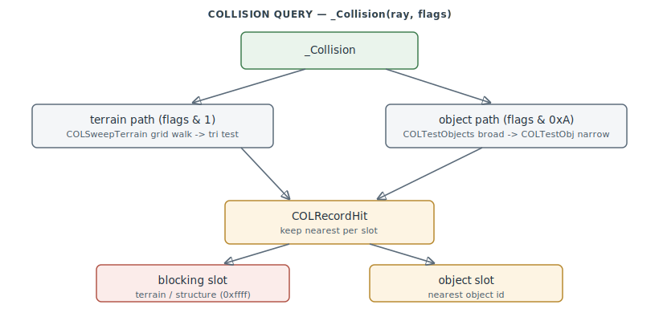

# FA.EXE Collision (COL)

The swept collision query engine — one entry point, `_Collision` (`0x42B800`), that answers
"what does this segment hit first?" against terrain and against registered objects. Used
for weapon impacts, line-of-sight/lock gating, ground-avoidance AI, and landing.
`0x42B800–0x42E680`.

> **Provenance:** Ghidra static analysis of FA.EXE with [FA.SMS](formats/SMS.md) symbols
> applied; recorded in the
> [symbol database](https://github.com/jomkz/fighters-codex/blob/main/db/symbols/collision.csv)
> and applied to the Ghidra project. Progress: [reconstruction matrix](reconstruction.md).
> Markers follow [spec-authoring.md](../spec-authoring.md): confirmed · inferred · unknown.

## One query, two phases, two result slots

`_Collision` stores the ray, computes a swept world AABB, and dispatches on a flag word:

- **Terrain path** (`flags & 1`): a precise swept walk `COLSweepTerrain` over ≤20 grid
  cells (`COLClipSegToCell` → `COLTestTerrainCell` → `COLTestTerrainTri`), with a coarse
  `COLFlatGround` fallback.
- **Object path**: broad-phase `COLTestObjects` iterates the frame's **registration list**
  (`COLAddObj` / `_colObjList`, structures in `_colStructList`) with a swept-AABB reject,
  then narrow-phase `COLTestObj` transforms the ray into each object's local frame and
  clips against its oriented box hierarchy (`COLClipSegToBox`, from `COLGetInfo`).

Both paths feed `COLRecordHit`, which keeps the nearest hit in **two slots** — a *blocking*
slot (terrain + special structures, surfaced as `0xffff`) and a *nearest-object* slot
(surfaced as an object id) — with a terrain-priority bias.

## Data model

A per-shape `COLInfo` block (X86 region tag `0xf2`, resolved by `COLGetInfo`) holds a list
of `0xe`-byte oriented boxes (6 bounds ×`0x100` + id/flags); the terrain `_th` grid supplies
leaf heights/normals (`T_GetLeaf`/`T_Normal`); and the collision scratch block
(`_colRay*`/`_colBound*`/`_colBlock*`/`_colObj*`, `0x536728`–`0x537254`) carries a query's
inputs, swept bounds, and two nearest-hit slots as file-scope globals — one query at a time.

## Functions

Full record: [`db/symbols/collision.csv`](https://github.com/jomkz/fighters-codex/blob/main/db/symbols/collision.csv).

| VA | Symbol | Role |
|----|--------|------|
| `0x42B800` | `Collision` | master swept collision query (the single entry) |
| `0x42BDC0` | `COLSweepTerrain` | swept segment-vs-terrain grid walk |
| `0x42BFC0` | `COLTestTerrainCell` | test one terrain cell's two triangles |
| `0x42C1A0` | `COLTestTerrainTri` | segment vs one terrain triangle plane |
| `0x42C840` | `COLTestObjects` | object broad-phase (AABB over registered ids) |
| `0x42C9B0` | `COLTestObj` | object narrow-phase (ray in local frame, box hierarchy) |
| `0x42D050` | `COLClipSegToBox` | segment vs oriented box (6-plane clip) |
| `0x42DE60` | `COLRecordHit` | keep-nearest hit accumulator (two slots) |
| `0x42DDA0` | `COLFlatGround` | coarse ground-plane crossing test |
| `0x42DF80` | `COLPitchToAvoidTerrain` | AI pull-up pitch to clear terrain ahead |
| `0x42E0C0` | `COLGetInfo` | resolve a shape's collision-info block |
| `0x42E4E0` | `COLTerrainBlocking` | terrain LOS gate to a target box |
| `0x42E540` | `COLAddObj` | register the current object as collidable this frame |

## Open Questions

### 1. `_Collision` flag-word bit map

Confirmed: `0x1` terrain, `0x2` structure broad-phase, `0x4` single-target, `0x8`
all-objects, `0x200` skip-self-predict. Bits `0x10`/`0x20`/`0x40`/`0x80` are object
class/side filters inferred from `COLTestObj` but not yet tied to specific callers
(`MoveObj`, PROJ). A caller sweep would pin them and confirm the COL→damage handoff.

*Status: open — re-static.*

## Related

- [physics.md](physics.md) — `COLPitchToAvoidTerrain` feeds the flight model's ground avoidance.
- [weapons.md](weapons.md) — `PROJ` uses `_Collision` for impact and LOS/lock gating.
- [objects.md](objects.md) — `COLAddObj` registers entities; hits reference object ids.
- The terrain grid (`_th`, `T_GetLeaf`/`T_Normal`) — terrain subsystem
  ([#221](https://github.com/jomkz/fighters-codex/issues/221), forthcoming).
