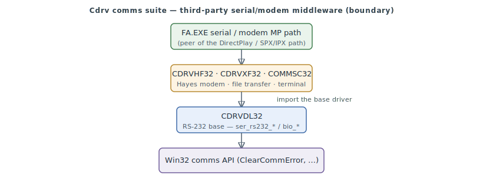

# COMMSC32.DLL — Cdrv comms terminal-screen service

`COMMSC32.DLL` is the **terminal-screen service**: a character-cell terminal window (`CdrvScr*` create/paint/resize/write, `commdrvw_char_screen`) for the comms UI.

The suite's shared design, third-party rationale, and the FA-side boundary are described in [comms.md](comms.md) (the CDRVDL32 base driver).

> **Provenance:** Ghidra static analysis of `COMMSC32.DLL` (imported into `fa-re`, auto-analysed;
> public names from the PE export table). Third-party middleware, documented at the **boundary**
> ([#247](https://github.com/jomkz/fighters-codex/issues/247) /
> [#255](https://github.com/jomkz/fighters-codex/issues/255)): the exported ABI is named; internals
> and referenced data are waived, not reversed. Confidence per [spec-authoring.md](../spec-authoring.md).

## Functions

Representative exports (all named in the [symbol DB](https://github.com/jomkz/fighters-codex/blob/main/db/symbols/comms-sc.csv)):

| VA | Export | Role |
|----|--------|------|
| `0x100011F0` | `commdrvw_char_screen` | Cdrv export |
| `0x10001990` | `CdrvScrDestroy` | Cdrv export |
| `0x100019B0` | `CdrvScrCreate` | Cdrv export |
| `0x100019D0` | `CdrvScrResize` | Cdrv export |
| `0x100019F0` | `CdrvScrWrite` | Cdrv export |
| `0x10001A10` | `CdrvScrKillFocus` | Cdrv export |
| `0x10001A30` | `CdrvScrSetFocus` | Cdrv export |
| `0x10001A50` | `CdrvScrPaint` | Cdrv export |

## Open Questions

### 1. Internals

The waived internals are the third-party Cdrv implementation and statically-linked CRT —
deliberately not reversed (licensed middleware; the exported ABI above is the documented
boundary). No FA understanding depends on them.

*Status: resolved — boundary-documented (third-party; internals out of scope by license).*

## Related

- [network.md](network.md) — FA.EXE's multiplayer, which drives the serial/modem path.
- [comms.md](comms.md) — the CDRVDL32 base driver and suite overview.
- [reconstruction.md](reconstruction.md) — the program this binary belongs to.
