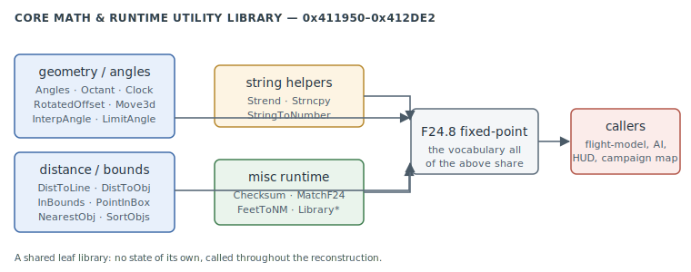

# Core Math & Runtime Utility Library

A leaf library of **fixed-point geometry, angle, distance/bounds, string and misc runtime
helpers** at `0x411950`–`0x412DE2` — the game's own libc-like layer that the flight model,
AI, HUD and campaign map all call. It holds no state of its own; every function is a pure
helper over the engine's **F24.8 fixed-point** vocabulary or plain C strings.

> **Provenance:** Ghidra static analysis of the game executable with [FA.SMS](formats/SMS.md) symbols applied; recorded in the [symbol database](https://github.com/jomkz/fighters-codex/blob/main/db/symbols/core-math.csv) and applied to the Ghidra project. Progress: [reconstruction matrix](reconstruction.md). Markers follow [spec-authoring.md](../spec-authoring.md): confirmed · inferred · unknown.

## The library

The functions fall into four groups, all named by [FA.SMS](formats/SMS.md):

- **Geometry & angles** — `Angles`/`AngleOffNose`/`AnglesOffNose` measure bearings between
  objects; `Octant`/`Clock` bucket a bearing into an 8-way octant or a 12-o'clock clock
  code; `RotatedOffset`/`RotatedOffsetF24`/`GetRotatedOffsetF24` rotate a body-frame offset
  into world space; `Move3d` advances a point along a heading; `InterpAngle`/`LimitAngle`
  interpolate and wrap angles; `TurnTowardAngle` steps a heading toward a target.
- **Distance & bounds** — `DistToObj`/`DistToLine` (point-to-object / point-to-segment),
  `SpeedToXYZ` (decompose a speed vector), `InBounds`/`InBounds3`/`BoundsAnd`/`PointInBox`
  (AABB tests), `NearestObj` (nearest of a set), `SortObjs` (sort by a key), `ObjRadius`,
  `FeetToNM` (unit convert), `Vertical`. confirmed

- **String helpers** — `Strend` (end pointer), `Strncpy`, `NextString` (walk a packed
  string table), `StringIsNumber`/`StringToNumber` (parse). confirmed
- **Misc runtime** — `Checksum` (a running checksum), `MatchF24` (fixed-point compare with
  tolerance), `MaybeExitToDOS` (fatal-exit path), and `LibraryStartup`/`LibraryShutdown`
  (the library's own init/teardown). inferred

## Functions

Full record: [`db/symbols/core-math.csv`](https://github.com/jomkz/fighters-codex/blob/main/db/symbols/core-math.csv).

| VA | Symbol | Role |
|----|--------|------|
| `0x411950` | `TurnTowardAngle` | step a heading toward a target angle |
| `0x411A40` | `Angles` | bearing between two objects |
| `0x411AF0` | `AngleOffNose` | angle of a target off the nose |
| `0x411BD0` | `Clock` | bearing → 12-o'clock clock code |
| `0x411CB0` | `Octant` | bearing → 8-way octant |
| `0x411D10` | `RotatedOffset` | rotate a body-frame offset to world |
| `0x411DE0` | `FeetToNM` | feet → nautical miles |
| `0x411E00` | `InBounds` | 2D AABB test |
| `0x411F50` | `SpeedToXYZ` | decompose a speed vector |
| `0x4120C0` | `Move3d` | advance a point along a heading |
| `0x412170` | `PointInBox` | point-in-box test |
| `0x412200` | `DistToLine` | point-to-segment distance |
| `0x412340` | `SortObjs` | sort objects by a key |
| `0x412480` | `InterpAngle` | interpolate between angles |
| `0x412B50` | `StringToNumber` | parse a numeric string |
| `0x412CB0` | `NearestObj` | nearest object of a set |
| `0x412DA0` | `LimitAngle` | wrap an angle into range |

## Open Questions

### 1. In-region functions with other homes

The `0x411950`–`0x412DE2` range also holds a few helpers that belong to other subsystems and
are **not** claimed here: `PrintShapeName` (`0x4129A0`), `SetHShake`/`SetVShake` (`0x412A30`/
`0x412A60`, the renderer's screen-shake state read by [`GG_Flush`](renderer.md)), and
`ButtonSound` (`0x412A90`). They sit inside this utility unit's address range but are homed
by their function, not their location; the `Sample*` cluster just past it (`0x4124E0`–
`0x4125C0`) is likewise held back pending identification (audio sample vs. statistical).

*Status: open — home the in-region non-math helpers to renderer/sound as those passes reach them.*

## Related

- [physics.md](physics.md) — the flight model, the biggest caller: bearings, rotation and bounds.
- [ai-interpreter.md](ai-interpreter.md) — angle/distance helpers in the CT decision code.
- [campaign.md](campaign.md) — the map screen's `MAPWorldToScreen` builds on these.
