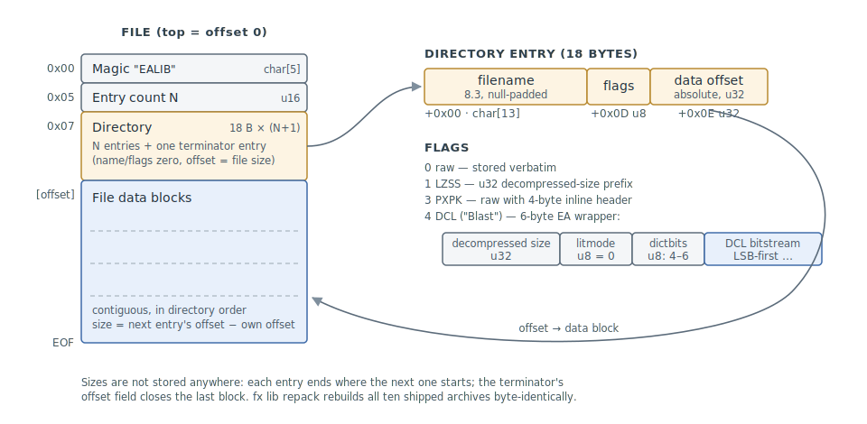

# LIB — EALIB Asset Archive (.LIB)

All game assets are packed into `.LIB` files using the EALIB container: a flat
directory of named entries followed by their data blocks, with optional per-entry
compression. The archives live in the install directory and on both game discs
(see the [inventory](#file-inventory) below); almost every other format documented
in this directory is stored inside one of them.

## Tools

### fx

```
fx lib ls      <file.LIB>                      # list entries with flags and sizes
fx lib unpack  <file.LIB> [-o output_dir]      # extract all entries, decompressing
fx lib extract <file.LIB> <ENTRY> [-o dir]     # extract one entry
fx lib pack    <input_dir> <file.LIB>          # build an archive (byte-identical)
fx lib repack  <file.LIB> <out.LIB>            # rebuild container from its own directory
fx lib patch   <file.LIB> <ENTRY> <new_file>   # replace one entry in place
```

`fx lib repack` keeps payloads raw (still compressed) and entry metadata
verbatim while recomputing every offset — byte-identical output for
well-formed archives. The `fa_repack_roundtrip` integration test (FX_FA_ROOT
mode) runs it against every archive in a real install.

`fx lib unpack` decompresses flags=0 and flags=4 automatically. Flags=1 (LZSS)
and flags=3 (PXPK) are **surfaced as unsupported**, not silently handed back
still-compressed: `ealib_extract` returns an empty payload and sets its
`unsupported` out-param (the CLI prints `SKIP … (flags=N, unsupported)`), so a
consumer walking a whole install never mistakes compressed bytes for the
decoded payload. Their decoders are tracked in #54; both are absent from the
Anthology install (100% flags 0/4). Container operations that do not decode —
`fx lib repack` and `fx lib pack` — still preserve such entries byte-identically
(raw bytes and flags copied verbatim).

### Other Tools

- **FATK** — free (abandonware, 1998); original GUI tool with project-based LIB
  editing; requires a compatibility layer on 64-bit Windows

## File Layout

All multi-byte integers are little-endian.



| Offset | Size   | Type   | Description |
|--------|--------|--------|-------------|
| `0x00` | 5      | char[5] | Magic `EALIB` (ASCII, no null terminator) |
| `0x05` | 2      | u16    | Number of directory entries (N) |
| `0x07` | 18 × (N+1) |    | Directory entries (see below), then one terminator entry |
| —      |        |        | File data blocks, contiguous and in directory order, immediately after the terminator |

The directory carries one extra 18-byte **terminator entry** after the N real
entries: name and flags bytes all zero, offset field = total file size. File
sizes are therefore **not stored** — each entry's size, the last included, is
the next entry's offset minus its own. Every archive in the FA install
follows this layout exactly, with no padding or gaps: `fx lib repack`
rebuilds each of the ten shipped `.LIB`s byte-identically from the parsed
directory alone (offsets recomputed from scratch), which is the proof the
layout claims here rest on. `fx_lib`'s reader also tolerates a *missing*
terminator (archives written by fx before the terminator was understood) by
falling back to end-of-file for the last entry's size.

### Directory Entry (18 bytes)

| Offset | Size | Type     | Description |
|--------|------|----------|-------------|
| `+0x00` | 13  | char[13] | Filename, null-padded, 8.3 DOS format (max 12 chars + null) |
| `+0x0D` | 1   | u8       | Flags byte (see table) |
| `+0x0E` | 4   | u32      | Absolute byte offset of file data in the .LIB |

### Flags

| Value | Name | Description |
|-------|------|-------------|
| 0 | raw | Uncompressed — data stored verbatim |
| 1 | lzss | LZSS compressed (4-byte decompressed-size prefix) — decoder tracked in #54; extraction surfaces it as unsupported |
| 3 | pxpk | Raw with a 4-byte `PXPK` inline header — decoder tracked in #54; extraction surfaces it as unsupported |
| 4 | dcl | PKWare DCL ("Blast") with 6-byte EA prefix |

### Filename Conventions

Certain filename prefixes are engine conventions that apply to files of any type
stored in a `.LIB`. On extraction, `fx lib unpack` maps the characters
`& * ? " < > | / \ :` to `_` (via `ealib_safe_name`) so output filenames are
legal and byte-identical on every platform; of the prefixes below, only `&` is
affected — `^`, `$`, and `_` extract as-is. The original names are preserved in
memory for patching operations.

| Prefix | Convention | Applies to |
|--------|-----------|------------|
| `&` | Looping ambient / cockpit sound | `*.11K`, `*.5K`, `*.8K` |
| `^` | Voice / radio callout (one-shot) | `*.11K`, `*.5K`, `*.8K` |
| `$` | 2D weapon / ordnance cockpit icon | `*.PIC` |
| `_` | Aircraft skin / texture | `*.PIC` |

Example: `&AFTB2.11K` in the archive extracts to `_AFTB2.11K` on disk.

### EA Compression Wrapper (flags=4)

Compressed entries prepend a 6-byte header to a standard PKWare DCL stream:

| Offset | Size | Type | Description |
|--------|------|------|-------------|
| `+0x00` | 4 | u32 | Decompressed size |
| `+0x04` | 1 | u8  | litmode: 0x00 = binary (only mode used in FA) |
| `+0x05` | 1 | u8  | dictbits: 4=1024-byte window, 5=2048, 6=4096 |
| `+0x06` | — |     | PKWare DCL bitstream (LSB-first) |

The decompressed-size field is written correctly by the game's tooling, but a
crafted archive can claim anything up to 4 GiB. `fx_lib` treats claims above
64 MiB as malformed and rejects the entry — the largest real FA-era entry
decompresses to a few MiB (#168). A zero claim extracts to an empty payload
(#169); a claim larger than the stream's actual output is tolerated (the
output is sized by what the bitstream produces, up to the claim).

### PKWare DCL Algorithm

Based on `blast.c` by Mark Adler (zlib project). See `lib/src/blast.cpp`.

**Bit reading:** bits are consumed LSB-first from a 32-bit buffer loaded one byte at a time.

**Fixed Huffman trees (not stored in stream):**

Length symbols (16 symbols):
```
RLE table:  { 0x02, 0x23, 0x24, 0x35, 0x26, 0x17 }
Code lengths: [2,3,3,3,4,4,4,5,5,5,5,6,6,6,7,7]
```

Distance symbols (64 symbols):
```
RLE table:  { 0x02, 0x14, 0x35, 0xE6, 0xF7, 0x97, 0xF8 }
```

Each RLE byte: high nibble = `reps-1`, low nibble = `code_length`.

**Decode loop:**
```c
flag = read_bits(1);
if (flag == 0) {
    emit read_bits(8);  // literal byte
} else {
    len  = lenbase[decode(len_tree)] + read_bits(lenextra[sym]);
    if (len == 519) break;  // END marker
    dsym = decode(dist_tree);
    dist = (len == 2) ? (dsym << 2) + read_bits(2) + 1
                      : (dsym << dictbits) + read_bits(dictbits) + 1;
    copy(len, from = output_tail - dist);  // overlapping ok; out-of-window = 0
}
```

**Critical: bit inversion.** The Huffman decode loop inverts each raw bit:
```c
code |= (bitbuf & 1) ^ 1;  // ^1 is required -- matches blast.c exactly
```
Without this inversion many files silently truncate to a wrong shorter output.

**Tables:**
```c
static const int lenbase[]  = {3,2,4,5,6,7,8,9,10,12,16,24,40,72,136,264};
static const int lenextra[] = {0,0,0,0,0,0,0,0, 1, 2, 3, 4,  5,  6,  7,  8};
```

## File Inventory

| File | TOOLKIT ID | Location | Key Contents |
|------|------------|----------|--------------|
| FA_1.LIB | `"1 "` | Install dir | `.FNT` ×15, `.PIC` ×1986 |
| FA_2.LIB | `"2 "` | Install dir | Main asset archive — see extension inventory below |
| FA_3.LIB | — | Disk 2 (Red) | `.PIC` ×822 (aircraft skin textures, raw), `.INF` ×269 (aircraft tech sheets, dcl) |
| FA_4B.LIB | — | Install dir | `.11K` ×77, `.5K` ×9 |
| FA_4C.LIB | `"4C"` | Disk 1 (Blue) | `.11K` ×44, `.PIC` ×43, `.CB8` ×4 |
| FA_4D.LIB | — | Install dir | `.CB8` + `.11K` FMV footage |
| FA_7.LIB | `"7 "` | Disk 1 (Blue) | `.FBC` ×355, `.VDO` ×355, `.11K` ×105, `.5K` ×1 |
| FA_10.LIB | `"10"` | Disk 2 (Red) | `.CB8` ×9, `.11K` ×9 |
| FA_10B.LIB | `"AB"` | Disk 2 (Red) | `.CB8` ×10, `.11K` ×10 |
| FA_11.LIB | `"41"` | Disk 2 (Red) | `.CB8` ×10, `.11K` ×10 |
| FA_11B.LIB | — | Disk 2 (Red) | `.CB8` ×8, `.11K` ×8 |

**TOOLKIT ID** is the 2-character identifier the FA TOOLKIT uses internally in its
`CACHE/LIBPTR.*` index files to record which `.LIB` a given asset lives in. Note that
`FA_10B.LIB` maps to ID `"AB"` and `FA_11.LIB` to `"41"` — these do not match the
filename suffix, so the IDs appear to be opaque tokens rather than derived from the name.
The **retail game does not read these `CACHE/LIBPTR.*` files at runtime**: it rebuilds its
own in-memory name index each launch by scanning the install directory
(`LibStartUp` — [memory-resource.md § LIB name resolution](../memory-resource.md#lib-name-resolution--the-hint-index)),
which also fixes the mount order and duplicate-name precedence.

### FA_2.LIB Extension Inventory

Full enumeration via `fx lib ls` (FA_3.LIB excluded — Disk 2 not mounted):

| Extension | Count | Notes |
|-----------|-------|-------|
| `.AI` | 9 | Artificial intelligence for objects |
| `.BI` | 9 | Supplementary AI for objects |
| `.BIN` | 6 | Lookup tables and palette data |
| `.CAM` | 6 | Campaign definitions |
| `.DLG` | 92 | In-game menu dialog layouts |
| `.ECM` | 30 | Electronic counter-measures |
| `.GAS` | 4 | Fuel definitions |
| `.HGR` | 2 | Hangar screen (Win32 PE DLL) |
| `.HUD` | 46 | Heads-up displays |
| `.JT` | 135 | Weapon (ordnance) definitions |
| `.LAY` | 24 | Cloud layers |
| `.M` | 517 | Missions |
| `.MC` | 21 | Campaign data |
| `.MM` | 75 | Theater/map layouts |
| `.MNU` | 12 | In-game menu layouts |
| `.MT` | 363 | Mission briefing text |
| `.MUS` | 9 | Music playlist / sequencer (Win32 PE DLL) |
| `.NT` | 84 | Vehicle definitions |
| `.OT` | 170 | Object definitions |
| `.PAL` | 1 | Color palette |
| `.PIC` | 1158 | 8-bit indexed bitmaps |
| `.PT` | 145 | Aircraft flight models |
| `.PTS` | 37 | Aircraft icon lookup (Win32 PE DLL) |
| `.SEE` | 51 | Seeker definitions |
| `.SEQ` | 126 | Cutscene sequencer |
| `.SH` | 1275 | 3D object shapes |
| `.T2` | 16 | Terrain height/color/type maps |
| `.TXT` | 8 | Campaign description text |
| `.XMI` | 78 | MIDI audio (Extended MIDI) |
| `.5K` | 781 | 5 kHz PCM audio |
| `.8K` | 1 | 8 kHz PCM audio |
| `.11K` | 114 | 11 kHz PCM audio |

## Round-Trip Notes

`fx lib pack` rebuilds an archive byte-identically from an unpacked directory,
and `fx lib patch` replaces a single entry while leaving every other byte of the
archive untouched; both are asserted by `tests/test_ealib.cpp` and exercised
end-to-end against a real install by the `fa_extract_manifest` integration test
(`FX_FA_ROOT` mode). Extraction-side filename sanitisation (see
[Filename Conventions](#filename-conventions)) is reversed from the in-memory
directory, not the on-disk names, so packing survives the `&` → `_` mapping.

## Open Questions

### 1. LZSS (flags=1) and PXPK (flags=3) payload formats

Both flag values are identified, and `ealib_extract` now surfaces such entries
as unsupported (empty payload + `unsupported` flag) rather than returning them
still-compressed (#159). The LZSS bitstream parameters and the `PXPK` inline
header still have no written spec — no FA archive contains either flavour, so
writing the decoders needs samples from the wider Fighters family (ATF/USNF).

*Status: open — re-static (#54)*

## Related

**Formats:** [PIC](PIC.md) and [11K](11K.md) document the filename-prefix
conventions from the consumer side; every format spec in this directory
describes content stored in these archives. [ESA](ESA.md) is the installer
container that ships four of these `.LIB` archives (`FA_1/2/4B/4D`) stored,
and whose `PKWA` streams are raw DCL — without the 6-byte EA wrapper the
`flags=4` entries here use.

**Engine:** [architecture.md](../architecture.md) — Asset System (EALIB
Archives) covers how the game executable mounts and reads them at runtime.
