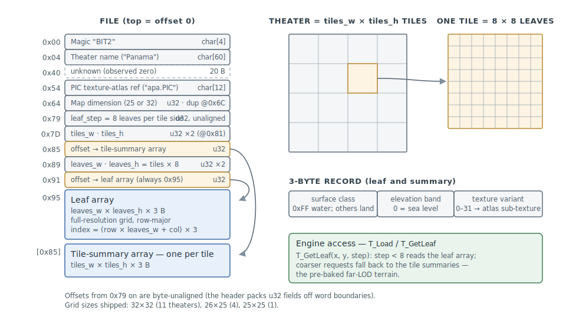

# T2 — Terrain Map (.T2)

FA_2.LIB contains 16 `.T2` files — one per theater. Each stores the terrain
grid data (height, color, surface type) for a campaign area. Referenced by
`.MM` theater files via the `map` keyword (e.g. `map apa.T2`).

## Tools

### fx

```
fx t2 info      <file.T2>            # grid, elevation range, surface classes
fx t2 dump      <file.T2> [--leaves] # records as CSV (summaries / full leaf grid)
fx t2 heightmap <file.T2> <out.png>  # leaf elevation bands as grayscale PNG
```

The `fx_lib` read API (`t2_read`, [api.md](../../api.md) § t2.h) decodes the
full map — header strings, the per-leaf records, and the per-tile summary
array — losslessly: header + records reassemble the file byte-identically
(proven over all 16 stock theaters).

### fxs

The **fxs** asset viewer previews a `.T2` as a textured 3D terrain — the leaf
grid as a heightfield (elevation band → height), each leaf textured with its
`texture_variant` tile through the shared [fx_render](../renderer.md) module
(§ Terrain Texturing below). Open the theater's texture LIB alongside the map
(tiles ship in a sibling LIB) so the tiles resolve. See
[gui.md](../../gui.md) § T2 terrain.

## File Layout

All multi-byte integers are little-endian.



### Header

| Offset | Size | Type | Description |
|--------|------|------|-------------|
| `0x00` | 4  | char[4] | Magic `BIT2` (ASCII, no null) |
| `0x04` | 60 | char[60] | Theater name, null-padded ASCII (e.g. "Panama") |
| `0x40` | 20 | ?   | **Unknown** (observed all-zero) |
| `0x54` | 12 | char[12] | PIC texture atlas reference, null-padded ASCII (e.g. "apa.PIC") |
| `0x60` | 4  | ?   | **Unknown** (observed 0) |
| `0x64` | 4  | u32 | Map dimension (tile columns = tile rows; 25 or 32) |
| `0x68` | 4  | ?   | **Unknown** (observed 0) |
| `0x6C` | 4  | u32 | Map dimension (duplicate of 0x64) |
| `0x70` | 8  | ?   | **Unknown** (observed all-zero) |
| `0x79` | 4  | u32 | `leaf_step` — leaves per tile side (8 in all theaters). *(The old "0x78 = always 2048" reading was this field misaligned by one byte: `8 << 8`.)* |
| `0x7D` | 4  | u32 | `tiles_w` — tile grid width *(the old "0x7C = cols × 256" reading was this field misaligned)* |
| `0x81` | 4  | u32 | `tiles_h` — tile grid height |
| `0x85` | 4  | u32 | File offset of the **tile-summary array** (`tiles_w × tiles_h × 3` bytes; the payload tail) |
| `0x89` | 4  | u32 | `leaves_w` = `tiles_w × leaf_step` |
| `0x8D` | 4  | u32 | `leaves_h` = `tiles_h × leaf_step` |
| `0x91` | 4  | u32 | File offset of the **leaf array** (`leaves_w × leaves_h × 3` bytes) — always `0x95` |
| `0x95` | —  |     | Terrain data payload: the two flat arrays (structure below) |

### Map Sizes

| Grid (w×h) | Files | `tiles_w` (`[0x7D]`) | `tiles_h` (`[0x81]`) | tiles | File size |
|------|-------|-----------------|----------------------|-------|-----------|
| 32×32 | 11 | 32 | 32 | 1024 | 199,829 B |
| 26×25 | 4 (EGY/FRA/UKR/VLA) | 26 | 25 | 650 | 126,899 B |
| 25×25 | 1 (TVIET) | 25 | 25 | 625 | 122,024 B |

When addressing tile (col, row): `tile_index = row × tiles_w + col`
(`T_GetLeaf` indexes both arrays row-major).

### Data Payload

The payload is **two flat row-major arrays of 3-byte records** (field map
above; the engine's `T_Load` @`0x4C5D70` relocates the two offsets into
pointers, and `T_GetLeaf` @`0x4C6040` indexes both arrays as
`(row × width + col) × 3`):

| Offset | Size | Contents |
|--------|------|----------|
| `0x95` (`[0x91]`) | `leaves_w × leaves_h × 3` | **Leaf array** — the full-resolution terrain grid (8×8 leaves per tile) |
| `[0x85]` | `tiles_w × tiles_h × 3` | **Tile-summary array** — one coarse record per tile |

`T_GetLeaf(x, y, step)` reads the leaf array while `step < leaf_step` and
falls back to the tile-summary array (indexing by `x / leaf_step`,
`y / leaf_step`) for coarser requests — the summaries are the pre-baked
far-LOD representation.

> **Superseded readings.** Earlier revisions described the payload as a
> "21-byte sub-header + N_tiles × 195-byte tiles". That cut was an artifact:
> the "sub-header" was the tail of the real header field map above (its
> mysterious "class constants — one fixed value per grid-size class" decode
> exactly as the array offsets and leaf-grid dimensions, which are pure
> functions of the grid size), and the "195-byte tile with an interleaved
> summary record" does not exist — leaves are stored globally row-major, and
> the per-tile summaries live in the separate tail array. The old "record 0
> selection algorithm" mystery dissolves with it: the summaries never sat
> among the leaves in the first place.

### 3-Byte Record (leaf and tile-summary)

| Byte | Field | Values / Notes |
|------|-------|----------------|
| 0 | Surface class | `0xFF` = water/ocean (all theaters); `0xD2` = land (APA, IRA, GRE, NSK, LFA — single land type); `0xD0`–`0xDA` = multiple land classes (EGY, UKR: sand, rocky, dunes, etc.); `0xC2`, `0xC4`–`0xC7` = land classes (TVIET: jungle, paddy, savanna, etc.) |
| 1 | Elevation band | 0 = sea level / coastal; higher = altitude above sea. Max observed per theater: APA=12, GRE=4, IRA=6, EGY=6, NSK=12, LFA=4, UKR=6, TVIET=16. Water leaves (class `0xFF`) carry bands too — almost all 0–1, with a handful of elevated water leaves in GRE/LFA/PGU/WTA (inland lakes, up to band 9 in WTA) |
| 2 | Texture variant | 0–31; selects a sub-texture within the PIC atlas for this surface class |

## File Inventory

| File | Name | Grid |
|------|------|------|
| APA.T2 | Panama | 32×32 |
| BAL.T2 | The Baltics | 32×32 |
| CUB.T2 | Cuba | 32×32 |
| EGY.T2 | Egypt | 25×26 |
| FRA.T2 | France | 25×26 |
| GRE.T2 | Greece | 32×32 |
| IRA.T2 | Iraq | 32×32 |
| KURILE.T2 | Kuril Islands | 32×32 |
| LFA.T2 | Falkland Islands | 32×32 |
| NSK.T2 | North/South Korea | 32×32 |
| PGU.T2 | Persian Gulf | 32×32 |
| SPA.T2 | Pakistan | 32×32 |
| TVIET.T2 | North Vietnam | 25×25 |
| UKR.T2 | Ukraine | 25×26 |
| VLA.T2 | Vladivostok | 25×26 |
| WTA.T2 | Taiwan | 32×32 |

All 16 live in FA_2.LIB. The PIC reference names the texture atlas used for
terrain tile rendering. Each theater has a matching `.PIC` file with the same
base name (e.g. `APA.T2` → `apa.PIC`).

## Engine Notes

### Loader and grid sampler (resolved 2026-07-05)

The two long-standing open questions were **resolved statically**
([#262](https://github.com/jomkz/fighters-codex/issues/262)):

1. **Sub-header "class constants"** — decoded as the header field map above
   (`leaf_step`, tile/leaf grid dimensions, and the two array offsets), read
   by `T_Load` (`0x4C5D70`) / `T_GetLeaf` (`0x4C6040`). The earlier literal
   scan (`0x95`, `0x80`, `195`, `21`) missed the loader because the engine's
   fields sit at `0x79–0x94` and no 195-byte stride exists. The values are
   pure functions of the grid size — why every theater of a size class
   shared them byte-for-byte.
2. **Tile summary record selection** — no selection happens: the summaries
   are a separate authored far-LOD array at `[0x85]`, returned by
   `T_GetLeaf` when the requested step reaches `leaf_step`. The
   "interleaved record 0" was a mis-cut of the flat leaf array.

### Terrain Texturing

*Per-leaf tile → PIC atlas. The mechanism, from static RE + asset
inspection; intent is not recovered.*

Each leaf's **texture variant** (byte 2 of the 3-byte record) selects a numbered
theater texture tile **`<theater><N>.PIC`** — a 256×256 palette-less indexed
dense PIC (`APA0.PIC` … `APA25.PIC` for Panama; `LAND.PIC` is the shared
fallback). `T_Load` (`0x4C5D70`) resolves the theater's textures on map load.
*Confirmed:* every observed tile's pixels fall in the palette band **192–255**
(measured across `APA0`/`APA1`/`APA4`/`APA12`). The `.PIC` named in the header
at `0x54` (e.g. `apa.PIC`) is the **overview map** — 800×800 with its own
128-colour embedded palette used only for indices 1–127, swapped in separately
by `MAPSwapPalette` (`0x42532A`) — *not* the terrain tile palette.

The colours for the 192–255 band are **not** shipped in a `.PAL`: the install's
only palette, `PALETTE.PAL`, leaves 192–254 as `(63,0,63)` magenta placeholders.
*Inferred:* the band is filled at scene init from the theater's atmosphere/sky
(LAY) state into the live `_curPalette` (`0x583DC4`), the same path the
`Remap` / `_tmapRemapTable` chain below runs through. The **fxs** viewer stands
in for that band with a default earthy ramp
([terrain_preview.cpp](https://github.com/jomkz/fighters-codex/blob/main/gui/src/editors/terrain_preview.cpp),
`FillDefaultTerrainBand`); the atmosphere-driven palette and the
`T_CellTmapLookup` (`0x4A8840`) named-tmap landmark overlay are not yet
reproduced.

### Surface Class → Palette Mapping (`Remap` pipeline)

The surface class byte (byte 0 of each 3-byte sub-tile record) is never used as
a raw palette index. At scene init, `@DoSetTmapRemaps@0` (`0x004cc518`) builds
a 256-byte precomputed cache:

```c
// pseudocode — restored by fixing Remap()'s signature in Ghidra
for (uint i = 0; i < 256; i++)
    _tmapRemapTable[i] = Remap((byte)i);
```

The terrain renderer indexes into `_tmapRemapTable[surface_class]` per-polygon
for speed rather than calling `Remap()` directly.

### `Remap()` — `0x004cc44c`

`Remap(byte surface_class)` maps a surface class to a final 8-bit palette index
under the current atmosphere state. Its pipeline (decompiled after signature
fix):

**Stage 1 — Extended surface class redirect**

If the incoming value is > 255 (i.e. an extended surface class passed via full
EAX), the function indexes into `DAT_0055b9e0`, a `uint16_t[]` redirect table:

```
palette_index = DAT_0055b9e0[surface_class]   // ushort lookup
if palette_index > 255: return palette_index directly (bypass atmosphere)
```

Surface classes 0–255 pass through this stage unchanged.

**Stage 2 — Atmosphere / lighting chain** (gated by `_effects` bits)

Applied only when `_effects & 0x8` is set:

| Step | Condition | Operation |
|------|-----------|-----------|
| Shade table | `unaff_EBX != 0` (caller-set flag) | `idx = _currentShadeTable[idx]` |
| Blend tables | `_effects & 0x10` | `idx = DAT_005843c8[DAT_005843c4[idx]]` |
| Tint table | always (within effects block) | `idx = _currentTintTable[idx]` |
| Brightness | `idx != 0xFF` | `idx += _globalColorAdd` |

**Stage 3** — return the final `byte` palette index.

### Globals referenced

| Symbol | Role |
|--------|------|
| `_tmapRemapTable` | 256-byte precomputed cache; rebuilt at scene init by `@DoSetTmapRemaps@0` |
| `DAT_0055b9e0` | `uint16_t[]` extended surface class redirect table (surface class > 255 path) |
| `_effects` | Rendering effects bitfield; bit 3 gates atmosphere chain, bit 4 gates blend layer |
| `_currentShadeTable` | Secondary atmosphere layer pointer; applied when `unaff_EBX != 0` |
| `_currentTintTable` | Primary atmosphere layer pointer; always applied within the effects block |
| `DAT_005843c4` / `DAT_005843c8` | Additional atmosphere blend layer pointers (double-pass blend) |
| `_globalColorAdd` | Global brightness/gamma shift; added to final index unless it is `0xFF` |
| `unaff_EBX` | Implicit caller-set flag (EBX) gating the shade table step; semantics unknown |

The `_currentShadeTable`, `_currentTintTable`, `DAT_005843c4`, and
`DAT_005843c8` are the same atmosphere layer globals populated by
`ParseLayerFile` / `SetActiveLayerByAngle` (see
[architecture.md](../architecture.md) — Sky & Atmosphere subsystem).

### Relation to `.MM` tmap coordinates

`MISSIONTextProc` is the MM file text parser (keyword dispatch loop). The
`tmap` keyword handler (confirmed from decompile) reads **4 × s16** values per
entry (format `tmap %d %d %d %d`), bounded to 3500 entries (counter
`tlistSize`), stored into arrays at `tlist`/`DAT_005733e4`. A second form
`tmap_named` reads a name string + 2 × s16, stored as a 53-byte struct at
`tdic + i × 0x35`. The `tdic` keyword reads 1 × u32 + 32 × u8 into the same
struct at offset `+0x0D` (max 300 entries, counter `tdicSize`).

Approximate tile-index formula (based on observed `tmap` values in MM files):

```
T2_tile_col = tmap_col / 8
T2_tile_row = tmap_row / 8
tile_index  = T2_tile_row × dim_x + T2_tile_col
```

## Round-Trip Notes

The write path (`t2_write`, `t2_repack` — [api.md](../../api.md) § t2.h) is
**byte-identical**: a `t2_read` → `t2_write` round-trip reproduces the file
exactly, verified over all 16 stock theaters (`t2_repack` census). This holds
because the format is fully accounted for — the entire pre-payload region is
carried verbatim in `T2Map::header` (including the handful of still-unresolved
sub-header bytes at `0x40`/`0x60`/`0x70`, which the spec observes as zero but
does not attribute), and the payload is just the two flat record arrays. No
field is recomputed on write, so nothing can drift.

`t2_write` re-derives the grid extents from the header's own offset fields and
requires the (editable) `leaves` / `summaries` vectors to match them, so an
edited map that keeps the grid shape serializes safely; a map whose record
counts no longer agree with its header is rejected (empty result) rather than
emitting a file the loader would misread.

## Related

**Formats:** [MM](MM.md) — theater files that reference `.T2` via
`map <name>.T2`; [PIC](PIC.md) — terrain texture atlas (same base name as
`.T2`).

**Engine:** [architecture.md](../architecture.md) — Sky & Atmosphere subsystem
shares the atmosphere layer globals used by the `Remap` pipeline.
