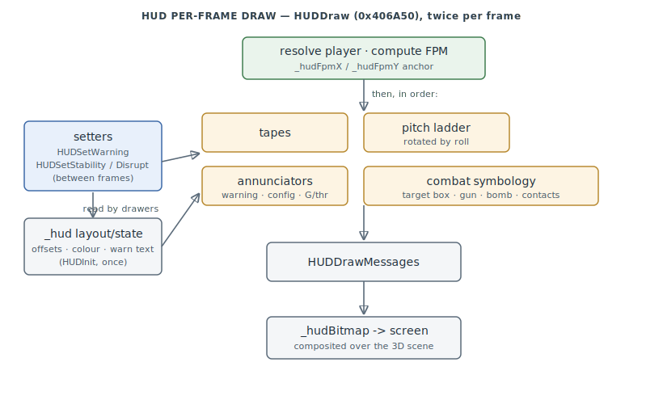

# FA.EXE HUD / Cockpit

The head-up display — the symbology layer drawn over the 3D scene each frame: the
flight-path marker, pitch ladder, speed/altitude/heading tapes, warning annunciators,
and the combat symbology (target boxes, gun reticle, CCIP bomb pipper, sensor contacts).
One tidy compilation unit (`HUD.C`), `0x405E30–0x40AE50`.

> **Provenance:** Ghidra static analysis of FA.EXE with [FA.SMS](formats/SMS.md) symbols
> applied; every symbol here is recorded in the
> [symbol database](https://github.com/jomkz/fighters-codex/blob/main/db/symbols/hud.csv)
> and applied to the Ghidra project; progress is tracked in the
> [reconstruction matrix](reconstruction.md). Confidence markers follow
> [spec-authoring.md](../spec-authoring.md): confirmed · inferred · unknown.

## Layout is computed once, symbology is drawn from one anchor

`HUDInit` (`0x406040`) computes a large **layout/state block** (base `0x521360`, the `_hud`
region) once from the screen geometry: per-element `(dX, dY)` screen offsets, text line
height, colour, the warning-text pointers, and blink phases. Everything the per-frame
drawers emit is positioned relative to the **flight-path marker** `_hudFpmX`/`_hudFpmY`
(`0x521D94`/`0x521D96`) plus a layout offset — so the whole HUD moves with the velocity
vector. Three fonts (`HUDSetFont`/`HUDSetSymFont`/`HUDSetWinFont`) and a const symbology
region (`0x4EBD00–0x4EC200`: warning strings, glyph bytes, numeric formats) supply the
marks. The **pitch-ladder** is data-driven from `_hudPitchBarTable` (`0x4EBD30`, 37×3
int16), and a target/padlock silhouette is rendered into an offscreen `_hudBitmap`
(`0x5213D4`) via the 3D pipeline.

## Per-frame draw flow

The flight loop calls `HUDDraw` (`0x406A50`) each frame. Its body resolves the player
object, computes the flight-path marker into `_hudFpmX/Y`, sets colour/font, then invokes
the element drawers in a fixed order — data block, tapes, pitch ladder, then the combat
symbology, and finally the scrolling message lines:

Setters called from the flight-model/damage code between frames stage state the drawers
read: `HUDSetWarning` (the blinking `STALL` / `LOW FUEL` string), `HUDSetStability`,
`HUDSetDisrupt` (damage flicker), and `HUDBrightness`.

## Functions

Representative subset; the full record is in
[`db/symbols/hud.csv`](https://github.com/jomkz/fighters-codex/blob/main/db/symbols/hud.csv).

| VA | Symbol | Role |
|----|--------|------|
| `0x406040` | `HUDInit` | compute the layout/state block from screen geometry |
| `0x406A50` | `HUDDraw` | per-frame master dispatcher (called twice per frame) |
| `0x405F50` | `HUDMessage` | queue a scrolling HUD text message |
| `0x4077B0` | `HUDSetWarning` | stage the blinking warning string |
| `0x407B60` | `HUDDrawHeading` | heading tape |
| `0x407EE0` | `HUDDrawSpeed` | airspeed tape |
| `0x408420` | `HUDDrawAlt` | altitude tape |
| `0x408E20` | `HUDDrawHVel` | horizontal-velocity / drift indicator |
| `0x4089A0` | `HUDDrawPitchLadder` | climb/dive ladder, rotated by roll about the waterline |
| `0x4078B0` | `HUDDrawWarning` | blinking warning-string draw |
| `0x407930` | `HUDDrawConfigFlags` | gear/flap/brake/hook annunciators |
| `0x407A00` | `HUDDrawGLoadThrottle` | G-load + throttle + thrust-vector readout |
| `0x409F30` | `HUDDrawTargetBox` | target-designator box over the padlock target |
| `0x409910` | `HUDDrawGunReticle` | gun aiming circle + range tape |
| `0x409760` | `HUDDrawBombFall` | CCIP bomb fall line / pipper |
| `0x409BF0` | `HUDDrawApproach` | ILS / carrier glideslope box (landing mode) |
| `0x408C80` | `HUDDrawLeadCaret` | lag/lead aim caret at the tracked target |
| `0x40A7F0` | `HUDDrawContacts` | radar/IR sensor contacts |
| `0x40A6C0` | `HUDDrawTargetLabels` | name tags over visible targets |
| `0x4075D0` | `HUDDrawTargetView` | 3D target silhouette rendered into the HUD bitmap |
| `0x40AD40` | `ComputeBombPosition` | ballistic impact point for the CCIP pipper |
| `0x40A530` | `HUDFindNearest` | pick the nearest target for auto-designation |

## Open Questions

### 1. `HUDDrawTargetView` (`0x4075D0`) content

It builds a 3D shape into `_hudShape`, flips the HUD bitmap, and blits it at several
offsets — plausibly a magnified target silhouette, an IR/FLIR image, or a combining-glass
reflection. Confirming needs the writer of `_hudShape`/`_hudTargetViewEnable` (likely in
`HUDInit` or a sensor subsystem).

*Status: open — re-static.*

### 2. `_hudMasterMode` (`0x521694`) enumeration

Values `0`/`1`/`2` are used (`2` = landing). Whether A/A vs A/G gun/bomb submodes are
encoded here or carried on the weapon record would pin the inferred reticle names.

*Status: open — re-static.*

## Related

- [reconstruction.md](reconstruction.md) — the program this subsystem belongs to.
- [objects.md](objects.md) — the entity mirror (`_cg`) the HUD reads aircraft/target state from.
- [renderer.md](renderer.md) — the `G_*` rasterizer the HUD draws its symbology through.
- [physics.md](physics.md) — the flight-model state (G-load, throttle, config) the HUD displays.
- [formats/HUD.md](formats/HUD.md) — the `.HUD` layout file that configures cockpit HUD elements.
