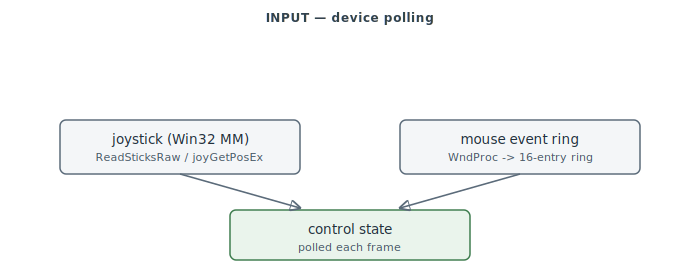

# Input — Joystick & Mouse

Player input device handling: the Win32 multimedia **joystick** API layer and the **mouse**
event ring. (Serial-cable and modem link transport, historically "input" territory, is
documented with the [network](network.md) transport layer per the reconstruction program's
ownership split.) Re-carved from a very broad nominal range into the two true device
clusters.

> **Provenance:** Ghidra static analysis of the game executable with [FA.SMS](formats/SMS.md) symbols applied; recorded in the [symbol database](https://github.com/jomkz/fighters-codex/blob/main/db/symbols/input.csv) and applied to the Ghidra project. Progress: [reconstruction matrix](reconstruction.md). Markers follow [spec-authoring.md](../spec-authoring.md): confirmed · inferred · unknown.

## Devices

- **Joystick** (`0x494270–0x494B50`): a thin layer over the Win32 MM joystick API
  (`joyGetNumDevs`/`joyGetPos(Ex)`/`joyGetDevCapsA`) — **not** DirectInput. `ReadSticksRaw`
  polls axes, `InitJoysticks` enumerates, `GetJoystickType` maps to a configured stick type.
- **Mouse** (`0x499CF0–0x499E5B`): a WndProc hook feeding a 16-entry event ring the shell and
  cockpit poll.

## Functions

Full record: [`db/symbols/input.csv`](https://github.com/jomkz/fighters-codex/blob/main/db/symbols/input.csv).

| VA | Symbol | Role |
|----|--------|------|
| `0x494270` | `ReadSticksRaw` | poll raw joystick axes (Win32 MM) |
| `0x4942D0` | `InitJoysticks` | enumerate/initialise joystick devices |
| `0x494430` | `GetJoystickType` | map a device to the configured stick type |
| `0x4944A0` | `ReadDevice` | read one device's current state |

## Open Questions

### 1. Calibration / mapping table — resolved (layout)

`NormalizeStick` (`0x4946B0`) indexes two parallel per-device arrays by the axis's device
number (`_joystickXDevice`/`YDevice`/`ThrottleDevice`/`RudderDevice`):

- **`_joystickInfo`** — Win32 `JOYINFO` snapshots, **stride `0x10`** (`&_joystickInfo + dev*0x10`).
- **Calibration table** at base `0x554670` — **stride `0x34` per device**; the raw axis words sit
  at record `+0x00` (X, `0x554670`), `+0x04` (Y, `0x554674`), `+0x0C` (rudder, `0x55467C`). The
  first poll auto-captures the resting value as centre (`_gotCenterX/Y/R` guard →
  `DAT_00554EBC/EC4/EC8`), and `ScaleToRange` (`0x494580`) maps raw→min/centre/max into the
  normalized int the sim consumes.

So each joystick device has a `0x34`-byte calibration record (raw + captured-centre per axis)
plus a `0x10`-byte `JOYINFO` slot; that is the layout the `.CFG` axis bindings persist.

*Status: resolved — re-static (calibration record: 0x34-byte stride/device; JOYINFO 0x10 stride).*

## Related

- [network.md](network.md) — the serial/modem link transport (SER_/MOD_).
- [physics.md](physics.md) — control inputs feed the flight model.
- [hud.md](hud.md) — slew/padlock controls drive HUD symbology.
