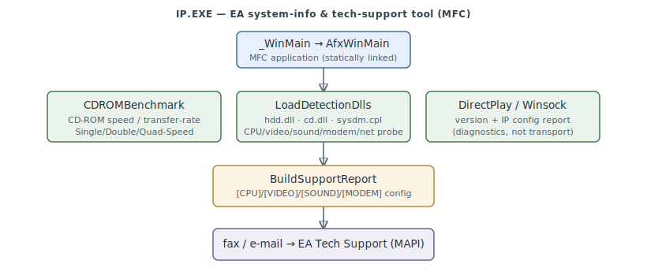

# IP.EXE — EA system-info & tech-support tool

`IP.EXE` (708 KB) is **not** a TCP/IP network transport — the epic's original assumption. Its
imports (`DDRAW`, `DSOUND`, `MAPI32`, `comdlg32`, `WINSPOOL`; **no winsock**), its `AfxWinMain`
entry, and its strings identify it as an **MFC application** that profiles the machine and
**faxes / e-mails a system-configuration report to EA Tech Support** (`support@ea.com`,
`Fax to: (650) 286-5080`). It is FA/EA-authored *app logic* wrapped around the statically-linked
Microsoft MFC framework — a bundled support utility, not game-engine or networking code.

> **Provenance:** Ghidra static analysis of `IP.EXE` (imported into the `fa-re` project,
> auto-analysed; no export table, no `.SMS` — named from strings / imports / RTTI / call
> structure). **Boundary-documented** ([#254](https://github.com/jomkz/fighters-codex/issues/254)):
> the identifiable FA/EA app-logic surface is named; the bulk (statically-linked MFC/CRT framework
> and un-analysed tool internals) is waived as third-party, the same license treatment as WAIL32
> (Miles) and the comms suite. Confidence markers follow [spec-authoring.md](../spec-authoring.md).

---

## What it actually does

Run from the game's support/setup path, `IP.EXE` gathers a machine profile and sends it to EA:

- **CD-ROM benchmark** — times the CD-ROM drive ("Benchmarking CD-ROM Drive…", Single/Double/
  Quad-Speed, "Data Transfer Rate: %d KB/s").
- **Hardware & OS detection** — loads `hdd.dll` / `cd.dll`, shells `sysdm.cpl`, and reads CPU
  (vendor/MMX/count), video card + memory + supported modes, sound, modem(s), RAM, Windows
  version, BIOS.
- **Network config report** — DirectPlay version, Winsock description, IP address, subnet mask,
  default gateway, RAS connections. These are *diagnostics reported to support*, **not** a
  transport — the actual multiplayer transport is DirectPlay (external) and the in-FA.EXE
  SPX/IPX/UDP path (see [network.md](network.md)).
- **Report + submit** — `BuildSupportReport` assembles a `[CPU]`/`[VIDEO]`/`[SOUND]`/`[MODEM]`
  config file and sends it to EA Tech Support by **fax or MAPI e-mail**.

## Functions

The identifiable EA app-logic entry points (VAs from the
[symbol DB](https://github.com/jomkz/fighters-codex/blob/main/db/symbols/ip.csv)):

| VA | Function | Role |
|----|----------|------|
| `0x004019B0` | `CDROMBenchmark` | CD-ROM speed / transfer-rate benchmark |
| `0x00403FE0` | `LaunchSystemProperties` | `ShellExecute` of `sysdm.cpl` (System control panel) |
| `0x00404061` | `LoadDetectionDlls` | `LoadLibrary` of `hdd.dll` + `cd.dll` (hardware-detection helpers) |
| `0x0040DC60` | `BuildSupportReport` | build the system-config report and fax / e-mail it to EA support |
| `0x00436EF0` | `WinMain` | MFC `AfxWinMain` wrapper (Ghidra FID) |

## Open Questions

### 1. Full reconstruction — mostly third-party MFC framework

`IP.EXE` has 1,805 functions: ~860 Ghidra-FID-matched (statically-linked MFC / MSVC CRT) and the
rest un-analysed. Because it is an MFC app, the large majority are **Microsoft MFC framework**
(third-party, statically linked — the same category as WAIL32's CRT and the MS redistributables),
with the FA/EA-authored part limited to the diagnostics logic named above. A full 100 % naming
pass is low-value (a bundled support utility, mostly third-party framework), so the FA/EA app-logic
surface is named and the framework is waived at the boundary.

*Status: resolved — boundary-documented (FA/EA app logic named; MFC/CRT framework waived as third-party).*

## Related

- [network.md](network.md) — FA.EXE's actual multiplayer transport (SPX/IPX/UDP + DirectPlay).
- [reconstruction.md](reconstruction.md) — the program this binary belongs to.
- [wail32.md](wail32.md) — the other companion binary; same third-party-framework boundary pattern.
