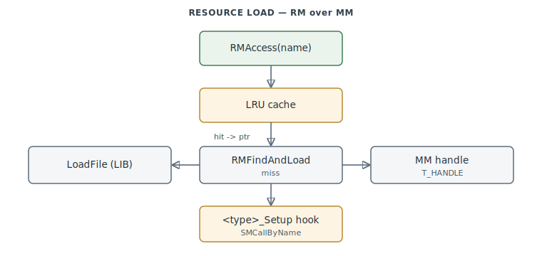

# Memory & Resource Managers (MM / RM)

Two layers the whole engine loads assets through: **MM**, a handle-based memory allocator
with memory-mapped-file support (`0x435C60–0x43631C`), and **RM**, the resource manager — a
filename registry with an LRU cache that resolves per-type load hooks and pulls bytes from
LIB archives into MM handles (`0x4A67F0–0x4A6E46`).

> **Provenance:** Ghidra static analysis of the game executable with [FA.SMS](formats/SMS.md) symbols
> applied; recorded in the
> [symbol database](https://github.com/jomkz/fighters-codex/blob/main/db/symbols/memory-resource.csv)
> and applied to the Ghidra project. Progress: [reconstruction matrix](reconstruction.md).
> Markers follow [spec-authoring.md](../spec-authoring.md): confirmed · inferred · unknown.

## MM — a 28-byte handle allocator

MM hands out **`T_HANDLE`** handles (28-byte free-list records) backed by `VirtualAlloc`/
`GlobalAlloc`, with alloc-id **group free** (free everything allocated under an id at once —
the pattern mission load uses to reclaim per-mission memory). Accessing a handle
(`MMAccessR`/`MMAccessW`/`MMAccessE`) is a pointer dereference (a no-op "lock" — a Mac-port
heritage), and flag `0x4000` marks a memory-mapped-file handle. `MMFreeHandle` calls back
into RM (`RMNotify`) to keep the resource registry coherent when a cached asset's memory is
released.

## RM — filename registry + LRU cache + per-type hooks

RM is a ~1400-slot filename registry (`resList`) with a 20-entry LRU cache. `RMAccess` by
name resolves through the cache; on a miss `RMFindAndLoad` pulls the bytes via `LoadFile`
(from a LIB) into an MM handle and runs the per-type hook — `SMCallByName` dispatches
`<TYPE>_Load` / `_Setup` / `_Free` (the same name-lookup mechanism the Chuck-Talk interpreter
uses). This is how a `~a10.SH` reference in a `.PT` resolves to a loaded, engine-ready shape.

## Functions

Full record: [`db/symbols/memory-resource.csv`](https://github.com/jomkz/fighters-codex/blob/main/db/symbols/memory-resource.csv).

| VA | Symbol | Role |
|----|--------|------|
| `0x435C60` | `MMInit` | initialise the handle allocator |
| `0x4A6B30` | `RMFindAndLoad` | resolve + load + register a resource by name |
| `0x4A6AB0` | `RMCacheInsert` | insert into the LRU resource cache (evict oldest) |
| `0x4A6DF0` | `RMSetup` | post-load per-type hook (`SMCallByName <type>_Setup`) |

## Open Questions

### 1. `FUN_004A6B10` ownership

`FUN_004A6B10` (the `ResolveTypeRecord` helper) sits in the RM range but is owned by
[objects.md](objects.md) — it resolves the MM handle at the type record's `+0x0F`. The
overlap is expected (RM and the object type-loader are tightly coupled); noted so the
boundary is explicit.

### 2. `T_HANDLE` flag bit `0x1000`

**Resolved statically** (2026-07-05, [#262](https://github.com/jomkz/fighters-codex/issues/262)):
`0x1000` is the **purged-handle mark** from the allocator's Mac heritage (a purgeable
handle whose memory was discarded by compaction must be reloaded). The readers are
real and all follow the same recovery contract — `RMFind` (`0x4A6990`) drops a
registry entry whose entry flag `+0x0E & 2` is set and whose handle carries `0x1000`
(frees the husk, returns miss), `RMFindAndLoad` re-loads in a loop on the same test,
and `BrushFromIndex` (`0x4AB860`) / `MAPDrawBG` (`0x4224EE`) free-and-reload their
cached PIC handles. But the **writer does not survive**: `MMUseHandle` stores caller
flags verbatim and no call site passes `0x1000`, `MMFreeHandle` zeroes the flag word,
and the one function that would purge — `MMCompactRAM` (`0x4361B0`) — is compiled to
`return 0` on Win32. In the shipping game the flag can never be set; the recovery
paths are vestigial.

*Status: resolved — vestigial purge protocol; writer stubbed out on Win32.*

## Related

- [objects.md](objects.md) — the type-loader that resolves shapes through RM/MM.
- [formats/LIB.md](formats/LIB.md) — the archive `LoadFile` reads asset bytes from.
- [shape-selection.md](shape-selection.md) — `RMAccess` loads the shape variants.
