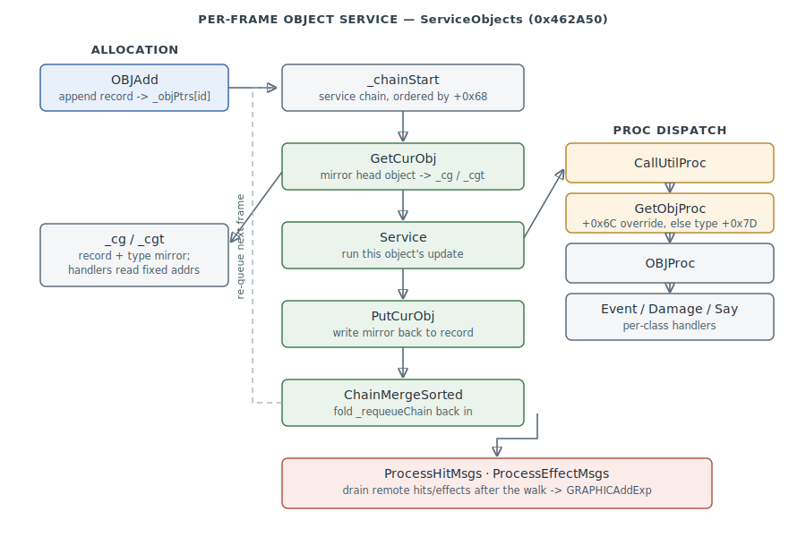

# Object / Entity System

How the game executable stores, services, and dispatches behavior for every live game object —
aircraft, ground vehicles, projectiles, and static props alike. This is the runtime
spine the flight model, AI, weapons, and renderer all hang off: one **object chain**
walked every frame, a **current-object mirror** each handler operates on, and a
**proc-dispatch** indirection that routes events, damage, and updates to the right
per-class code.

> **Provenance:** Ghidra static analysis of the game executable with [FA.SMS](formats/SMS.md)
> symbols applied; recovered from `DumpAllFunctions.txt` and `AnalyzeOTNT.txt`
> ([scripts/ghidra/](https://github.com/jomkz/fighters-codex/tree/main/scripts/ghidra)).
> Every symbol here is recorded in the
> [symbol database](https://github.com/jomkz/fighters-codex/blob/main/db/symbols/objects.csv)
> and applied to the Ghidra project; progress is tracked in the
> [reconstruction matrix](reconstruction.md). Confidence markers follow
> [spec-authoring.md](../spec-authoring.md): confirmed · inferred · unknown.

## Objects, ids, and the pointer table

Every object is a variable-length record addressed by a small integer **id**. The
global pointer table `_objPtrs` (`0x553848`) maps `id → record base`; almost all
engine code reaches an object as `(&_objPtrs)[id]`. Id `0` is the null object. Ids
are handed out by the allocator (below); a separate high band of **alias ids**
(negative, per-computer) is reserved for multiplayer references.

A record is **`0xDE` bytes of common region followed by a per-class extension**, and it is
self-describing: the type record states how long the extension is (`type +0x03`) and how long
it is itself (`type +0x01`). `OBJAdd` asks for `type[+0x03] + 0xDE` bytes; `GetCurObj` computes
the same total independently when it mirrors a record. So there is no fixed `sizeof` for an
object — see [structs.md](structs.md) for the recovered layouts.

The first `0xDE` bytes of every record are shared across all classes — the fields the
object system itself reads:

| Offset | Size | Field | Meaning | Confidence |
|--------|------|-------|---------|------------|
| `+0x00` | 1 | `class` | object class tag (`& 0x1f`); `4` = aircraft | confirmed |
| `+0x01` | 4 | `flags` | status bits; `& 1` = alive, `& 0x100000` = draw destroyed model | confirmed |
| `+0x05` | 4 | `type` | pointer to the shared **type record** (OT/NT/PT/JT) | confirmed |
| `+0x0E` | 2 | `health` | `0` = destroyed | confirmed |
| `+0x11` | 12 | `pos` | world position (X,Y,Z, 24.8 fixed) | confirmed |
| `+0x64` | 2 | `next_id` | next object in its service chain | confirmed |
| `+0x68` | 2 | `service_key` | sort key that orders the service chain | inferred |
| `+0x6C` | 4 | `event_override` | optional per-instance proc override | inferred |

The per-instance record is documented in full in [structs.md](structs.md); the
shared **type record** (and its shape fields) in
[shape-selection.md](shape-selection.md).

## The current-object mirror (`_cg` / `_cgt`)

Handlers do **not** operate on the object record in place. `GetCurObj` (`0x4628B0`)
copies the whole record into a fixed scratch buffer `_cg` (`0x50CE80`) and its type
record into `_cgt` (`0x50D268`), records the id in `_curId` (`0x4F6FBC`), and (for
aircraft) unpacks the flight-model fields. Every subsystem then reads and writes
`_cg`/`_cgt` — which is why so much of the engine references fixed addresses like
`_cg+0x11` (position) rather than an object pointer. `PutCurObj` (`0x462980`) copies
the mirror back and clears `_curId`. `_curObjSize`/`_curTypeSize` hold the byte
counts to copy; `PushCurObj`/`PopCurObj` nest the mirror (`_curObjStackTop`) so a
handler can service a second object re-entrantly.

This mirror is the reason the object record layout and the `_cg` global layout are
the same map — a fact this subsystem's waivers record explicitly, pointing every
`_cg+N` interior back to entity `+N` in [structs.md](structs.md).

## The service chain and per-frame loop

Active objects live on a singly linked **service chain** (`_chainStart`, `0x546B90`),
ordered by `service_key` (`+0x68`). `ServiceObjects` (`0x462A50`) walks it once per
frame:

1. `GetCurObj` mirrors the head object.
2. If its ready time is in the future, stop (the chain is time-ordered).
3. Detach the head, run its update via `Service` → the proc dispatch below.
4. If the handler destroyed the object and the type opts into auto-removal
   (`type +0x09 & 0x400`), `RemoveCurObj` unlinks it.
5. `PutCurObj` writes the mirror back, then the object is re-queued.

Servicing pulls objects off `_chainStart` and collects the ones to run again into a
**re-queue chain** (`_requeueChain`, `0x546BA8`); `ChainMergeSorted` (`0x462B70`)
folds that back into `_chainStart` in `service_key` order at end of frame.
`ChainInsertCurObj` (`0x4626D0`) does the ordered insert; `ChainRemoveCurObj`
(`0x462640`) the unlink. After the walk, `ServiceObjects` drains two remote-event
queues (below).

## Proc dispatch — one object, many behaviors

An object's behavior is not called directly; it is resolved through a **proc
selector**. `CallUtilProc` (`0x463F60`) is the hub: given a selector index it calls
`GetObjProc` (`0x463F30`), which returns either the object's per-instance override
(`+0x6C`) or the class proc looked up on the type record (`+0x7D`), then invokes it.
Higher-level entry points wrap it:

- `CallEventProc` (`0x4639C0`) — routes a game event, first offering it to a global
  `_eventFilterProc` hook (used by the mission/AI layer to intercept).
- `CallDamageProc` (`0x463EC0`) — routes a hit; may trigger `RemoveCurObj` when the
  object dies and the type auto-removes.

Each object **class** publishes its procs through a small selector function.
`OBJProc` (`0x473BE0`) is the static-object one: selector `3` → `OBJEventProc`
(`0x473A40`), `4` → `OBJDamageProc` (`0x473B40`), `6` → `OBJSayProc`. Aircraft,
projectiles, and ground vehicles (`GV`) publish their own proc sets the same way, so
the same `CallUtilProc` call reaches class-appropriate code.

The type record names its class proc **by symbol** — the `.OT`/`.NT`/`.PT`/`.JT` files
literally carry `symbol _PLANEProc ; utilProc`, which the loader resolves through
[FA.SMS](formats/SMS.md). There are **eight** classes, and they form a hierarchy: a proc
that does not handle a selector **tail-calls its parent's**, so a parent's handlers run on
a child's objects.

| class proc | VA | used by | falls back to |
|---|---|---|---|
| `_PLANEProc` | `0x49FB10` | `.PT` — aircraft (×145) | `_GVProc` |
| `_GVProc` | `0x473DB0` | `.NT` — ground vehicles (×73) | `_OBJProc` |
| `_OBJProc` | `0x473BE0` | `.OT` — static objects (×157) | — |
| `_PROJProc` | `0x4C1F50` | `.JT` — projectiles (×135) | — |
| `_STRIPProc` | `0x4BE640` | `.OT` — runways (×13) | — |
| `_CARRIERProc` | `0x4BD5B0` | `.NT` (×5) | `_OBJProc` |
| `_EJECTProc` | `0x4692D0` | `.NT` (×1) | `_OBJProc` |
| `_CATGUYProc` | `0x442720` | `.NT` (×1) | `_OBJProc` |

That hierarchy is why a plane responds to ground-vehicle events, and why the aircraft
extension is the only one big enough to hold the flight model — see
[structs.md](structs.md) for the per-class extension sizes, which the retail type records
state outright.

## Allocation and aliases

Objects are bump-allocated from a single arena. `OBJInit` (`0x491250`) reserves the
arena (`_objArena`, capacity `_objArenaSize`) and seeds the id counter and the
per-computer alias band (`_tempAliasBase`/`_tempAliasMax`). `OBJAdd` (`0x4913E0`)
copies a prepared record to the arena bump cursor (`_objArenaNext`), records its byte
size in `_objSizes`, and publishes the `id → base` entry in `_objPtrs`; `OBJSubtract`
(`0x491490`) pops the most recent one.

`OBJAdd` has exactly **one** call site — in `_T_AddObj` (`0x4A73B0`), which stages the new
record in `_cg`, then asks for `0xDE + type[+0x03]` bytes (rounded up to a dword). Every object
in the game is therefore born the same way: staged in the mirror, sized by its type, memmoved
into the arena. `OBJAlias` (`0x4914C0`) and its variants map a
transient reference (waypoint, multiplayer peer, preferred target) onto a real id so
that AI and networking can name objects that may not be locally resident.

## Remote effect and hit queues

In multiplayer, other computers' hits and effects arrive as messages, drained after
the service walk:

- `ProcessHitMsgs` (`0x462C91`) — reads hit events (`MSG 0x800B`/`0x800C`), raises
  the `0x4000` event on the target, and spawns the explosion via `GRAPHICAddExp`.
- `ProcessEffectMsgs` (`0x462D40`) — reads per-computer effect spawns
  (`MSG 0x8003+n`): explosions, smoke trails, and `MANAdd` man/parachute spawns.

Local destruction takes the same visual path from the flight model:
`PLANEBreakUp` sets the `0x300000` destroyed/awaiting-swap flags and writes the
damage-set selector — see [shape-selection.md](shape-selection.md).

## GRAPHIC effect spawning

Transient visual effects — explosions, smoke, fire, debris, craters, chaff/flare, dust
puffs — are *not* full game objects. They live in a fixed **GRAPHIC pool**: a 100-entry
array `_graphics` of **`0x66` (102)-byte** entries, initialised by `_GRAPHICInit@0`
(`0x442c00`), stepped every frame by `_GRAPHICUpdate@0` (`0x442de0`), and drawn by
`_GRAPHICAddYourObjs@4` (`0x4431b0`) when the object system's `0x200` "add graphics" flag
is set. A free entry is marked by `0xffff` in the owner field (`+0x04`); the allocator
`GRAPHICAlloc` (`0x443b70`) initialises a slot found by `GRAPHICFindSlot` (`0x443c60`) —
the first free entry, or when full the live effect with the lowest priority-weighted age
(older + lower-class effects go first, so explosions and craters outlive smoke). The spawn
logic behind this API was read under [#493](https://github.com/jomkz/fighters-codex/issues/493).

### Spawn API

Every spawner takes a **spawning-computer id** as its first argument (network origin —
the local machine only mirrors the spawn to peers when it equals `_thisComputer`, via the
`MP*` twin) and an **`F24_POINT3*` world position**. The family:

| VA | Function | Parameters after `(computerId, pos)` |
|----|----------|----------------------------------------|
| `0x4432d0` | `_GRAPHICAddExp@28` | `ownerObjIdx`, `useOwnerVelocity`, `spawnSecondaryDebris`, `collisionScatter` — the canonical explosion; applies random type-variation (see below) and chains debris / cluster-release / smoke children |
| `0x443e80` | `_GRAPHICAddSmoke@28` | `type`, `lifetime`, `riseHeight`, `intensity2`, `ownerObjIdx` — a smoke puff that drifts with `_windH`/`_windSpeed` |
| `0x444020` | `_GRAPHICAddFire@32` | `type`, `ownerObjIdx`, `WORD_POINT3* mountOri`, `groundZ`, `intensity`, `intensity2` — attaches a looping fire + sound |
| `0x4441d0` | `_GRAPHICAddDebris@24` | `count`, `WORD_POINT3* baseVel`, `spread`, `upwardBias` — scatters `count` tumbling fragments |
| `0x443d00` / `0x443dc0` | `@GRAPHICAddCrater@12` / `@GRAPHICAddHulk@12` | `id` — ground scar / burnt-out hulk marker |
| `0x443f90` / `0x4443d0` / `0x444560` | `_GRAPHICAddSmokeAdder@40` / `_GRAPHICAddClusterRelease@24` / `_GRAPHICAddSpecialDebris@16` | secondary-spawn helpers used by `AddExp` |
| `0x4447a0` | `@GRAPHICAddDevice@12` | `type`, `WORD_POINT3* ejectDir` — countermeasure dispense (`type 0xC` = CHAFF, `0xD` = FLARE) |
| `0x444150` | `_GRAPHICMakeAdder@24` | `entry*`, `adderType`, `interval`, `p1`, `p2`, `p3` — converts an existing entry into a **continuous emitter** (below) |

The MP twins carry the fully-typed signatures that pin the parameter kinds, e.g.
`?MPGraphicAddExp@@YGXJPAUF24_POINT3@@GDDD@Z` (id `J`, `F24_POINT3*`, owner `G`, three
flag bytes `D`) and `?MPGraphicAddFire@@…GPAUWORD_POINT3@@JJJ@Z` (a `WORD_POINT3*`
orientation plus three longs).

### GRAPHIC entry layout (`0x66` bytes)

| Offset | Size | Field | Meaning |
|--------|------|-------|---------|
| `0x00` | u8 | `type` | effect type → shape and parameter tables (below) |
| `0x01` | u8 | `frame` | shape frame / colour variant |
| `0x02` | u16 | `flags` | bit0 attached-to-owner · bit1 terrain-follow · bit5/6 fuse-timing mode · bit7 expired · bit8 emitter (has adder) |
| `0x04` | u16 | `owner` | owner object index into `_objPtrs`; **`0xffff` = free slot** |
| `0x06`,`0x0A`,`0x0E` | F24×3 | `pos` | world position (F24.8) |
| `0x12`,`0x14`,`0x16` | s16×3 | `orient` | orientation, spun each frame by the rates at `0x3A` |
| `0x18` | F24 | `ground_z` | terrain floor from `_T_Info` — the Z the effect settles onto |
| `0x1C`,`0x1E`,`0x20` | s16×3 | `mount` | attach offset applied via `_RotatedOffset` when `flags` bit0 is set |
| `0x22`,`0x26`,`0x2A` | F24×3 | `vel` | velocity, integrated by `_frameTicks` each update |
| `0x2E`,`0x30`,`0x32` | s16×3 | `accel` | drift/acceleration (smoke seeds this from wind) |
| `0x34`,`0x36`,`0x38` | s16×3 | `damp` | velocity damping targets (`_MatchF24`) |
| `0x3A`,`0x3C`,`0x3E` | s16×3 | `spin` | per-axis angular rate |
| `0x40` | i32 | `spawn_tick` | `_currentTicks` at spawn |
| `0x44` | i32 | `expiry_tick` | death tick (`lifetime*0x100 + spawn`; `0x7FFFFFFF` = permanent, e.g. craters) |
| `0x48` | u8 | `intensity` | brightness / scale |
| `0x49` | u8 | `intensity2` | secondary brightness / alpha |
| `0x4A` | u8 | `adder_type` | continuous-emitter type (0 = none; 7–11 = smoke trail) |
| `0x4B` | u16 | `adder_interval` | ticks between child spawns |
| `0x4D`–`0x4F` | u8×3 | `adder_p1..3` | child-spawn parameters |
| `0x50` | i32 | `adder_next` | next emit tick |
| `0x54` | char[] | `loop_sound` | looping sound-effect name (fire) |
| `0x61` | u16 | `sound_param` | loop-sound parameter |
| `0x65` | u8 | `spawn_computer` | network origin computer id |

### Effect types and shapes

`_GRAPHICInit@0` resolves one `.SH` handle per effect type into a table at `_DAT_0053da38`
(indexed `type*4`). The type ranges:

| Type(s) | Shape | Effect |
|---------|-------|--------|
| `0` | — | none / mixed |
| `1`–`3` | `crater.SH` | ground craters |
| `4`–`6` | `debris.SH` | tumbling debris |
| `7`–`11` | `smoke.SH` | smoke puffs / trails |
| `12` | `chaff.SH` | chaff bundle |
| `13` | `flare.SH` | flare |
| `14` | `fire.SH` | fire |
| `15`–`0x26` | `exp.SH` | explosion variants (airbursts, ground bursts, water, etc.) |
| `0x28`–`0x2A` | `spd/mpd/lpd.SH` | small / medium / large dust puffs |

For a **local** `AddExp`, the requested type is randomly varied into a nearby variant
(`_Percent_4`/`_Rand_4`) so repeated explosions differ — e.g. type `0x12` promotes to one
of `0x13/0x14/0x1C/0x1D` a fraction of the time. The random remap runs **only** on the
originating machine; the chosen concrete type is what ships in the network mirror, so all
peers show the same variant.

### Effect-parameter table

The static per-type tuning lives in a **`0x30` (48)-byte record** indexed by effect type at
`0x4f46c4` (`AddExp` reads it as `base + type*0x30`). Recovered fields:

| Offset | Size | Meaning |
|--------|------|---------|
| `0x04` | s16 | intensity base (scaled by `Rand(0x42)+0x42` → entry `0x48`/`0x49`) |
| `0x06` | s16 | shape frame count / start frame |
| `0x08` | u16 | sub-type / shape selector (low byte also carries a ground-burst flag, bit 2) |
| `0x0A` | s16 | secondary-debris count |
| `0x0C` | s16 | secondary-debris spread |
| `0x0E`.. | u32[≤8] | sound-effect name pointers — one picked at random per spawn (list ends at first null) |
| `0x2E` | s16 | sound pitch/parameter |

This record is the **effect-data block** that the fx_lib effect interpreter
([#315](https://github.com/jomkz/fighters-codex/issues/315)) turns into semantic form; the
remaining bytes of the `0x30` record are not yet individually resolved.

### Adders (continuous emitters) and lifecycle

`_GRAPHICMakeAdder@24` sets `flags` bit8 and fills `0x4A`–`0x50`, turning an entry into a
periodic emitter. Each `_GRAPHICUpdate@0` tick, `GRAPHICStep` (`0x442e10`) computes the
entry's life fraction `(now − spawn_tick)·100 / (expiry_tick − spawn_tick)`; when it crosses the
fuse threshold (100% for bit6, 50% for bit5) it spawns its follow-on (e.g. a burning wreck
grows a fire + smoke adder), and while alive an adder of type 7–11 emits a `smoke` child
every `adder_interval` ticks. Non-attached entries integrate velocity and spin; attached
entries (bit0) track their owner via `_RotatedOffset` from the `mount` offset. When
`now ≥ expiry_tick` the entry is freed (`owner = 0xffff`).

Effect spawns propagate to other machines as **`MSG 0x8003` records** (17 bytes:
`type` u8, `pos` F24×3, `owner` u16, two flag bytes), drained remotely by
`ProcessEffectMsgs` (above).

## Globals

Recovered object-system state (full list, with per-symbol confidence, in the
[symbol database](https://github.com/jomkz/fighters-codex/blob/main/db/symbols/objects.csv)):

| Global | Address | Role | Confidence |
|--------|---------|------|------------|
| `_objPtrs` | `0x553848` | `id → record base` pointer table | confirmed |
| `_chainStart` | `0x546B90` | head of the service chain | confirmed |
| `_requeueChain` | `0x546BA8` | objects to re-queue this frame | confirmed |
| `_curId` | `0x4F6FBC` | id of the mirrored current object | confirmed |
| `_cg` | `0x50CE80` | current-object record mirror | confirmed |
| `_cgt` | `0x50D268` | current-object type-record mirror | confirmed |
| `_curObjSize` | `0x546B94` | bytes to copy for the object mirror | confirmed |
| `_curTypeSize` | `0x546B9C` | bytes to copy for the type mirror | confirmed |
| `_objArena` | `0x4FFE34` | base of the entity arena | confirmed |
| `_objArenaNext` | `0x553828` | arena bump cursor | confirmed |
| `_objArenaSize` | `0x553840` | arena capacity, bounds `OBJAdd` | confirmed |
| `_objSizes` | `0x553120` | per-id record byte sizes | confirmed |
| `_nextObjId` | `0x553838` | next id to allocate | confirmed |
| `_tempAliasNext` | `0x55383C` | next transient alias id | confirmed |

## Functions

| VA | Symbol | Role |
|----|--------|------|
| `0x00462600` | `InitChain` | reset the service chain and event hook |
| `0x00462A50` | `ServiceObjects` | per-frame walk of the object chain |
| `0x004626D0` | `ChainInsertCurObj` | ordered insert by `service_key` |
| `0x00462640` | `ChainRemoveCurObj` | unlink the current object from a chain |
| `0x00462B70` | `ChainMergeSorted` | fold the re-queue chain back into `_chainStart` |
| `0x004628B0` | `GetCurObj` | copy an object + type into the `_cg`/`_cgt` mirror |
| `0x00462980` | `PutCurObj` | write the mirror back to the record |
| `0x00463F60` | `CallUtilProc` | resolve and call a proc by selector |
| `0x00463F30` | `GetObjProc` | pick instance override (`+0x6C`) or class proc (`+0x7D`) |
| `0x004639C0` | `CallEventProc` | route a game event (through `_eventFilterProc`) |
| `0x00463EC0` | `CallDamageProc` | route a hit; may auto-remove on death |
| `0x00473BE0` | `OBJProc` | static-object proc selector |
| `0x00473A40` | `OBJEventProc` | static-object event handler |
| `0x00473B40` | `OBJDamageProc` | static-object damage handler |
| `0x00491250` | `OBJInit` | reserve the entity arena and id/alias bands |
| `0x004913E0` | `OBJAdd` | append a record; publish `id → base` |
| `0x00491490` | `OBJSubtract` | pop the most recently added record |
| `0x004914C0` | `OBJAlias` | map a transient reference onto a real id |
| `0x00462C91` | `ProcessHitMsgs` | drain remote hit events → explosions |
| `0x00462D40` | `ProcessEffectMsgs` | drain remote effect spawns |
| `0x00436B30` | `MoveObj` | advance an object toward its move goals |
| `0x004A6EB0` | `SetupOT` | type-load: generate damage-model variants (see shape-selection) |
| `0x00442C00` | `GRAPHICInit` | init the 100-entry effect pool + per-type `.SH` handles |
| `0x00442DE0` | `GRAPHICUpdate` | step every live effect (motion, fuse, adders) |
| `0x004431B0` | `GRAPHICAddYourObjs` | draw live effects when the object `0x200` flag is set |
| `0x004432D0` | `GRAPHICAddExp` | spawn an explosion (+ chained debris / smoke) |

### Aircraft (`PLANE*`) & ground-vehicle (`GV*`) object procs

The aircraft class (`.PT`, `_PLANEProc`) and ground-vehicle class (`.NT`, `_GVProc`)
carry their own event dispatchers and per-class helpers.

| VA | Symbol | Role |
|----|--------|------|
| `0x0049D510` | `_PLANEInit@0` | init the plane-object subsystem |
| `0x0049D520` | `@PLANERemove@4` | remove a plane object |
| `0x0049D580` | `PLANEDoCurrentWaypoint` | advance the plane along its current waypoint |
| `0x0049D6E0` | `_PLANESetEjectTime@4` | set the pilot eject time |
| `0x0049D730` | `PLANEBreakUp` | break the aircraft into wreckage pieces |
| `0x0049D890` | `_PLANECrash@4` | crash handling |
| `0x0049DF40` | `_PLANEEventProc` | plane-object main event proc (class dispatcher; parallels `_PLANEProc`) |
| `0x0049FA10` | `_PLANECheckEject@0` | test/handle pilot ejection |
| `0x0049FAA0` | `_PLANEList@8` | plane-list helper |
| `0x0049FB70` | `_PLANECheckFuel@0` | fuel check |
| `0x0049FCD0` | `@PLANESetThrottle@8` | set throttle |
| `0x0049FD40` | `@PLANEUpdateJustLanded@8` | just-landed state update |
| `0x004A0310` | `_PLANEHackForPlayerWing@0` | player-wing special-case |
| `0x004A04F0` | `_PLANETurnOffGunSound@0` | silence the gun sound |
| `0x004A0510` | `_PLANESetFeetWet@0` | set over-water ("feet wet") state |
| `0x00473DE0` | `GVDoCurrentWaypoint` | advance a ground vehicle along its waypoint |
| `0x00473F50` | `_GVEventProc` | ground-vehicle main event proc |
| `0x00469970` | `@EJECTAdd@4` | spawn an ejection-seat object (paired `_EJECTRemove`) |
| `0x00469960` | `_EJECTRemove@0` | remove the ejection-seat object |

## Open questions

### 1. `service_key` (`+0x68`) time base — resolved

`+0x68` (a `u16`) is an **absolute schedule tick on the mission-sim clock** (`_currentT`),
not a relative offset. The service walk gates on it directly against the clock — objects are
processed while `key <= deadline` and skipped while `_currentT + 1 < key` (`(&_objPtrs)[id] +
0x68`) — so the chain is a priority queue keyed by absolute due-time. The re-queue writes the
next key through `TimeAddSat` (`0x463B90`), which **saturates near `0x7FFF`** instead of
wrapping (the same guard applied to `DAT_0050CED2`/`CED4`), matching `_currentT`'s `0x7F9A`
cap. So an object due "now + N ticks" stores `TimeAddSat(_currentT + N)`, and near end-of-scale
the key sticks at `0x7FFF` rather than wrapping past the clock.

*Status: resolved — re-static.*

## Related

- [shape-selection.md](shape-selection.md) — the whole-model damage swap and the
  type-record shape fields this system's objects carry.
- [structs.md](structs.md) — the full per-instance entity record mirrored into `_cg`.
- [game-loop.md](game-loop.md) — where `ServiceObjects` sits in the per-frame update.
- [physics.md](physics.md) — the flight model that runs inside an aircraft's service
  slot and drives `PLANEBreakUp`.
- [network.md](network.md) — the multiplayer layer that produces the remote hit and
  effect messages, and consumes object aliases.
