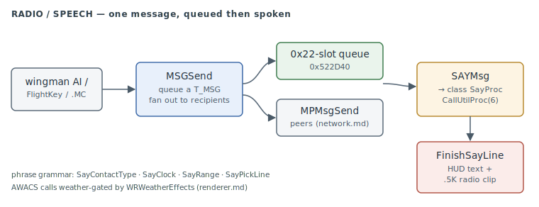

# Radio / Speech — orders & AWACS chatter

The in-game voice: the **message queue** (`MSG*`) that carries every order and event
between planes, and the **speech layer** (`SAY*`) that turns a queued message into a HUD
line plus a played `.5K` radio clip. This is what produces wingman comms, AWACS/GCI calls,
low-fuel and rearm prompts, and the running combat chatter.

> **Provenance:** Ghidra static analysis of the game executable with [FA.SMS](formats/SMS.md) symbols applied; recorded in the [symbol database](https://github.com/jomkz/fighters-codex/blob/main/db/symbols/radio.csv) and applied to the Ghidra project. Progress: [reconstruction matrix](reconstruction.md). Markers follow [spec-authoring.md](../spec-authoring.md): confirmed · inferred · unknown.

## The message queue (`MSG*`, #493)

`MSGSend` (`0x4180A0`, the subsystem's largest function) is the single primitive behind
every order and combat event. It queues a **`T_MSG`** record into a fixed 0x22-slot table
(`0x522D40`, stride `0xD5`; the `+6` fire-time word is `0xFFFF` when the slot is free):
confirmed

```
T_MSG  +0x00 u8   flags (bit0 = silent, bit2 = from-network)
       +0x01 u8   random salt (line variation)
       +0x02 u16  fromId
       +0x04 u16  toId
       +0x06 u16  fireT   (_currentT + delay; 0xFFFF = empty slot)
       +0x08 u16  param
       +0x0A u8   kind    (the SayProc opcode — see below)
       +0x0B i16  payloadLen (<=200)
       +0x0D …    payload
```

Recipient addressing is the interesting part: a `toId` of `0x8000`/`0x8001`/`0x8002` is not
an object — it **fans out** through `WNGPart`/`WNGWingmen`/`WNGLeader` to the leader, the
whole wing, or the wing-minus-sender; `0x8003 + thisComputer` addresses a specific human
station; `0x800B` is an any-AI wildcard used by `MSGReceive`. Local AI recipients are
serviced immediately (`ImmediateService`); non-local recipients are mirrored to peers by
`MPMsgSend`. If the message is addressed to the player and audible, `MSGSend` also calls
`SAYMsg` so the player hears it. confirmed

`MSGReceive` pulls the first due message matching a recipient mask; `MSGMultiGet`/
`MSGMultiCanGet` are the multiplayer relay path; `MSGHide`/`MSGPop` bracket a burst of
orders so only the net effect is spoken; `MSGRemoveCurObj`/`MSGRemoveSecondaries` are the
death/cleanup purges. `MSGSendChatter` (owned by [network.md](network.md) as a shipped-.MC
import) is the mission-script entry point that sends a chatter line to a wing. confirmed

## The speech layer (`SAY*`, #493)

`SAYMsg` (`0x48D350`) renders one queued message: it pushes the sender as the current
object and dispatches to that object class's **SayProc** via `CallUtilProc(6)` — the
`OBJSayProc` dispatch slot [objects.md](objects.md) names but never followed. The procs
live with the object system (`_PLANESayProc` `0x48D780`, `_OBJSayProc` `0x48E8D0`,
`_PLANECommentProc` `0x48EC40`), and each builds a line out of the shared SAY helpers
documented here. confirmed

Line construction is a small phrase grammar, assembled into two accumulators (text at
`0x552FF0`, a comma-separated `.5K` sound-name list at `0x553050`) and flushed by
`FinishSayLine`/`SayFlushLine`: confirmed

- **`SayPickLine`** chooses one of N alternative lines for a topic — random when there is
  no sender, otherwise `senderId % N` so a given plane says it consistently.
- **`SayContactType`** builds "*N bandit(s)*", special-casing MiG-17/19/21 by type-name
  prefix and appending the aspect word from the target's facing bits.
- **`SayClock`** / **`SayRange`** / **`SaySpellNumber`** / **`SayNumberWord`** are the
  "*your 3 o'clock, high*", "*2 miles*", digit-spelling, and number-word builders.
- **`SayContactCall`** and **`SayWaypointCall`** assemble the full AWACS "*Contact, multiple
  bandits, …, please advise*" and "*Proceed to waypoint N, bearing X, descend to angels Y*"
  transmissions — both **weather-gated** by `WRWeatherEffects` (see
  [renderer.md § Weather](renderer.md#weather-atmosphere-and-visibility-493)), so a call only
  reports what the caller could actually see.

`FinishSayLine` prefixes the speaker's callsign (`SayObjName`; "CO-PILOT"/"VOICE" for the
player), `HUDMessage`s the text, plays the `.5K` list at radio volume, and arms the chatter
cooldown (`SayScaleTime` scales it by time compression). `SayFlushLine` additionally
re-sends the line over the network so remote players hear it. confirmed

**Fixed lines.** `SAYLowFuelMessage` is the Joker/Bingo/"running on fumes"/"out of gas"
ladder, each fired once via plane-flag latch bits; `SAYRearmMessage`, `SAYSuppRadarMessage`
(AWACS/GCI link on/off/broken), and the Fort reports (`SAYFortAircraft`/`SAYFortStatus`)
round it out. `SAYTranslate` swaps an English distress clip for its Russian equivalent when
the player flies a MiG (side `0x14`/`0x15`). confirmed



## Functions

Full record: [`db/symbols/radio.csv`](https://github.com/jomkz/fighters-codex/blob/main/db/symbols/radio.csv).

| VA | Symbol | Role |
|----|--------|------|
| `0x4180A0` | `MSGSend` | queue an order/event to one or a fanned-out recipient set |
| `0x4185A0` | `MSGReceive` | pull the first due message for a recipient mask |
| `0x48D350` | `SAYMsg` | render a queued message via the object SayProc |
| `0x48D470` | `FinishSayLine` | speak the assembled line (HUD text + `.5K` audio) |
| `0x48E740` | `SayContactCall` | the full AWACS contact call (weather-gated) |
| `0x48EB20` | `SAYLowFuelMessage` | the Joker/Bingo/fumes/out-of-gas ladder |
| `0x490F30` | `SAYTranslate` | English→Russian distress-clip swap for MiG players |

## Open Questions

### 1. The SayProc bodies are owned by the object system

`_PLANESayProc` / `_OBJSayProc` / `_PLANECommentProc` (the per-class line generators, and
`_PLANECommentProc`'s 2.6 KB of unscripted air-combat banter) are claimed in
[`db/symbols/objects.csv`](https://github.com/jomkz/fighters-codex/blob/main/db/symbols/objects.csv)
with their chatter-state globals (`_sayLastComment`, `_sayCommentUntil`, …). They dispatch
*through* this subsystem (`SAYMsg` → `CallUtilProc(6)`) but are documented as object
behaviour. The split is deliberate; this doc is the transport + phrase-grammar half.

*Status: resolved (by design) — the procs live with [objects.md](objects.md); the pipeline is here.*

### 2. The `kind` opcode table

`PLANESayProc`'s switch enumerates the message kinds (5 break, 6 approach, 0xB engage,
0x12 firing, 0x14 splash, 0x1C in-range, 0x1F mission-accomplished, …). They are the same
opcodes `FlightKey` and the wingman AI pass to `MSGSend`; a consolidated kind→line table
would be a useful reference but is mechanical to extract.

*Status: open — re-static (tabulate the PLANESayProc/PLANECommentProc kind switch).*

## Related

- [objects.md](objects.md) — the SayProc dispatch slot and the per-class line generators.
- [wingman.md](wingman.md) — the wing/group AI that issues most orders via `MSGSend`.
- [network.md](network.md) — `MSGSendChatter` and the `MPMsgSend` peer mirror.
- [renderer.md](renderer.md) — `WRWeatherEffects`, the visibility model AWACS calls respect.
- [chat.md](chat.md) — the human multiplayer chat that rides the same `MSGSend` path.
