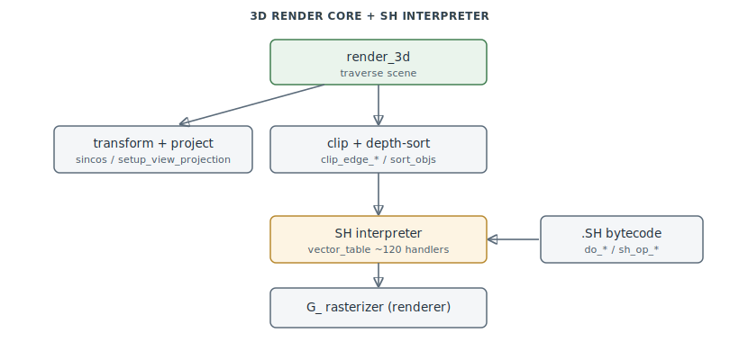

# 3D Render Core & SH Interpreter (GR)

The 3D scene pipeline that turns transformed geometry into the 2D rasterizer calls — and the
hand-written threaded-code **SH interpreter** that executes `.SH` shape bytecode into it.
`0x4CD588–0x4D6C00`. This is the layer above the [2D rasterizer](renderer.md): `render-core`
issues the `G_*` calls, `renderer` fills them.

> **Provenance:** Ghidra static analysis of the game executable with [FA.SMS](formats/SMS.md) symbols
> applied; recorded in the
> [symbol database](https://github.com/jomkz/fighters-codex/blob/main/db/symbols/render-core.csv)
> and applied to the Ghidra project (the ~120 `vector_table` SH-opcode handlers, previously
> created only by `AnalyzeSHDispatch.java`, are now captured in `db/` and materialised on
> apply). Progress: [reconstruction matrix](reconstruction.md). Markers follow
> [spec-authoring.md](../spec-authoring.md): confirmed · inferred · unknown.

## The 3D pipeline

`render_3d` (`0x4CDCB8`) traverses the scene; `setup_view_projection` builds the per-frame
aspect/head-vector/frustum constants from zoom and screen size; `check_flat` picks the flat
vs. perspective path from the object matrix. Fixed-point math leaves (`sincos`, `acos`,
`isqrt16`) back the transforms; Sutherland–Hodgman `clip_edge_{left,right,top,bottom}` clip
polygons to the screen; `_Sun` computes the lighting dot product; and `sort_objs_wrapper`
depth-sorts (painter's order, no z-buffer). The public API (`GRInit3d`, `GRRender`, `GRExec`,
`GRTo2d`, `GRSinCos`, `GRAddBrentObj`, `GRSetLightSource`) is how the rest of the engine
drives it; `GRAddBrentObj` queues a shape into the render-sort list.

## The SH interpreter

Each queued shape is drawn by the **SH bytecode interpreter** — a hand-written threaded-code
dispatcher over the `vector_table` (`0x5183A0`, ~120 handlers indexed by opcode). Handlers
(`do_*` / `sh_op_*`) walk the `.SH` instruction stream, apply transforms
(`do_xformunmask`), and synthesize the polygon micro-programs that dispatch into the
[`G_*` 2D rasterizer](renderer.md) (`do_new_poly` for opcode `0xFC` faces). Ten unassigned
opcodes share a single `sh_op_stub` no-op. This is the same interpreter documented, from the
format side, in [SH.md](formats/SH.md) (epic #52) — here it is named and mapped as engine
code.

## Functions

Full record: [`db/symbols/render-core.csv`](https://github.com/jomkz/fighters-codex/blob/main/db/symbols/render-core.csv).

| VA | Symbol | Role |
|----|--------|------|
| `0x4CDCB8` | `render_3d` | scene traversal / per-frame 3D entry |
| `0x4CDEB4` | `setup_view_projection` | per-frame view/projection/frustum setup |
| `0x4CE4B4` | `check_flat` | pick the flat vs. perspective render path |
| `0x4CD588` | `sincos` | table-lookup sine/cosine (transform core) |
| `0x4CD8B0` | `_Sun` | light dot-product against the world light source |
| `0x4CD8F0` | `clip_edge_right` | Sutherland–Hodgman screen-edge clip |
| `0x4CE968` | `sort_objs_wrapper` | painter's-order depth sort |
| `0x4D3194` | `do_xformunmask` | SH opcode `0xC4`: render a sub-stream at a relative transform |
| `0x4D0C8A` | `sh_op_6A` | SH opcode `0x6A` handler (render-state/geometry) |
| `0x4D17E0` | `sh_op_stub` | shared no-op for 10 unassigned SH opcodes |

## Open Questions

### 1. Remaining `sh_op_*` handler semantics

The `vector_table` handlers are named and materialised; the larger handlers' exact
geometry/state effects are the remaining substrate for finishing [SH.md](formats/SH.md)'s
`Unk*` opcodes.

**Characterized.** `sh_op_80` (`0x4D1FC0`) is a **shading/colour-setup** opcode: it early-outs
on `codes_and`, and when `gouraudOn == 0` calls `SetFlatColor(a, b)` — i.e. it selects flat vs.
Gouraud shading and stages the primitive colour. `sh_op_78` (`0x4D3938`, the 2085-byte largest
handler) is a **bounding-box visibility cull**: it reads a center point plus an extent vector,
transforms the extent by the view matrix, and forms the box's **8 corners** (`center ± (±dx,
±dy, ±dz)`); it projects each via `code_pnt` (a Cohen–Sutherland clip outcode) and range-tests
them, **trivially rejecting** the guarded geometry when the box falls outside a frustum edge. It
emits no geometry — a cull/LOD gate, not a mesh op. (This matched OpenFA, which likewise treats
`0x78` as an opaque fixed-size instruction, and explains why a static codec can skip it safely.)

*Status: open — re-static ([#262](https://github.com/jomkz/fighters-codex/issues/262); `sh_op_78`
and `sh_op_80` characterized; the remaining larger handlers' fine state effects continue).*

## Related

- [renderer.md](renderer.md) — the `G_*` 2D rasterizer this core drives.
- [formats/SH.md](formats/SH.md) — the `.SH` shape-bytecode format this interpreter runs.
- [shape-selection.md](shape-selection.md) — whole-model selection feeding `GRAddBrentObj`.
- [terrain.md](terrain.md) — terrain geometry enters the same pipeline.
