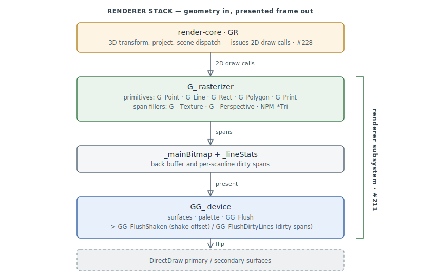

# Renderer & Rasterizer

The **2D graphics device and software rasterizer** — the primitive-drawing library the whole
game renders through. Two layers: `GG_*`, the DirectDraw surface/mode/palette/present device
(`0x45DBD0–0x45E460`), and `G_*`, the software rasterizer — points, lines, rectangles,
polygons, text, bitmap blit/scale, and the polygon/triangle span fillers (`G_*` clusters at
`0x497330`, `0x4B7900`, and the span fillers at `0x4C6000+`). Functions are identified by
virtual address (VA) and SMS name where available.

> **Scope:** this is the [reconstruction-program](reconstruction.md) `renderer` subsystem
> (#211) — the device + rasterizer. The generic **3D scene pipeline** that drives it (`GR_*`:
> transform, project, scene dispatch, camera, culling) is the separate **render-core**
> subsystem, documented in [render-core.md](render-core.md) (#228, landed). The horizon/sky
> path (§1 Scene Dispatch, §10 Horizon) is kept here because it is the concrete consumer of
> the device — its entry point `T_DrawHorizon` is filed under the
> [terrain](reconstruction.md) subsystem in the symbol database and is cross-referenced from
> [LAY.md](formats/LAY.md), which owns the atmosphere lookup-table side. §5 Camera and §6
> Visibility remain provisional pending consolidation into render-core.md. The
> [SH shape format](formats/SH.md) is its own subsystem.

> **Provenance:** Ghidra static analysis of the game executable with [FA.SMS](formats/SMS.md) symbols
> applied; every symbol here is recorded in the
> [symbol database](https://github.com/jomkz/fighters-codex/blob/main/db/symbols/renderer.csv)
> and applied to the Ghidra project. Confidence markers follow
> [spec-authoring.md](../spec-authoring.md): confirmed · inferred · unknown.

---

## 1. Scene Dispatch

The per-frame scene is built inside `T_DrawHorizon` (`0x4aacfe`), the sole caller of `@G_Tile@32`
(`0x447aa5`). It is reached through the adjacent `_T_DefaultHorizon` horizon descriptor
(`0x4aacf0`); the LAY DLL's dispatch table resolves the horizon slot to this render path at load
time. The dispatch chain is:

| VA | SMS name | Role |
|----|----------|------|
| `0x4aacf0` | `_T_DefaultHorizon` | Default horizon descriptor record (14 B, symbol DB · `terrain`) — the data the horizon/scene render is reached through |
| `0x4aacfe` | `T_DrawHorizon` | Core per-frame scene builder — clips the viewport, selects colour tables, calls `_SolidHorizon`, `_GouraudHorizon`, `@G_Tile@32`, and `@GRExec@4` |

`T_DrawHorizon` takes 13 parameters encoding clip rect, fog colour entries, and atmosphere flags. Its
first act is to test `DAT_00583a58` and `DAT_00573396` to choose between a sky-tile path and a
straight solid-horizon path.

Key globals read at scene start:

| Global | Role |
|--------|------|
| `_clipLeft`, `_clipRight`, `_clipTop`, `_clipBottom` | Active viewport clip rectangle |
| `_currentLayer` | Bitmask of active LAY layer flags (bit 3 = sun, bit 4 = cloud layer, bit 14 = tile mode) |
| `_currentTimeOfDay` | Used to gate sun rendering against `DAT_00583a82`–`DAT_00583a86` window |
| `_hackSky` / `_hackHorizonUp` / `_hackHorizonDown` / `_hackGround` | Debug overrides for sky palette — skips `_currentTintTable` lookup when non-zero |
| `DAT_00573394` | Cloud/tile quality level (0 = no tile, 1 = reduced, 2+ = full) |
| `_currentTintTable` | Per-layer atmosphere colour table (the active LAYER's tint LUT, set at load — see [LAY.md](formats/LAY.md#layer-struct-layout-0x160-bytes)). `T_DrawHorizon` reads individual band colours as single bytes at `+0xd4`/`+0xdf` (sky-top / horizon-down, clear) and `+0xed`/`+0xfc` (overcast), `+0xe5`/`+0xec` (upper sky / horizon-up), `+0xf0` (ground), and `+0xf1`/`+0xf3`/`+0xf4` (Gouraud gradient endpoints), then passes them as the colour arguments to `_SolidHorizon`/`_GouraudHorizon`. `_hackSky`/`_hackHorizon*`/`_hackGround` override this whole lookup when non-zero |

The scene dispatch builds a `GRExec` command list on the stack (a `0xf8`-terminated short-int
stream), then calls `@GRExec@4` (`0x4d6498`) to execute it, which renders the sky gradient and
cloud tiles.

---

## 2. Shape System (.SH Files)

The `.SH` string appears at over 60 data addresses in the `0x4F4E00`–`0x50C441` range, used as
file-extension literals in load/lookup paths. The primary load infrastructure sits in two
confirmed SMS functions:

| VA | SMS name | Role |
|----|----------|------|
| `0x47a130` | `@LibFileExists@4` | Tests whether a named asset (with `.SH` extension check at `0x47a3cc`) exists in any mounted LIB |
| `0x4ad3c0` | `_LoadFile@16` | Generic asset loader; resolves `.SH` extension at `0x4ad7bd` and hands off to the resource manager |

The resource manager exposes:

| SMS name | Role |
|----------|------|
| `_RMAccess_8` | Lock an already-loaded asset handle for read |
| `_RMAccessHandle_8` | Load by name + flags, returning a locked handle |
| `_RMChangeType_12` | Swap the file extension on a name buffer (used to resolve terrain-variant `~` names) |
| `_MMAllocHandle_8` | Allocate a tracked memory handle |
| `_MMAccessW_4` | Get a writable pointer from a handle |
| `_MMAccessR_4` | Get a read-only pointer from a handle |
| `_MMFreeHandle_4` | Release a handle |

Shape handles are stored in the runtime entity struct — the `OBJ_TYPE` record in a `.PT`/`.OT`/`.NT`
file names shapes via `~` asset references, which the engine resolves at mission load into resource
handles. No dedicated "shape cache" table was found in the analysed range; caching is implicit via
the resource manager's handle pool.

---

## 3. Polygon and Vertex Pipeline

The rasteriser is split into a fixed-integer path (`G_UPolygon` family) and a floating-point
near-plane-mapped path (NPM, prefixed `NPM_`).

### 3.1 Integer polygon path

| VA | SMS name | Role |
|----|----------|------|
| `0x4984b0` | `@G_PolygonFlip@8` | Submit filled polygon; integer fixed-16.16 vertices |
| `0x4984f0` | `@G_UPolygonFlip@8` | Unclipped variant — fast path when all vertices are inside the viewport; falls through to `_G_FloatFlatFlip_8` when `_cFillType` is set and the `0x10000` effects bit is active |
| `0x498530` | `@G_SPolygonFlip@8` | Shaded polygon (Gouraud) flip |
| `0x498550` | `@G_SUPolygonFlip@8` | Shaded + unclipped flip |
| `0x4c6ecc` | `@G_UPolygon@8` | Core integer rasteriser — walks vertices in fixed-16.16 screen space, computes left/right edge slopes, fills spans via `_G_DrawYLR_4` |
| `0x4c77d0` | `@G_SUPolygon@8` | Shaded (Gouraud colour-interpolated) variant of `G_UPolygon` |
| `0x4c7350` | `UPolygonToYLR` | Converts polygon vertices to a YLR (Y, Left, Right) scanline list |

Vertex format (5 words per vertex, 16.16 fixed point): `[x_fp, y_fp, u_fp, v_fp, c_packed]`.

The `_G_DrawYLR_4` fill loop writes `_cColor` (flat) or a per-pixel Gouraud-interpolated colour into
the current bitmap row pointer obtained from `_cb` (the current render-target bitmap handle).

Clip globals used by `G_UPolygon`:

| Global | Role |
|--------|------|
| `_eclipLeft`, `_eclipRight`, `_eclipTop`, `_eclipBottom` | Extended clip rect for polygon clipping (wider than viewport) |
| `_no_overlap` | When non-zero, right edge is exclusive — avoids overdraw at tile seams |
| `_overflow_ptr` | Exception-handler slot — set to `_divide_by_ebp_handler` during raster inner loops |

The `fx_render::fa` span core reproduces this path — `PolygonToYlr` (`UPolygonToYLR`) feeding
flat YLR span fills with the `_no_overlap` exclusive-right-edge rule — with the stepping
conventions recorded as inferred: edge x evaluated per integer scanline from the 16.16 slope,
span endpoints truncated (`x >> 16`, inclusive right by default), and vertical coverage
half-open (`⌈y_min⌉ … ⌈y_max⌉ − 1`, so vertically abutting polygons never overdraw). Pinned by
`tests/render/test_fa.cpp` (#329). The shaded variant (`G_SUPolygon`) rides `c_packed` — a
**palette/shade index**, not an RGB blend — through the same edge/span stepping, evaluated at
each pixel's integer x and clamped to the palette range (both inferred); flat-vs-Gouraud
selection is the `_cFillType` dispatch the SH interpreter stages via `sh_op_80`/`SetFlatColor`
(#330).

### 3.2 Near-plane mapped (NPM) floating-point path

Used for perspective-correct texture-mapped polygons that may cross the near plane.

| VA | SMS name | Role |
|----|----------|------|
| `0x4b8e10` | `?NPM_clipTop@@YIJPAUFVERTEX@@0@Z` | Clips a triangle against the top frustum plane; populates `DAT_005843d8` with surviving vertex count |
| `0x4b8f70` | `?NPM_clipTri@@YAJPAUFVERTEX@@@Z` | Clips one triangle; initialises float vertex buffer at `DAT_005843e0`–`DAT_005845a0`; writes guard bits `DAT_00584834` (AND) and `DAT_00584838` (OR) for trivial-accept/reject |
| `0x4b90c0` | `?NPM_clipAndScan@@YIJPAUFVERTEX@@J@Z` | Clips + scans a triangle to `DAT_0058b7d4`/`DAT_0058b7e4` (Y-top/Y-bottom) |
| `0x4b9430` | `?NPM_FlatTri@@YIXPAUFVERTEX@@J@Z` | Flat-shaded triangle inner loop; called by `_G_FloatFlatFlip_8` |
| `0x4b9630` | `?NPM_TextureLinearTri@@YIXPAUT_BITMAP@@PAUFVERTEX@@J@Z` | Linearly texture-mapped triangle; called by `_G_FloatTextureLinearFlip_12` (`0x4ba500`) |
| `0x4b9b90` | `?NPM_TexturePerspectiveTri@@YIXPAUT_BITMAP@@PAUFVERTEX@@J@Z` | Perspective-correct texture triangle; called by `_G_FloatPerspectiveFlip_12` (`0x4ba660`) |

FVERTEX layout (7 floats): `[x_screen, y_screen, u, v, w_reciprocal, clip_flags, pad]`. The clip
flag word uses bit 2 (`0x4`) for the top-plane guard.

Texture coordinate interpolation sets up six `_DAT_0058b7??` doubles as gradient coefficients
(du/dx, dv/dx, dw/dx, du/dy, dv/dy, dw/dy), then calls `(*(code *)_gbuffer)()` which is a
function pointer to the actual scanline fill kernel selected at startup.

`fx_render::fa` reproduces the clip stages: the outcode near-plane scheme (`CodePnt`,
AND-reject / OR-accept guard words, straddlers cut with attributes interpolated —
`NearClipPolygon`), the screen-edge Sutherland–Hodgman polygon clip in the render-core
`clip_edge_{left,right,top,bottom}` order (`G_Polygon`'s clipped entry), and the
Cohen–Sutherland `G_ClipLine` for `G_Line`. The clipped and span-clamped paths are
cross-validated pixel-identical by `tests/render/test_fa.cpp` (#331).

### 3.3 Z-buffer

No dedicated Z-buffer write was observed in the rasteriser output — the game executable predates z-buffer
hardware and relies entirely on painter's-order submission (objects sorted back-to-front by the
scene graph before draw calls). The `_lineStats` array (base `0x5568a8`) is a per-scanline byte
flag used to mark which scanlines are occupied by a polygon, preventing re-scan of empty rows.

`fx_render::fa` reproduces this property structurally: the fa surface carries no depth buffer,
and occlusion comes only from the painter's-order submission list (`PaintersList`, the
`GRAddBrentObj` → `sort_objs_wrapper` stage) sorting back-to-front on the centroid+size key —
pinned, including a case where a z-buffer would disagree, by `tests/render/test_fa.cpp` (#332).

---

## 4. Sprite and Billboard Rendering

The SPRITE section in the analysis output has no decompiled function bodies — Ghidra either did not
recover functions in this range or they fall inside the dark zone (see section 10). The following
SMS symbol is confirmed present:

| VA | SMS name | Role |
|----|----------|------|
| `0x4440f0` | `_GRAPHICAddInvisible@20` | Adds an entity to the invisible (non-rendering) sprite list; allocates a 0x2B-type node via `FUN_00443b70` and populates a 4-byte position + 2-byte type field |

> **Correction (#488).** `_explode` (`0x401000`) is **not** a renderer function: it is the
> PKWARE DCL (Data Compression Library) decompressor — the same "explode" algorithm `fx_lib`
> reimplements in [`lib/src/blast.cpp`](https://github.com/jomkz/fighters-codex/blob/main/lib/src/blast.cpp),
> used to unpack `.LIB` archive members. Its "callback pointer / decode up to 0x800 bytes /
> lookup tables from `0x4eb0c0`–`0x4eb110`" are Blast's output callback and its Huffman/length
> decode tables, not particle state, and the struct it walks is the Blast state, not an entity.
> The earlier reading of `entity+0x2234` here is the contamination #488 traces into
> `structs.md`'s census and `network.md`'s CN_INFO table.

Additional billboard symbols seen in surrounding code:

| SMS name | Role |
|----------|------|
| `_G_Blit_36` | 2D blit (used for HUD elements and cockpit overlays) |
| `_G_Circle_16` | Filled-circle draw (lens flare, disruption ring) |
| `_G_AcTexture_12` | Binds a texture handle via `_G__AC_Texture` assembly kernel |

---

## 5. Camera and Viewport

The 3D-to-2D projection is handled by:

| VA | SMS name | Role |
|----|----------|------|
| — | `_GRTo2d_8` | Projects a world-space `F24_POINT3` to 2D screen coords; returns negative if behind the near plane |
| — | `_Move3d_16` | Translates and rotates a world point to camera-relative coords; takes position, heading, pitch angles |
| — | `_GRSinCos_12` | Look-up sin/cos from a packed angle (360 × 0xb6 units) |

These appear in `_HUDDraw_4` (`0x406a50`) and related HUD functions as the primary world-to-screen
pathway. The viewport centre is maintained in `DAT_00521d94` / `DAT_00521d96` (s16 x/y). The HUD
draw code reads `_mainV` (`DAT_00521084`) for the main viewpoint object index, and
`_xscale` / `_yscale` for screen-resolution scale factors (0 = 640×480 reference, non-zero for
higher resolutions).

Viewport clip bounds set by `T_DrawHorizon` (`0x4aacfe`):

- `_clipLeft`, `_clipRight`, `_clipTop`, `_clipBottom` — integer pixel bounds of the active clip rect
- `_clipWidth` / `_clipHeight` — derived dimensions; compared against 200/300 thresholds to select
  LOD fog distance (`param_8` = `0xFFFFFFEC` for narrow viewports, `0xFFFFFFC4` for full-width)

The texture coordinate scaling constants at `DAT_004e9528` and `DAT_004e9530` convert fixed-24.8
world units to float screen-space texture coordinates inside the NPM vertex preparation loops.

---

## 6. Visibility Culling

| VA | SMS name | Role |
|----|----------|------|
| `0x498a50` | `_G_Visible` | Per-entity visibility test against `_visibleLineStats`; result drives whether a shape is submitted for raster |
| `0x4b4b30` | `@WRCanSee@8` | Fog/weather-gated visibility check — calls `_WRWeatherEffects` to get visibility range, then `_Dist_8` for actual distance; returns bool |

`_visibleLineStats` (`0x5568a8`) is a byte array indexed by scanline. `_visibleTargetIds`
(`0x57cc70`) and `_numVisibleTargets` (`0x580bb4`) track the target entities visible on screen for
HUD target-box drawing.

`@WRCanSee@8` reads `entity+0x15` for each object's altitude (used to index a LAYER struct at
stride `0x160`) and `entity+5` for the object-type pointer (to get the `.SH` bounding radius at
`+0x3b`). Visibility is gated by weather — `_WRWeatherEffects` walks the LAYER stack between two
altitudes and returns the minimum visibility percentage.

The NPM triangle clipper (`NPM_clipTri`) performs near-plane culling by writing bit 2 of the FVERTEX
clip-flags word — if all three bits are set (`DAT_00584834 != 0`), the triangle is entirely behind
the near plane and discarded.

No LOD system was found in the analysed range. Terrain tile LOD is implicit in `@G_Tile@32` via
the `tileExpand__3JA` flag (set by `_tileExpand__3JA = (DAT_00573394 < 2)` in `T_DrawHorizon`).

---

## 7. DirectDraw Surface Management

| VA | SMS name | Role |
|----|----------|------|
| `0x4b7a80` | `_G_AllocSurfaceBitmap@8` | Allocates a W×H bitmap with a DirectDraw secondary surface; calls `CDirDraw::CreateSecondarySurface`, locks it via `CDirDrawSurface::Lock`, clears to zero, builds a row-pointer table, and returns an MM handle |
| `0x4b7bf0` | `@G_FreeSurfaceBitmap@4` | Releases the DirectDraw surface via `CDirDrawSurface::Destroy` and clears `_DDsurfaceBitmap__3PAVCDirDrawSurface__A` |

Key DirectDraw globals:

| Global | Role |
|--------|------|
| `_m_singleton_CDirDraw__1PAV1_A` | Singleton `CDirDraw` object — checked for null before any surface allocation |
| `_DDsurfaceBitmap__3PAVCDirDrawSurface__A` | Active secondary surface used for 3D rendering |
| `_surfaceBitmap__3PAEA` | Raw pixel pointer from the locked surface |
| `_cb` | Current render-target bitmap MM handle — read extensively by the rasteriser (`_cb + 6` = height, `_cb + 0x22` = row-pointer array) |

`G_AllocSurfaceBitmap` stores the DirectDraw surface's locked pixel pointer (`piVar3[9]`) and row
stride (`piVar3[4]`) directly into the bitmap header, then builds a `param_2`-entry array of row
pointers at the handle's data area starting at offset `+0x32`. The the game executable bitmap struct (used as
`_cb`) has this layout at known offsets:

| Offset | Field |
|--------|-------|
| `+2` | Width (pixels) |
| `+6` | Height (scanlines) |
| `+10` | Row stride (bytes) |
| `+0x22` | Row-pointer array pointer |

The `fx_render::fa` surface reproduces this record's semantics — runtime width/height/stride
with row-pointer access — as the reconstruction's software render target; the layout and the
192-entry 6-bit palette presentation are pinned by `tests/render/test_fa.cpp` (#328).

`@G_DoubleBitmapX@4` (`0x4b8bf0`) doubles a bitmap's width by duplicating each pixel horizontally,
used when upscaling to higher resolutions (`@G_DoubleBitmapY@4` at `0x4b8960` is the height twin).

---

## 8. WR Raster Subsystem

The WR (Weather/Raster) subsystem owns the sky palette, atmosphere state, and fog. All WR functions
were found in the dark zone `0x4B4200`–`0x4BEDFF` (see section 10).

| VA | SMS name | Role |
|----|----------|------|
| `0x4b4320` | `WRFogLayerUpdate` | Per-frame fog jitter — adds `Rand(51) - 25` to each LAYER's `fog_density` field at `+0xfe`, clamped to [217, 235] (0xD9–0xEB) |
| `0x4b4370` | `_WRInit@4` | Full WR initialisation — calls `_WRShutdown_0`, loads the `.LAY` DLL via `_RMAccess_8`, copies 30 dwords to `_hdr`, initialises `_currentShadeTable` and `_currentTintTable`, sets `_fillTypes`, copies the real palette, calls `_WRForcePaletteUpdate_0` and `_InitTmapRemaps` |
| `0x4b46d0` | `_WRShutdown@0` | Frees `_hdrPtr__3PAULAYER_FILE_HEADER__A` via `_MMFreePtr_4` and clears `DAT_0050c8b8` |
| `0x4b46f0` | `@WRInt@4` | Writes `DAT_0050c8b8` — single-byte WR-enabled flag |
| `0x4b4700` | `_WRForcePaletteUpdate@0` | Clears `_lastPalette` (0xC0 dwords) to force a full palette upload on the next frame |
| `0x4b4720` | `_WRWeatherEffects` | Queries visibility percentage for an altitude range — walks LAYER structs between two altitudes, returns the minimum `+0x14e` visibility byte |
| `0x4b4790` | `?InitTmapRemaps@@YIXXZ` | Clears the texture-remap cache (`DAT_00581140`, 0x843 entries) and resets `DAT_00583aa0` |
| `0x4b47b0` | `@SetTmapRemaps@0` | Checks the texture-remap cache for the current `_currentShadeTable`/`_currentTintTable`/`DAT_005843c4`/`DAT_005843c8`/`_globalColorAdd` combination; if not found, evicts LRU entry and calls `_DoSetTmapRemaps_0` to regenerate a 64-entry remap table, which is then copied into `_tmapRemapTable` |
| `0x4b48c0` | `@WRMakeHazeList@12` | Builds a haze-distance list for sky rendering — walks the active LAYER's `+0x3a` colour-entry list and interpolates fog density across its visibility ramp (`+0x12` `fog_alt_low`, `+0x16` `vis_lo`, `+0x1a` `fog_alt_high`, `+0x1e` `vis_hi` — see [LAY.md § LAYER struct](formats/LAY.md#layer-struct-layout-0x160-bytes)), emitting `(distance, colour)` pairs terminated by `0x7fffffff` into the `0x583940` buffer |
| `0x4b4990` | `@WRLensFlare@0` | Draws lens-flare halos when `_gamePrefs` bit 7 is set, `(*DAT_00580d90 & 8) != 0`, and `DAT_0050c8a2 > 0xb5` (sun above horizon); uses `_sunPoint` and `DAT_00583dbe` for projected sun position; calls `_G_Circle_16` for each flare disc from `DAT_0050c8d8` table |
| `0x4b4b30` | `@WRCanSee@8` | See section 6 |
| `0x4b3190` | `_WRGetLayer@8` | Returns the LAYER struct pointer for a given altitude (right-shifts by 8, clamps to LAYER array bounds) |
| `0x4b3d90` | `_WRUpdatePalette@0` / `_WRUpdatePalette__YSKYSx` | Per-frame palette animation — steps `_palSunWhiten`, `_palCockpitWhiten`, `_palBlacken`, `_gForceBlacken`, and `_palColor` toward their destination values, then applies to `DAT_00583b20`/`DAT_00583aa8` ranges via `_WRBlackenPalette_12`, `_WRWhitenPalette_12` |
| `0x4c8e20` | `_WRBlackenPalette@12` | Scales N×3-byte RGB entries by `(256 - param_3) / 256` toward black |
| `0x4c8e6c` | `_WRWhitenPalette@12` | Scales N×3-byte RGB entries toward 0x3F (VGA maximum) |
| `0x4c8ec8` | `_WRReddenPalette@12` | Shifts R channel toward 0x3F while darkening G and B |

`_WRInit@4` additionally sets up the `_fillTypes` dispatch table (14 entries at `0x60e99`–`0x60ea?`),
mapping fill-type indices to scanline fill kernel addresses, and loads cloud/sky PIC wildcards via
`FUN_004b4680` (a `strchr(name, '*')` + `_Rand_4` + `_Sprintf` pattern for wildcard PIC selection).

---

## 9. PIC Texture Loading

PIC textures are loaded into DirectDraw surfaces via the DirectDraw path in `G_AllocSurfaceBitmap`
(section 7). The binding to shapes uses the texture remap system:

| VA | SMS name | Role |
|----|----------|------|
| `0x4b87f0` | `@G_AcTexture@12` | Calls `_MMAccessW_4` to get a writable pointer to the texture handle, then calls `_G__AC_Texture()` — an assembly kernel that writes the texture pointer into the global raster state |
| `0x4b7c30` | `?RemapAdd@@YAXPAUT_HANDLE@@H@Z` | Adds a colour offset to all bytes in a PIC's pixel buffer (palette shift) |
| `0x4b7c60` | `?RemapRelocate@@YAXPAUT_HANDLE@@F@Z` | Applies a palette base-address relocation to a PIC handle |
| `0x4b47b0` | `@SetTmapRemaps@0` | See section 8 — builds the 64-entry `_tmapRemapTable` used by NPM texture kernels |

The texture-remap cache at `DAT_00581140` has 8 entries at stride `0x11A` each. Each entry holds
a generation counter, the effects mask (`_effects & 0x14`), five table pointers
(`_currentShadeTable`, `DAT_005843c8`, `DAT_005843c4`, `_currentTintTable`, `_globalColorAdd`),
and a 64-dword copy of `_tmapRemapTable`. On a cache miss, the LRU entry (lowest generation) is
evicted and `_DoSetTmapRemaps_0` regenerates the table.

For double-resolution modes, `@G_DoubleBitmapX@4` (`0x4b8bf0`) doubles a PIC's width by pixel
duplication, creating a 2× stretched copy for the higher-resolution renderer path.

`fx_render::fa` reproduces the textured fills over indexed texels: the affine u/v span
stepping on the five-word vertex (`G__Texture`), the NPM linear and perspective triangle
kernels (u·w′/v·w′/w′ interpolation with a per-pixel `carefulDiv`-guarded divide), and the
256-entry `_tmapRemapTable` shade/tint remap (`SetTmapRemaps`) applied per sampled texel —
pinned, including a linear-vs-perspective divergence golden, by `tests/render/test_fa.cpp`
(#333).

---

## 10. Horizon / Sky Integration

This section traces the sky/horizon pipeline **end-to-end**: from the LAY atmosphere lookup
tables through colour selection to the raster fills that put pixels on the surface. The
lookup-table side — how a `.LAY` DLL is loaded, how the active LAYER's tint/shade tables and
colour-entry list are resolved, and the fog/brightness/angle mechanics that populate them — is
documented in [LAY.md](formats/LAY.md) (§ [Engine Notes](formats/LAY.md#engine-notes)); this
section is that data's consumer.

`T_DrawHorizon` (`0x4aacfe`) is the per-frame scene builder; it is reached through the
`_T_DefaultHorizon` descriptor (`0x4aacf0`) whose slot the LAY DLL dispatch table resolves at
load time. Its sequence:

1. **`_T_Info_24`** — query atmosphere parameters into a local buffer.
2. **`_WRMakeHazeList_12`** (`0x4b48c0`) — build the fog-density list into a stack buffer at `0x583940` from the active LAYER's visibility ramp (§8).
3. **colour selection** — unless a `_hack*` override is set, read the sky/horizon/ground band colours as single bytes from `_currentTintTable` (offsets listed in §1) — the LAY tint LUT.
4. **`_SolidHorizon`** — draw a solid-colour sky band (clear sky or overcast).
5. **`@G_Tile@32`** (`0x447aa5`) — if `DAT_00583a42` is non-zero (cloud tiles enabled), draw cloud tile layer from the tile bitmap at `DAT_00583a50`×`DAT_00583a54`.
6. **`_GouraudHorizon`** — draw the horizon gradient band.
7. **`@GRExec@4`** (`0x4d6498`) — execute the GR command list (sky dome elements, sun disc).
8. Second `_SolidHorizon` + optional `@G_Tile@32` — draw the ground colour band.
9. Second `_GouraudHorizon` — draw the lower-horizon gradient.

The sun element is appended to the GRExec command list only when `_currentLayer & 8`, the current
time of day is inside `[DAT_00583a82, DAT_00583a86]`, and `DAT_0050c8a2 > -0x71d`. The sun entry
is a 4-short record: `[0xF8, _sunAngle, DAT_0050c8a2, 0]` followed by one dword `DAT_0057cd08`
(sun colour/brightness). The GRExec list is null-terminated by a `0` short.

The `_landFilename` global selects the terrain tile bitmap used for the distant ground plane when
`_currentLayer & 0x10` is clear. `DAT_00583a58` and `DAT_00583a66` / `DAT_00583a6a` control the
terrain tile distance fade thresholds.

### Solid horizon band — `_SolidHorizon` (`0x4c924c`)

The solid path draws a flat sky (or ground) band clipped to the tilted horizon line. It stores the
selected sky/ground colour bytes into `_sky_color_data` / `_ground_color_data`, then computes the
four horizon-line endpoints (`DAT_0050fd96`–`0x9c`) from the camera up-vector components
(`top_up`, `right_up`, `forward_up`) plus `__amtMoveHorizon` — the vertical horizon offset staged
by `T_DrawHorizon` — so the band tilts and slides with pitch/roll. A 4-iteration sign-bit loop
tests those endpoints against the viewport (`wleft_data`/`wright_data`/`wtop_data`/`wbot_data`) to
decide visibility. When the band is on-screen it clamps the four viewport edges
(`FUN_004c93c3`/`FUN_004c93f6`), orders the span endpoints into `hhigh`/`hxlow`/`hxhigh`/`hlow`,
and calls **`Horizon2d()`** — the scanline fill that writes the colour band into the raster
surface; otherwise it calls **`NoHorizon()`**. This is the terminal "through raster" step of the
solid path.

### Gouraud horizon gradient — `_GouraudHorizon` (`0x4c942c`)

The gradient path renders the sky/ground colour ramp as shaded polygons through the shared SH
interpreter. It saves and zeroes the viewer position (`__viewer_x/y/z`, so the gradient is drawn
in view space) and the `_effects`/`_effectsAllowed` flags, then stages a fixed set of gradient
quads into the `0x50fda0`–`0x50fe40` command region: the up/horizon/ground colour bytes (params
from the tint-table lookup) fill the per-vertex colour slots, and the screen-space deltas are
derived from the camera heading vector (`_headv_x`, `_headv_z`, right-shifted) so the bands tilt
with the horizon. It then **dispatches the staged polygons through `vector_table`**
(`(*vector_table[DAT_0050fda0*2])()` and `[DAT_0050fdfe*2]`) — i.e. the gradient sky is
rasterized by the same Gouraud draw-opcodes as any SH shape (see
[SH.md § Interpreter dispatch](formats/SH.md#interpreter-dispatch--vector_table-traced) and
[render-core.md](render-core.md#the-sh-interpreter)). Finally it restores the effects flags and
viewer position. The polygons land in the same triangle/span fillers documented in §3 and §8, so
both horizon paths converge on the rasterizer's fill kernels.

---

## 11. Dark Zone: 0x4B4200–0x4BEDFF

This range was explicitly annotated as the "shape manager range" in the Ghidra script but also
contains the entirety of the WR subsystem and several airport/carrier management functions.
Functions found within the zone:

| VA | SMS name | Notes |
|----|----------|-------|
| `0x4b4320` | `WRFogLayerUpdate` | Fog density jitter — see section 8 |
| `0x4b4370` | `_WRInit@4` | WR/LAY initialiser — see section 8 |
| `0x4b4680` | — | Wildcard PIC selector (strchr `*`, rand, sprintf) — called from `_WRInit` |
| `0x4b46d0` | `_WRShutdown@0` | WR teardown |
| `0x4b46f0` | `@WRInt@4` | WR enable flag setter |
| `0x4b4700` | `_WRForcePaletteUpdate@0` | Force palette upload |
| `0x4b4720` | `_WRWeatherEffects` | Weather/visibility query |
| `0x4b4790` | `?InitTmapRemaps@@YIXXZ` | Texture remap cache init |
| `0x4b47b0` | `@SetTmapRemaps@0` | Texture remap cache lookup/update |
| `0x4b48c0` | `@WRMakeHazeList@12` | Haze-distance list builder |
| `0x4b4990` | `@WRLensFlare@0` | Lens flare renderer |
| `0x4b4b30` | `@WRCanSee@8` | Fog-gated visibility test |
| `0x4b4bb0` | — | JPEG decoder init (allocates `JPEGMEM`-sized pool; sets up 11-slot vtable) |
| `0x4b4cf0` | — | JPEG allocator (`FUN_004b4cf0`) — bump-allocates from a two-segment pool |
| `0x4b4e30` | — | JPEG error handler (raises error code via vtable dispatch) |
| `0x4b4e60` | — | JPEG high-watermark allocator |
| `0x4b4f10` | — | JPEG row-pointer array allocator |
| `0x4b4fd0` | — | JPEG DCT row-buffer allocator |
| `0x4b5460` | — | JPEG row-decoder trampoline (calls per-row kernel from `param_2[10]`) |
| `0x4b5660` | — | JPEG row-decoder with 0x80-stride variant |
| `0x4b5700` | — | JPEG memory free (two-pass: free callback list then pool) |
| `0x4b5960` | — | JPEG marker parser — scans for `0xFF` start codes, dispatches to segment handlers |
| `0x4b5a90` | — | JPEG image-object init (sets up `FUN_004b7700` + 4 other vtable slots) |
| `0x4b5f90` | — | JPEG SOF parse stub — reads 2-byte segment length |
| `0x4b6410` | — | JPEG SOF0 handler — reads image dimensions, validates, allocates component table |
| `0x4b64c0` | — | JPEG SOF0 component descriptor reader — reads H/V sampling factors and quantisation table IDs |
| `0x4b6840` | — | JPEG SOS handler — reads scan header, validates component count (1–4), populates Huffman selector table |
| `0x4b6c20` | — | JPEG DHT segment skip handler |
| `0x4b6df0` | — | JPEG DQT (quantisation table) reader — reads up to 256-byte tables |
| `0x4b7700` | — | JPEG decoder state reset |
| `0x4b7890` | — | JPEG restart handler |
| `0x4b78c0` | — | JPEG decoder shutdown |
| `0x4b7a80` | `_G_AllocSurfaceBitmap@8` | DirectDraw secondary surface allocator — see section 7 |
| `0x4b7bf0` | `@G_FreeSurfaceBitmap@4` | DirectDraw surface release — see section 7 |
| `0x4b7c30` | `?RemapAdd@@YAXPAUT_HANDLE@@H@Z` | PIC palette shift |
| `0x4b7c60` | `?RemapRelocate@@YAXPAUT_HANDLE@@F@Z` | PIC palette relocation |
| `0x4b8bf0` | `@G_DoubleBitmapX@4` | Double-width bitmap duplication (height twin `@G_DoubleBitmapY@4` at `0x4b8960`) |
| `0x4b79b0` | `_G_AllocBitmap@12` | Software-only fallback bitmap allocation |
| `0x4b80??` | Various `G_Color*`, `G_Scale*`, `G_Texture*`, `G_Print*` wrappers | 2D graphics utility functions |
| `0x4b8d90` | `?carefulDiv@@YANPAMMM@Z` | Float divide with NaN/zero guard for texture gradient setup |
| `0x4b8e10` | `?NPM_clipTop@@YIJPAUFVERTEX@@0@Z` | Near-plane top-clip — see section 3.2 |
| `0x4b8f70` | `?NPM_clipTri@@YAJPAUFVERTEX@@@Z` | Triangle clipper — see section 3.2 |
| `0x4b90c0` | `?NPM_clipAndScan@@YIJPAUFVERTEX@@J@Z` | Clip + scan — see section 3.2 |
| `0x4b90d6` | — | NPM flat-triangle rasteriser inner loop |
| `0x4b9430` | `?NPM_FlatTri@@YIXPAUFVERTEX@@J@Z` | Flat NPM triangle — see section 3.2 |
| `0x4b9630` | `?NPM_TextureLinearTri@@...` | Linear texture NPM triangle — see section 3.2 |
| `0x4b9b90` | `?NPM_TexturePerspectiveTri@@...` | Perspective texture NPM triangle — see section 3.2 |
| `0x4ba400` | `@G_FloatFlatFlip@8` | Float flat polygon flip (vertex conversion + NPM dispatch) |
| `0x4ba500` | `@G_FloatTextureLinearFlip@12` | Float linear-texture polygon flip |
| `0x4ba660` | `@G_FloatPerspectiveFlip@12` | Float perspective polygon flip |
| `0x4ba770` | `@APInit@0` | Airport manager init — zeroes `DAT_0058e870` (0x21C dwords) |
| `0x4ba800` | `@APAdd@4` | Airport/carrier registration (up to 40 airports, stride 0x134) |
| `0x4ba870` | `@APDelete@4` | Remove airport by short ID |
| `0x4baac0` | `@APLandingType@8` | Determine valid landing approach type for an airport |
| `0x4baa10` | `@APTakeoffType@8` | Determine valid takeoff type (catapult, STOL, VTOL) |
| `0x4bad?0` | `@APNearest@20` | Find nearest compatible airport to a world position |
| `0x4baa?0` | `@APLandingType@8` | Returns landing capability flags |
| `0x4bab20` | — | Carrier-deck position check helper |
| `0x4bb?00` | Various `AP*` functions | Carrier/airport on-board tracking |
| `0x4bbd?0` | Various `AP*` / plane management | Plane wing/slot assignment |
| `0x4bbfe0` | — | Autopilot reset (gear up, flaps neutral, 100% throttle, enter state 0x1f) |
| `0x4bd950` | — | Airport taxiway/pad rotated-offset computation (`_RotatedOffset_20` × 9 pad slots) |
| `0x4be6a0` | `_APApproachPath@20` | Compute ILS approach path vectors |
| `0x4beb60` | `@APRemoveFromCarrier@0` | Remove current object from its carrier slot |
| `0x4bed70` | `_APHomeAirport@0` | Set player home airport from campaign state or nearest default |

The JPEG decoder cluster (`0x4b4bb0`–`0x4b7700`) is a stripped-down libjpeg port used to
decode `.PIC` files that are JPEG-compressed (as opposed to the raw 8-bit palette format). It reads
the `JPEGMEM` environment variable to override its memory pool size (default from `DAT_004e94d0`).

---

## Key Global Reference

| Global | Role |
|--------|------|
| `_cb` | Current render-target bitmap (MM handle) — updated by the flip path |
| `_effects` | Render effects bitmask — bit 0x4 = shadow, bit 0x10 = float fill, bit 0x10000 = NPM |
| `_cFillType` | Current fill type (0 = flat, 1 = shaded, 2+ = textured) |
| `_cColor` | Current flat fill colour (palette index) |
| `_currentShadeTable` | Pointer to the active shade (lighting) lookup table |
| `_currentTintTable` | Pointer to the active atmosphere tint table |
| `_globalColorAdd` | Global colour addition bias applied to all shading |
| `_fillTypes` | 14-entry dispatch table mapping fill-type codes to scanline fill kernels |
| `_gbuffer` | Function pointer to the active texture fill kernel (set by `SetTmapRemaps`) |
| `_tmapRemapTable` | 64-entry table mapping texture palette indices through the current shade/tint |
| `_sunAngle` | Packed sun azimuth (in 0xb6 units per degree) |
| `DAT_0050c8a2` | Sun elevation above the horizon (negative = below) |
| `DAT_0057cd08` | Sun disc colour/brightness for GRExec |
| `_realPalette` / `_curPalette` | 0xC0-entry (192) VGA 6-bit RGB palette (base + sky range) |
| `_lastPalette` | Copy of the last-uploaded palette; zeroed by `_WRForcePaletteUpdate` to trigger re-upload |

The raster-state subset of these globals — the clip box, `_cColor`, `_cFillType`, and the
192-entry palette — is reproduced by the `fx_render::fa` state block and pinned by
`tests/render/test_fa.cpp` (#328).

## Pipeline

The renderer is a strict stack: the 3D core (render-core, `GR_*`) transforms geometry into
2D calls; the `G_*` rasterizer turns those into spans; the `GG_*` device presents the
finished frame to DirectDraw. This subsystem owns the lower two layers.

## Functions

Representative subset of the device + rasterizer; the full record is in
[`db/symbols/renderer.csv`](https://github.com/jomkz/fighters-codex/blob/main/db/symbols/renderer.csv).

| VA | Symbol | Role |
|----|--------|------|
| `0x45DBD0` | `GG_InitMode` | create the DirectDraw surfaces and enter the graphics mode |
| `0x45DE70` | `GG_SetPalette` | upload the 192-entry palette to the primary surface |
| `0x45E120` | `GG_Flush` | present the back buffer (dispatches to the two paths below) |
| `0x45DEDF` | `GG_FlushShaken` | present with the current screen-shake offset |
| `0x45E13F` | `GG_FlushDirtyLines` | present only the dirty scanlines tracked in `_lineStats` |
| `0x45E3A0` | `GG_RestoreSurfaces` | rebuild surfaces after a DirectDraw device loss |
| `0x45CDA0` | `DrawAcrossBank` | span helper that draws across a VGA bank boundary |
| `0x497340` | `G_Init` | initialise the rasterizer (clip box, colour, font, line stats) |
| `0x4974F0` | `G_SetClipBox` | set the active clip rectangle |
| `0x4976D0` | `G_Point` | plot a single clipped pixel |
| `0x498160` | `G_Line` | draw a clipped line |
| `0x497BF0` | `G_Rect` | draw a clipped filled rectangle |
| `0x497DE0` | `G_ClipLine` | Cohen–Sutherland line clip against the clip box |
| `0x4986B0` | `G_Print` | draw a text string in the current font |
| `0x4B79B0` | `G_AllocBitmap` | allocate a rasterizer bitmap |
| `0x4B7CD0` | `G_LoadBitmap` | load a `.PIC`/brush into a bitmap |
| `0x4B7E10` | `G_RemapBitmapToPalette` | nearest-colour remap of a bitmap to `_curPalette` |
| `0x4B7FE0` | `G_Blit` | blit a bitmap to a surface |
| `0x4B8670` | `G_Scale` | scaled bitmap blit |
| `0x4B87F0` | `G_AcTexture` | affine-textured span setup |
| `0x4B9B90` | `NPM_TexturePerspectiveTri` | perspective-correct textured triangle rasterizer |
| `0x4C6ECC` | `G_UPolygon` | unclipped convex-polygon span fill |
| `0x4C8A38` | `G_Polygon` | clipped convex-polygon span fill |
| `0x4CAE38` | `G__Texture` | affine texture-mapped scanline span filler |
| `0x4CBD0B` | `G__Perspective` | perspective texture-mapped scanline span filler |

## Open Questions

### 1. `GG_Flush` path selection

A disassembly + caller sweep corrects the premise. `GG_Flush` (`0x45E120`) is a single
**SEH-wrapped flush routine** — called by `G_Flush` (`0x498420`) and `PlaySeq` — that itself
chooses **full-frame redraw** (when `_forceRedraw` is set, or at 320×200) versus the
**`_lineStats` dirty-line diff-blit** default; its SEH handler is at `0x45E356`. So the real
predicate is `_forceRedraw`/resolution *inside* `GG_Flush`, not a dispatch between two callees.
`GG_FlushDirtyLines` (`0x45E13F`) is a Ghidra **mid-function split** of `GG_Flush`'s own body
(it falls inside the `0x45E120`–`0x45E356` extent), not a separate function; `GG_FlushShaken`
(`0x45DEDF`) is a distinct 518-byte variant with **no direct callers** in the image (reached, if
at all, only via a shake path outside the analyzed call graph). Both facts — the
`GG_FlushDirtyLines` fall-through split and the uncalled `GG_FlushShaken` — are now recorded in
the [symbol-DB notes](https://github.com/jomkz/fighters-codex/blob/main/db/symbols/renderer.csv)
([#262](https://github.com/jomkz/fighters-codex/issues/262)).

*Status: resolved — re-static (single SEH flush; `_forceRedraw`/resolution predicate; DirtyLines is a Ghidra split).*

## Related

- [reconstruction.md](reconstruction.md) — the program this subsystem belongs to, and the
  forthcoming **render-core** (#228) 3D pipeline that drives this rasterizer.
- [objects.md](objects.md) — the object system whose draw-enqueue passes feed geometry in.
- [shape-selection.md](shape-selection.md) / [SH.md](formats/SH.md) — the shape format the
  3D core interprets into the polygon calls this rasterizer fills.
- [formats/PIC.md](formats/PIC.md) — the bitmap format `G_LoadBitmap` consumes.
