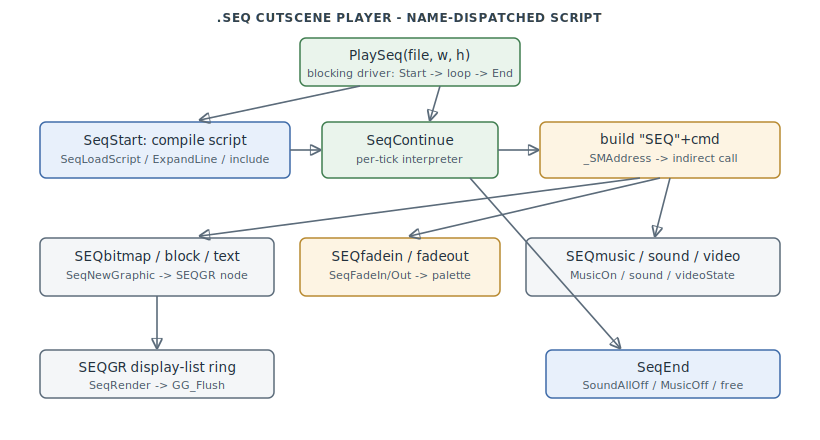

# FA.EXE .SEQ Cutscene Player

The **.SEQ sequence player** runs Jane's scripted intro/outro cutscenes from a **text
script file** (e.g. `g_intro`). It loads and compiles the script, then ticks a timeline of
commands that draw bitmaps, blocks and wrapped text into a display list, fade the palette,
and play music, sound and video. `0x444F70–0x4471E0` (plus the public entry `PlaySeq` at
`0x412C10`).

> **Provenance:** Ghidra static analysis of FA.EXE with [FA.SMS](formats/SMS.md) symbols
> applied; recorded in the
> [symbol database](https://github.com/jomkz/fighters-codex/blob/main/db/symbols/seq.csv)
> and applied to the Ghidra project. Progress: [reconstruction matrix](reconstruction.md).
> Markers follow [spec-authoring.md](../spec-authoring.md): confirmed · inferred · unknown.
> Found by the [reproducibility audit](https://github.com/jomkz/fighters-codex/blob/main/db/reproducibility-audit.md)
> as the 19th subsystem the original map missed (#240).

## Dispatch is by name, not by opcode

The defining feature of the `.SEQ` player is that **script commands are dispatched by
name through the shipped symbol table**, not through a switch or an opcode jump table.
`_SeqStart` reads the `.SEQ` file, performs `%N` argument substitution and `include`
expansion (`SeqLoadScript` → `SeqExpandLine` / `SeqParseInclude`), and compiles the result
into a per-slot command buffer. Each tick, `_SeqContinue` fetches the next line
(`SeqFetchLine` parses a leading `/abs` or `+rel` timecode), then for a command word like
`bitmap` it **builds the string `"SEQ" + command`** into a local buffer, resolves that
symbol at runtime with `_SMAddress` (a lookup into the same FA.SMS map this project
applies), and indirect-calls it with up to eight parsed operands.

The consequence for reconstruction is concrete: the twelve `_SEQ<verb>` handlers
(`_SEQbitmap`, `_SEQtext`, `_SEQmusic`, `_SEQvideo`, `_SEQwait`, …) are reached **only**
through `_SMAddress`, never by a direct `CALL`, so Ghidra's auto-analysis never created
them as functions. They exist in the binary — FA.SMS gives their addresses — and applying
the symbol database materialises them (`createFunction`). This is exactly the class of
name-dispatched leaf that a purely xref-driven inventory misses.

## Graphics: the SEQGR display list

Drawing commands do not paint immediately; they allocate **`SEQGR` nodes** from a
free-list (`SeqNewGraphic`) and link them into a ring (`seqGraphics`). Each node carries a
rect, a type (1 = bitmap, 2 = filled block, 4 = multiline colour text), an owning-sequence
index and an expiry tick. `SeqRender` walks the ring once per frame, expires aged nodes
(`SeqExpireGraphics`), and redraws the dirty ones under the current clip box
(`SeqDrawGraphic`), marking overlapped neighbours dirty so partial refreshes stay correct.
Palette fades run in parallel: `_SEQfadein` / `_SEQfadeout` latch a direction into
`seqFading`, and `SeqFadeIn` / `SeqFadeOut` blacken or restore `curPalette` by an
elapsed/length ratio each tick.

## Functions

Full record: [`db/symbols/seq.csv`](https://github.com/jomkz/fighters-codex/blob/main/db/symbols/seq.csv).

| VA | Symbol | Role |
|----|--------|------|
| `0x412C10` | `PlaySeq` | public entry — blocking `SeqStart` → tick loop → `SeqEnd` |
| `0x445060` | `SeqStart` | load `.SEQ`, alloc a `SEQUENCE` slot, compile the script |
| `0x445330` | `SeqLoadScript` | read the file, expand includes and `%N` substitutions |
| `0x445700` | `SeqContinue` | per-tick interpreter — build `"SEQ"+cmd`, `_SMAddress`-dispatch |
| `0x446500` | `SeqNewGraphic` | allocate a `SEQGR` node and link it into `seqGraphics` |
| `0x445ED0` | `SeqRender` | walk the display-list ring, expire + redraw dirty nodes |
| `0x446660` | `SEQbitmap` | script op — display a bitmap as a `SEQGR` node |
| `0x446F10` | `SEQtext` | script op — wrapped-text node via `FormatText` |
| `0x446B70` | `SEQmusic` | script op — start a music track (`MusicOn`) |
| `0x445E30` | `SeqEnd` | tear down all sequences — `SoundAllOff` / `MusicOff` / free |

## Open Questions

### 1. Dispatch prefix and keyword strings

The exact bytes of the dispatch prefix `DAT_004F4F5C` (inferred `"SEQ"`), the `sync`
keyword at `DAT_004F4F64`, and the `SEQmusic` suffix at `DAT_004F4F6C` are not recoverable
from the decompile dumps (binary-only rodata). They are waived in the symbol database with
notes rather than named on a guess.

*Status: open — re-static (needs a bench read of the rodata bytes).*

### 2. `SEQUENCE` / `SEQGR` struct maps — resolved

The program-wide struct-typing pass ([#230](https://github.com/jomkz/fighters-codex/issues/230))
addressed this: `SEQUENCE` (stride `0x38`), `SEQGR`, `SEQLBL`, `SEQFNT` and `SEQTXT` are declared
as the recovered type vocabulary in [db/types/fa_types.h](https://github.com/jomkz/fighters-codex/blob/main/db/types/fa_types.h),
and the FA.SMS array-base globals are typed against them (`seqGrArray`/`seqGrList`/`seqGraphics`
→ `SEQGR *`, `seqFontArray`/`seqFonts` → `SEQFNT *`, `seqTextArray` → `SEQTXT *`,
`seqLabelList` → `SEQLBL *`). Per that pass's conservative policy the struct *interiors* stay
reserved padding rather than guessed byte-exact layouts.

*Status: resolved — struct-typing pass (#230).*

## Related

- [sound.md](sound.md) — `MusicOn` / `SoundAllOff`, driven by the `SEQmusic`/`SEQsound` ops.
- [video-decode.md](video-decode.md) — the Cobra `.VDO` player the `SEQvideo` op invokes.
- [renderer.md](renderer.md) — `GG_Flush` and the bitmap blit the `SEQGR` renderer uses.
- [formats/SMS.md](formats/SMS.md) — the FA.SMS symbol map that `_SMAddress` (`0x46A4E0`) resolves the `"SEQ"+cmd` names against.
