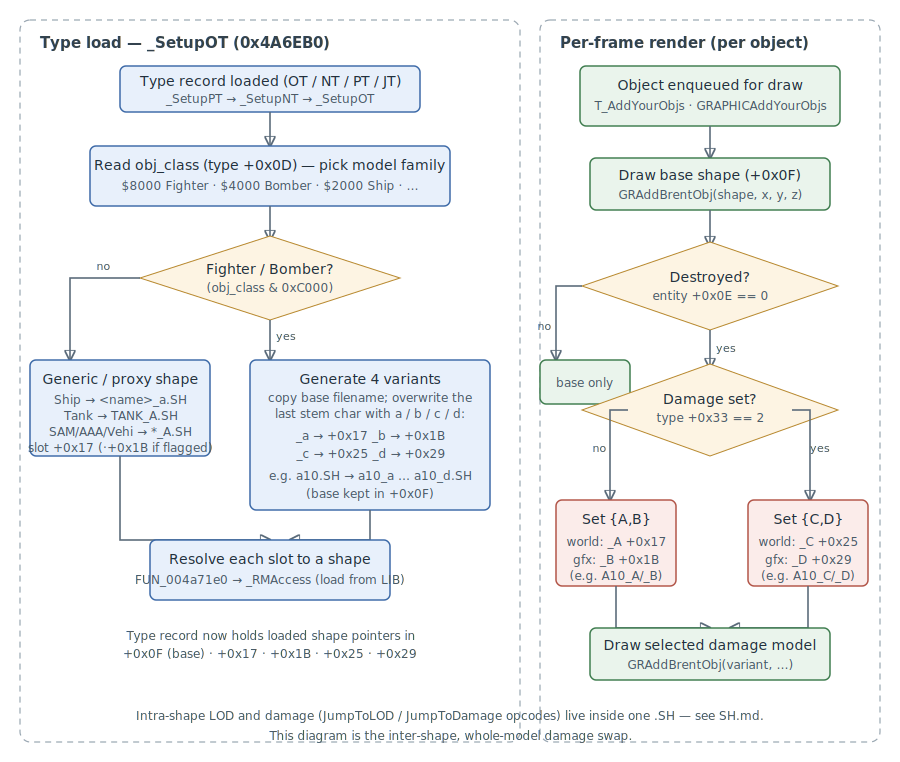

# Shape Selection & Damage Models

How FA.EXE chooses which `.SH` model to draw for a game object — the **whole-model
damage swap** that replaces an aircraft with a wreck when it is destroyed, and the
per-class variant set (`A10_A.SH`, `A10_C.SH`, …) that supplies those wrecks.

> **Provenance:** Ghidra static analysis of FA.EXE with [FA.SMS](formats/SMS.md)
> symbols applied; recovered from `DumpAllFunctions.txt`
> ([scripts/ghidra/](https://github.com/jomkz/fighters-codex/tree/main/scripts/ghidra)).
> Confidence markers follow [spec-authoring.md](../spec-authoring.md):
> confirmed · inferred · unknown.

## Two axes of shape variation

FA varies an object's geometry along **two independent axes**, handled by two
different mechanisms — keeping them straight is the key to reading this system:

| Axis | Granularity | Mechanism | Where |
|------|-------------|-----------|-------|
| Detail (distance) and articulation/damage *within* a model | **intra-shape** | `.SH` bytecode opcodes — `JumpToLOD`, `JumpToDetail`, `JumpToDamage`, and the x86 `_PL*` selectors | [SH.md → Engine Notes](formats/SH.md#engine-notes) |
| Whole-model swap when the object is **destroyed** | **inter-shape** | separate `.SH` files (`_A`…`_D`) chosen at render time | **this document** |

So `A10.SH` already contains its own LOD ladder and gear/flap articulation
(intra-shape); the sibling files `A10_A.SH`…`A10_D.SH` are *destroyed-state*
models that the engine substitutes when the aircraft dies. The two never overlap.

## The variant set is generated, not authored

The `.PT` type record names only the primary shape and the shadow (for the A-10:
`shape → a10.SH`, `shadow_shape → a10_s.SH`). The lettered variants appear in no
file — **the engine derives their names at type-load time.**

`_SetupOT` (`0x4A6EB0`) — reached for every object type via
`_SetupPT`/`_SetupNT`/`_SetupJT` → `_SetupOT` — copies the base filename and
**overwrites the last character of the stem** with `a`/`b`/`c`/`d`, producing the
sibling names, then resolves each through the resource manager
(`FUN_004a71e0` → `_RMAccess`) into a loaded shape pointer stored on the type
record:

```text
a10.SH  (template)  ──▶  a10_a.SH → +0x17   a10_b.SH → +0x1B
                         a10_c.SH → +0x25   a10_d.SH → +0x29
        base kept at +0x0F
```

**How many variants an object gets depends on its `obj_class`** (type `+0x0D`, the
same bitfield documented in [PT.md](formats/PT.md)):

| `obj_class` | Class | Variants generated |
|-------------|-------|--------------------|
| `& 0xC000` | Fighter (`0x8000`) / Bomber (`0x4000`) | full `_a` `_b` `_c` `_d` set — **confirmed** |
| `0x2000` | Ship | per-ship `<name>_a.SH` proxy — **confirmed** |
| `0x400` / `0x800` / `0x1000` / `0x200` | Tank / AAA / SAM / Vehicle | shared generic `TANK_A.SH` / `AAA_A.SH` / `SAM_A.SH` / `VEHI_A.SH` — **confirmed** |

The `_b` slot (`+0x1B`) is additionally gated on a type flag (`+0x0E & 0xC0`); the
`_c`/`_d` slots are built **only** for aircraft (the `& 0xC000` branch). This is
why every aircraft carries four siblings while a tank references one shared shape.

## Runtime selection — gated on destruction

The choice is made per object, per frame, in the two draw-enqueue passes. Both
always draw the **base shape** (`+0x0F`); then, **only when the object is
destroyed** — entity health word `+0x0E == 0` (the same word `ShapeSetup`
(`0x4AB450`) turns into the global `_destroyed`) and the entity carries the
`0x100000` flag — they add a second, whole-model wreck shape:

```c
// _T_AddYourObjs  (world / terrain pass)      // _GRAPHICAddYourObjs (graphics pass)
if (entity[0x0E] == 0 && (entity[1] & 0x100000)) {
    variant = (type[0x33] == 2) ? type[0x25]   //   variant = (type[0x33]==2) ? type[0x29]
                                : type[0x17];   //                              : type[0x1B];
    GRAddBrentObj(variant, x, y, z);            //   GRAddBrentObj(variant, ...);
}
```

The per-type field `+0x33` selects between **two damage-model sets**: `{_A, _B}`
when `+0x33 != 2`, `{_C, _D}` when `+0x33 == 2`. Within a set, one variant is
drawn in the world/terrain pass (`_A` or `_C`) and its partner in the graphics
pass (`_B` or `_D`). Distance never enters this decision — LOD is entirely
intra-shape.

`+0x33` is **not** authored in the type file — it is written at the moment of
destruction. `PLANEBreakUp` (`0x49D730`, the flight model's break-up handler)
sets `damage_set = _Rand(2) + 1` (so `1` or `2`) as it raises the destroyed
flags, then chooses ground vs. air debris. A value of `2` routes the object to
the `{_C, _D}` set, `1` to `{_A, _B}` — i.e. **the wreck pair is picked at random
per kill**, which is why the same airframe shows either the torn-airframe or the
flat-silhouette wreck across replays.



## Worked example — the A-10 family in `FA_2.LIB`

| File | Faces | Bounds (ft) | Role | Evidence |
|------|------:|-------------|------|----------|
| `A10.SH` | 81* | X ±81 | in-flight model (articulated, x86 `_PL*` selectors) | base slot `+0x0F`; gear/flap trampolines |
| `A10_A.SH` | 432 | X −87..80 | destroyed set `{A,B}` — world pass | slot `+0x17` |
| `A10_B.SH` | 98 | X ±13 | destroyed set `{A,B}` — graphics pass | slot `+0x1B` |
| `A10_C.SH` | 398 | X −45..**84** (asymmetric) | destroyed set `{C,D}` — world pass | slot `+0x25`; torn airframe |
| `A10_D.SH` | 80 | X −54..27, Z −2..3 (flat) | destroyed set `{C,D}` — graphics pass | slot `+0x29`; ground wreckage |
| `A10_S.SH` | 6 | Z = 0 | shadow | `.PT` `shadow_shape` |

<small>*`A10.SH` reports 81 extracted faces because the rest of its geometry sits
behind x86 selector blocks the `fx` codec skips — see
[SH.md → X86Unknown Region](formats/SH.md#x86unknown-region). Its true face count is
comparable to `A10_A`.</small>

The geometry corroborates the trace: `A10_C` is laterally **asymmetric** (one side
torn away) and `A10_D` is **flat** (a burnt ground silhouette) — destruction, not
detail reduction.

## Object-type record — shape fields

Recovered subset of the OT/NT/PT/JT **type record** (the struct `_SetupOT` operates
on; distinct from the per-instance [entity struct](structs.md)). Offsets are from
the type-record base.

| Offset | Size | Field | Meaning | Confidence |
|--------|------|-------|---------|------------|
| `+0x0D` | 2 | `obj_class` | class bitfield (drives variant generation) | confirmed |
| `+0x0E` | 1 | `type_flags` | `& 0xC0` enables the `_b` slot | inferred |
| `+0x0F` | 4 | `shape` | base shape → loaded pointer | confirmed |
| `+0x13` | 4 | `shape_name` | filename used as the suffixing template | confirmed |
| `+0x17` | 4 | `shape_a` | `_a` variant (loaded) | confirmed |
| `+0x1B` | 4 | `shape_b` | `_b` variant (loaded) | confirmed |
| `+0x25` | 4 | `shape_c` | `_c` variant (loaded), aircraft only | confirmed |
| `+0x29` | 4 | `shape_d` | `_d` variant (loaded), aircraft only | confirmed |
| `+0x33` | 4 | `damage_set` | `== 2` selects the `{_C,_D}` set; written `_Rand(2)+1` by `PLANEBreakUp` | confirmed |

Instance-side fields this system reads (see [structs.md](structs.md)): entity
`+0x05` → type record, `+0x0E` health word (`0` = destroyed), `+0x01 & 0x100000`
damage-model flag.

## Functions

| VA | Symbol | Role |
|----|--------|------|
| `0x4A6EB0` | `_SetupOT` | generate the lettered variant names and load every shape slot |
| `0x4A7200` / `0x4A7220` / `0x4A7230` | `_SetupNT` / `_SetupPT` / `_SetupJT` | per-type-kind entry points → `_SetupOT` |
| `0x4A71E0` | `LoadShapeSlot` | resolve one slot's name to a loaded shape via `_RMAccess` |
| `0x4A6B10` | `ResolveTypeRecord` | return the type-record pointer via the MM handle at `+0x0F` (`_SetupOT`'s first step) |
| `0x4A6AE0` | `_RMAccess@8` | resource-manager load/lock by name |
| `0x4A7A40` | `_T_AddYourObjs@0` | world/terrain draw-enqueue; selects `_A`/`_C` |
| `0x4431B0` | `_GRAPHICAddYourObjs@4` | graphics draw-enqueue; selects `_B`/`_D` |
| `0x4D057C` | `_GRAddBrentObj@40` | queue a shape into the render-sort list (consumes the [SH header](formats/SH.md#header-field-consumption-traced)) |
| `0x4AB450` | `@ShapeSetup@4` | per-object shape-state init; derives `_destroyed` from the health word |

## Open questions

### 1. `damage_set` (`+0x33`) derivation — resolved

`+0x33` is written at destruction time by `PLANEBreakUp` (`0x49D730`) as
`_Rand(2) + 1`, so the `{_A,_B}` vs `{_C,_D}` wreck pair is chosen at random per
kill rather than fixed per aircraft (see above). No longer open.

*Status: resolved — re-static.*

## Related

- [objects.md](objects.md) — the entity/object system that owns the type record and
  runs the destruction path.
- [SH.md](formats/SH.md) — the shape format; intra-shape LOD/damage/articulation
  opcodes and the x86 `_PL*` selectors (the *other* variation axis).
- [PT.md](formats/PT.md) — the plane-type record whose `obj_class` and shape fields
  feed this system.
- [structs.md](structs.md) — the per-instance entity struct (health word, type
  pointer, flags).
- [renderer.md](renderer.md) — the render-sort pipeline `GRAddBrentObj` feeds.
