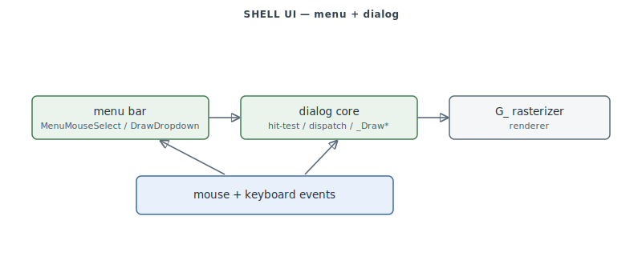

# FA.EXE Shell / Menu / Dialog UI

The out-of-cockpit interface: the **menu-bar** state machine and the **dialog/widget** core
that render and drive every menu screen, dialog box, and button. Re-carved from a nominal
range that was ~85% foreign into its two true clusters (menu core `0x40B8A0–0x40D79C`,
dialog core `0x487A3A–0x48D200`) plus scattered screen entries.

> **Provenance:** Ghidra static analysis of FA.EXE with [FA.SMS](formats/SMS.md) symbols applied; recorded in the [symbol database](https://github.com/jomkz/fighters-codex/blob/main/db/symbols/shell-ui.csv) and applied to the Ghidra project. Progress: [reconstruction matrix](reconstruction.md). Markers follow [spec-authoring.md](../spec-authoring.md): confirmed · inferred · unknown.

## Menu bar and dialogs

- **Menu core** (`0x40B8A0–0x40D79C`): the menu-bar state machine — `MenuStartUp`,
  `MenuLoadFont` (MENUFONT.PIC / MFONT320.PIC), `MenuMouseSelect` (hit-test), and
  `MenuDrawDropdown` (draw an opened submenu with background save/restore), over a
  `_firstMenu` linked list with palette-remap chrome.
- **Dialog/widget core** (`0x487A3A–0x48D200`): the DIALOG lifecycle — record hit-test and
  dispatch, and every `_Draw*` widget renderer (check/toggle/list-box/scrollbar) with
  edit/rocker/slider input. Many `_Draw*` handlers are label-only in FA.SMS and materialise
  on apply.

## Functions

Full record: [`db/symbols/shell-ui.csv`](https://github.com/jomkz/fighters-codex/blob/main/db/symbols/shell-ui.csv).

| VA | Symbol | Role |
|----|--------|------|
| `0x40BD30` | `MenuStartUp` | initialise the menu bar |
| `0x40C160` | `MenuLoadFont` | load the menu font PIC |
| `0x40C670` | `MenuMouseSelect` | hit-test the mouse over the bar/items |
| `0x40C990` | `MenuDrawDropdown` | draw an opened submenu |
| `0x40BF60` | `MenuMeasureItemWidth` | measure the widest menu label |

## Open Questions

### 1. DLG record types

The decompiled `_Draw*` widget renderers are the source for the unmapped `.DLG` record types
(1/3/4/5/7/8) still open in [DLG.md](formats/DLG.md).

*Status: open — re-static (#54).*

## Related

- [formats/DLG.md](formats/DLG.md) / [formats/MNU.md](formats/MNU.md) — the dialog and menu formats.
- [renderer.md](renderer.md) — the `G_*` rasterizer the UI draws through.
- [campaign.md](campaign.md) — the campaign/mission screens the shell hosts.
