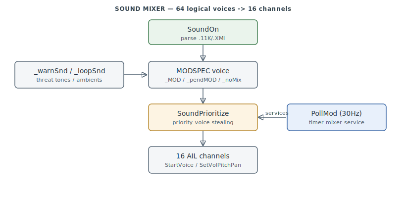

# Sound / Music

The audio engine: positional sound effects, threat-warning tones, ambient loops, and the
two-layer music system — all driven onto the Miles Sound System (WAIL32.DLL / AIL) through
a logical-voice mixer. `0x4328B0–0x435C60`.

> **Provenance:** Ghidra static analysis of the game executable with [FA.SMS](formats/SMS.md) symbols
> applied; recorded in the
> [symbol database](https://github.com/jomkz/fighters-codex/blob/main/db/symbols/sound.csv)
> and applied to the Ghidra project (five mixer functions folded into gaps — incl. the
> `PollMod` timer callback — are materialised on apply). Progress:
> [reconstruction matrix](reconstruction.md). Markers follow
> [spec-authoring.md](../spec-authoring.md): confirmed · inferred · unknown.

## Logical voices onto physical channels

`SoundOn` (`0x433680`) is the master SFX entry — it parses the `.11K`/`.XMI` name, allocates
a **`MODSPEC` logical voice**, and sets position/pitch/pan/falloff. There are 64 logical
voices across four banks (`_MOD`, `_pendMOD`, `_noMixLeft`, `_noMixRight`) that multiplex
onto **16 physical AIL sample handles**:

`SoundPrioritize` resolves contention by priority voice-stealing, with a waiting queue
(`_pendMOD`) drained by `StartWaitingSounds`. Two specializations: an 8-entry threat-warning
tone table (`_warnSnd`: IR/radar tracking + lock, both directions) and looping ambients
(`_loopSnd`: engine/wind/heartbeat, via `MaybeLoopSound`). The mixer is serviced by the
30 Hz timer callback `PollMod`. `ServiceSounds` runs per frame for per-object distance
volume/pan; `ViewPan` computes stereo pan from a 3D point.

## Music: dynamic score + shell

Two layers. **Dynamic score** (`.MUS`): `ScoreOn` loads a `.MUS` bytecode script and
`ScoreUpdate` interprets it each frame (a byte-switch that weights and selects tracks),
dispatching to `MusicOn` (XMIDI via `AIL_*_sequence`) or `DMusicOn` (digital `.11K`). See
[MUS.md](formats/MUS.md). **Shell music**: `ShellMusicUpdate` picks menu / briefing /
debrief tracks. The Miles driver is reached only through the `_AIL_*` import thunks;
WAIL32.DLL itself is an overlay (out of scope here).

## Functions

Full record: [`db/symbols/sound.csv`](https://github.com/jomkz/fighters-codex/blob/main/db/symbols/sound.csv).

| VA | Symbol | Role |
|----|--------|------|
| `0x433180` | `InitSound` | open the DIG_DRIVER; register the `PollMod` 30 Hz timer |
| `0x433300` | `InitMixer` | init 64 MODSPEC voices + the warn-tone table |
| `0x433680` | `SoundOn` | master SFX entry: allocate a voice, set 3D params |
| `0x4349D0` | `ServiceSounds` | per-frame per-object distance volume/pan |
| `0x4354B0` | `PollMod` | 30 Hz AIL timer mixer-service callback |
| `0x4357C0` | `SoundPrioritize` | priority voice-stealing across 16 channels |
| `0x435900` | `StartWaitingSounds` | dequeue waiting voices when channels free |
| `0x435980` | `StartVoice` | `AIL_start_sample` on a physical channel |
| `0x435A00` | `SetVolPitchPan` | AIL 3D volume/pan/rate on a voice |
| `0x4343B0` | `ViewPan` | stereo pan from a 3D point vs the camera |
| `0x432C30` | `ScoreOn` | load a `.MUS` score |
| `0x432CA0` | `ScoreUpdate` | per-frame MUS bytecode interpreter |
| `0x4329E0` | `MusicOn` | start XMIDI playback |
| `0x432F80` | `ShellMusicUpdate` | pick menu/brief/debrief music |

## Open Questions

### 1. `PollMod` per-tick work — resolved

A fresh decompile shows `PollMod` (`0x4354B0`) is the **pause/resume mixer service**, not a
voice-aging/fade stepper. Each tick it reconciles the mixer against the pause state
(`_timeCompression == 0x7FFF` PAUSED, or `MPPaused()`, or `DAT_004F3BC8`):

- **Music** (when `_musicOn`): on entering pause it calls Miles `AIL_stop_sequence` on
  `_musicSeqHandle` (once, guarded by `DAT_004F3BF0`); on leaving pause, `AIL_resume_sequence`
  and restores volume via `MusicVolume(_flightMusicVol)` or `MusicVolume(_otherMusicVol)`
  depending on `_curScreen`.
- **Sound** (when `_soundOn`): on entering pause it silences all **16 voices** — a loop over the
  `_MOD` voice table (stride `0x54`) calling `SetVolPitchPan(&_MOD[i], i)` — guarded by
  `DAT_004F3C08`; it un-silences on resume.

So the per-tick work is suspend/restore of the Miles music sequence and the 16-voice `_MOD`
table across pause transitions, plus screen-dependent music-volume selection.

*Status: resolved — re-static (pause/resume of the Miles music sequence + 16-voice `_MOD` table).*

## Related

- [formats/MUS.md](formats/MUS.md) — the `.MUS` score-bytecode format `ScoreUpdate` runs.
- [formats/11K.md](formats/11K.md) — the sampled-audio format.
- [objects.md](objects.md) — `ServiceSounds` reads per-object state through the mirror.
- The Miles/AIL driver (WAIL32.DLL) — an overlay binary, tracked separately.
