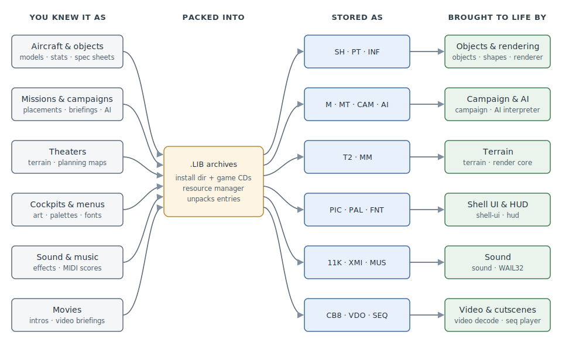

# Start Here

If you flew U.S. Navy Fighters, ATF, or Fighters Anthology in the 90s — and especially
if you ever swapped a skin, edited a mission, or poked at the Pro editors — you already
understand this game. What you're missing is the layer underneath: where each thing you
remember actually lives on disk, what its bytes mean, and which part of the engine
brings it to life. That's what this knowledge base documents, and this page is the map.

Everything here was recovered by reverse engineering and is **validated by working
code**: for every format, the [fx toolkit](../cli.md) can decode and re-encode the real
game files byte-identically — a round-trip is the proof that a spec is right, and the
[status matrix](formats/STATUS.md) tracks exactly how far that proof extends for every
format.

## The 30-second map

Almost every file the game owns is packed into a handful of `.LIB` archives (in the
install directory and on the CDs). The engine unpacks entries through its resource
manager and hands each format to the subsystem that consumes it. Modding, at its core,
has always been: unpack a LIB, change a file, put it back. The
[LIB spec](formats/LIB.md) makes the container itself editable; the rest of the specs
make the *contents* editable.

## What you already know, in file terms

| In the game | On disk | Start with |
|---|---|---|
| An aircraft's 3D model (and its damage states) | `.SH` shape | [SH](formats/SH.md) |
| Its flight model, thrust, hardpoints | `.PT` | [PT](formats/PT.md) |
| The reference-section spec sheet | `.INF` | [INF](formats/INF.md) |
| A mission — placements, waypoints, triggers | `.M` | [M](formats/M.md) |
| Briefing and debrief text | `.MT` | [MT](formats/MT.md) |
| A campaign | `.CAM` | [CAM](formats/CAM.md) |
| A theater — terrain and the planning map | `.T2` + `.MM` | [T2](formats/T2.md), [MM](formats/MM.md) |
| Skins, cockpit art, menu screens | `.PIC` + `.PAL` | [PIC](formats/PIC.md), [PAL](formats/PAL.md) |
| Sound effects | `.11K` / `.8K` / `.5K` | [11K](formats/11K.md) |
| Music | `.XMI` + `.MUS` | [XMI](formats/XMI.md), [MUS](formats/MUS.md) |
| Intro movies and video briefings | `.CB8` / `.VDO` | [CB8](formats/CB8.md), [VDO](formats/VDO.md) |
| The Pro editors' object definitions | the `BRF` text DSL family | [BRF](formats/BRF.md) |
| Enemy behavior | `.AI` scripts (+ compiled `.BI`) | [AI](formats/AI.md), [BI](formats/BI.md) |

The full catalog — all formats, grouped the same way — is the
[format reference](formats/README.md).

## How the game is put together

Three layers, each documented at its own depth:

1. **The archives.** `.LIB` containers hold the assets; the
   [architecture page](architecture.md) explains the runtime environment, the resource
   manager, and how the game finds and prefers files (which is why dropping a modified
   LIB into the install directory works).
2. **The executable.** The engine is documented as named subsystems — the
   [game loop](game-loop.md) dispatches [objects](objects.md), [physics](physics.md),
   the [AI interpreter](ai-interpreter.md), [weapons](weapons.md), the
   [renderer](renderer.md), the [HUD](hud.md), and the rest. Every function and every
   referenced global in the executable has been named; each subsystem page gives you
   the recovered symbols, struct layouts, and a flow diagram.
3. **The overlay binaries.** Audio ([WAIL32](wail32.md)), the serial/modem comms stack
   ([comms](comms.md)), and the other companion binaries the game ships get the same
   treatment.

## How to read a spec page

Format specs follow one template ([spec-authoring.md](../spec-authoring.md)), so once
you can read one, you can read all of them:

- **Front matter** states the spec's completeness and which codec/tests validate it —
  claims are checked in CI, so what a page says matches what the tools do.
- Facts carry a confidence vocabulary — **confirmed** (proven by round-trip or engine
  disassembly) vs **inferred** (consistent with observations, not yet proven).
- **File Layout** is the byte-level truth; **Engine Notes** connect the format to the
  subsystem that consumes it; **Open Questions** are tracked as issues, not left to rot.

## Pick your track

**The modder.** You want to change the game.
Read the [modding guide](modding.md) first — step-by-step recipes with `fx` commands.
Then go deeper per asset type: [LIB](formats/LIB.md) → [PIC](formats/PIC.md)/[PAL](formats/PAL.md)
for art, [PT](formats/PT.md) and the [BRF family](formats/BRF.md) for stats and loadouts,
[M](formats/M.md)/[MT](formats/MT.md) for missions. The [status matrix](formats/STATUS.md)
tells you which formats round-trip cleanly today.

**The tool writer.** You want to build your own extractor, converter, or editor.
Start with [LIB](formats/LIB.md) (everything else is inside it), then the format specs
you care about; the [CLI reference](../cli.md) and [C++ API](../api.md) show how the
validation toolkit is put together, and [spec-authoring.md](../spec-authoring.md)
defines the vocabulary the specs use. Fixture and fuzzing conventions are in
[development.md](../development.md).

**The engine archaeologist.** You want to know how it *works*.
[Architecture](architecture.md) → [game loop](game-loop.md) → [objects](objects.md),
then follow the subsystem pages wherever curiosity leads. The
[reconstruction matrix](reconstruction.md) shows the naming/documentation state of
every subsystem across all binaries; [symbols](symbols.md), [globals](globals.md), and
[structs](structs.md) are the recovered-fact registries behind them.

## Where the ground truth lives

Specs are prose, but the facts underneath are mechanical: recovered names and types
live in the [symbol database](https://github.com/jomkz/fighters-codex/blob/main/db/README.md),
codecs prove the formats, and CI regenerates and checks the matrices so the docs can't
drift from reality. When a page says *confirmed*, something executable stands behind it.
