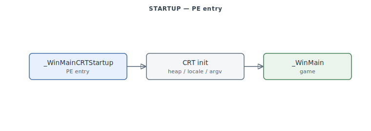

# Startup & C Runtime

The program's boot path and the statically-linked **MSVC C runtime** it pulls in. Notably,
The game executable is a **native Win32 PE** — there is *no* Phar Lap DOS extender (that name refers to
the `PL\0\0` overlay-DLL format handled elsewhere). The one genuine startup element in this
range is the PE entry `_WinMainCRTStartup` (`0x4D9D00`); the rest is CRT.

> **Provenance:** Ghidra static analysis of the game executable with [FA.SMS](formats/SMS.md) symbols applied; recorded in the [symbol database](https://github.com/jomkz/fighters-codex/blob/main/db/symbols/startup.csv) and applied to the Ghidra project. Progress: [reconstruction matrix](reconstruction.md). Markers follow [spec-authoring.md](../spec-authoring.md): confirmed · inferred · unknown.

## What's here

- **`_WinMainCRTStartup`** (`0x4D9D00`): the PE entry point — CRT init (heap, locale, argv,
  atexit) then the jump to the game's `_WinMain`.
- **CRT public functions**: ~180 FA.SMS-named MSVC runtime routines (memory, string, math,
  stdio, locale) plus 41 IAT import thunks to DDRAW / the serial-comms driver / matchmaking.
- **CRT internals**: ~116 compiler-runtime helpers (EH funclets, locale init/teardown,
  `__amsg_exit`, FID-identified library internals) — **waived** as "CRT runtime helper";
  they are boilerplate, named where FA.SMS provides a name and waived otherwise. Per the
  reconstruction DoD, startup carries the CRT with these waivers rather than pretending the
  runtime is game code.

## Functions

Full record: [`db/symbols/startup.csv`](https://github.com/jomkz/fighters-codex/blob/main/db/symbols/startup.csv).

| VA | Symbol | Role |
|----|--------|------|
| `0x4D9D00` | `_WinMainCRTStartup` | PE entry: CRT init → game `_WinMain` |
| `0x4D715A` | `_DirectDrawCreate@12` | DDRAW import thunk |
| `0x4D7220` | `_ser_rs232_getpacket@12` | serial-comms driver import thunk |

### Win32 application bootstrap

The Win32 shell around `_WinMain@16` (`0x476120`): window-class registration, the main
window procedure, the game thread, and the pre-launch screens. Like `_WinMain` itself,
these sit in the `0x476xxx` WinMain region — **outside** the CRT range
(`0x4D715A`–`0x4E8A2F`) — and are claimed by explicit VA rows.

| VA | Symbol | Role |
|----|--------|------|
| `0x436320` | `StartGameThread` (`?StartGameThread@@YAKPAK@Z`) | thread proc that runs the game (`DWORD` return, thread-param) |
| `0x476180` | `MainWndproc` (`?MainWndproc@@YGJPAXIIJ@Z`) | main window procedure (`WndProc`: hwnd, msg, wParam, lParam) |
| `0x4764B0` | `InitApplication` (`?InitApplication@@YAHPAX@Z`) | register the window class / application init |
| `0x476660` | `CreateGameThread` (`?CreateGameThread@@YAHXZ`) | create the game thread |
| `0x476700` | `EndGame` (`?EndGame@@YAXXZ`) | shut the game down |
| `0x4767F0` | `DisplayCopyright` (`?DisplayCopyright@@YAXPAX@Z`) | show the copyright / splash |
| `0x492740` | `doConfigurationScreen` (`?doConfigurationScreen@@YAXJP6AXPAUCN_INFO@@PAD@Z@Z`) | pre-launch configuration screen (callback over `CN_INFO`) |
| `0x44A120` | `ErrorExit` | fatal-error exit (with `ErrorExitNoMem`/`InstallErrorExit`) |
| `0x44A370` | `GameCleanup` | shut the game down on exit |
| `0x41EB60` | `LoadDLL` | load a plugin DLL (`IsDLL`/`FindSection`/`VAToPtrInFile` parse its PE) |

## Open Questions

### 1. Import-thunk attribution

The 41 IAT import thunks are carried under startup; a later pass could reassign them to the
subsystems that call them (DDRAW → renderer, serial → network, …) for purer attribution.

**Decision: keep them under startup.** Each thunk is a single shared IAT entry (one per
imported symbol, called from many subsystems), and the owning module is already legible from
the import DLL name, so per-caller reattribution would duplicate entries across files and churn
the DB for no analytic gain. The IAT/CRT-bootstrap grouping stays.

*Status: resolved — re-static (kept in startup by decision).*

## Related

- [game-loop.md](game-loop.md) — the `_WinMain` → `FlyingLoop` sequence startup hands off to.
- [architecture.md](architecture.md) — the runtime environment and overlay-DLL system.
- [network.md](network.md) — the serial-comms driver the thunks reach.
