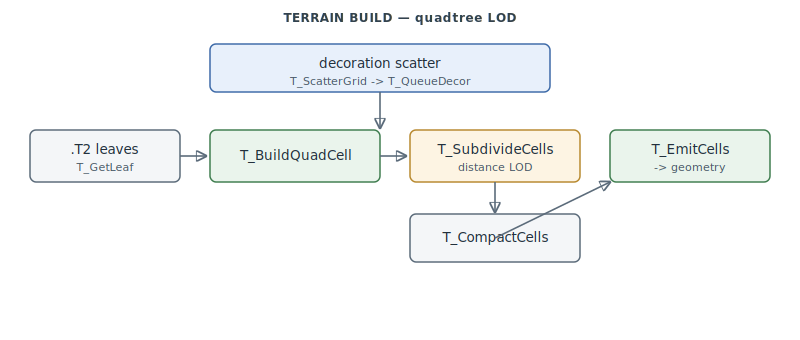

# Terrain (T_)

The terrain engine — how a `.T2` heightfield becomes drawable geometry each frame: a
view-adaptive **quadtree cell** tessellation with distance LOD, plus the decoration-scatter
system that places trees/objects across the ground. `0x4A7310–0x4ABBE2` (+ a small tail at
`0x4C5D30–0x4C60E8`).

> **Provenance:** Ghidra static analysis of the game executable with [FA.SMS](formats/SMS.md) symbols
> applied; recorded in the
> [symbol database](https://github.com/jomkz/fighters-codex/blob/main/db/symbols/terrain.csv)
> and applied to the Ghidra project. Progress: [reconstruction matrix](reconstruction.md).
> Markers follow [spec-authoring.md](../spec-authoring.md): confirmed · inferred · unknown.
> The nominal manifest range was a grab-bag; this is the true `T_*` cluster (the ~40 KB
> middle held ~15 other subsystems).

## Quadtree cells with distance LOD

Each frame the visible ground is built as a grid of **quad cells** in `_cellArray`:
`T_BuildQuadCell` samples the `.T2` leaf heights at a cell's four corners (`T_GetLeaf`),
computes a representative altitude (`T_QuadAltitude`) and a flat-vs-sloped flag
(`T_QuadSetFlags`). `T_ViewBounds` rotates the view box by heading to bound the working set;
`T_SubdivideCells` is the **LOD pass** — cells nearer the camera subdivide finer;
`T_CompactCells` drops off-screen cells; and `T_EmitCells` walks the survivors, looks up each
cell's texture (`T_CellTmapLookup`), computes normals where sloped (`T_Normal`), and emits
the geometry via `T_LeafOp` into the render pipeline.

## Decoration scatter

Ground decoration (trees, clutter, objects) is data-driven: `T_RunAmbientProcs` runs up to
17 decoration procs, `T_ScatterGrid` tiles a 2ⁿ×2ⁿ region calling `T_ScatterDecorTile` per
tile, which applies per-band distance LOD, gates on the leaf id, samples altitude, and
appends to the decoration queue (`T_QueueDecor`). `T_AddVisibleObjs` folds visible world
objects into the same pass.

## Functions

Full record: [`db/symbols/terrain.csv`](https://github.com/jomkz/fighters-codex/blob/main/db/symbols/terrain.csv).

| VA | Symbol | Role |
|----|--------|------|
| `0x4A9D00` | `T_BuildQuadCell` | build one quad cell (sample corners, altitude, flags) |
| `0x4A9E20` | `T_QuadAltitude` | representative altitude of a cell |
| `0x4AA070` | `T_SubdivideCells` | distance-LOD subdivision pass |
| `0x4AA2B0` | `T_CompactCells` | drop off-screen cells |
| `0x4AA4A0` | `T_EmitCells` | emit surviving cells' geometry (`T_LeafOp`) |
| `0x4A9ED0` | `T_ViewBounds` | rotate the view box by heading |
| `0x4A8090` | `T_ScatterGrid` | tile the decoration-scatter region |
| `0x4A8130` | `T_ScatterDecorTile` | place one decoration cluster per tile |
| `0x4A8C30` | `T_QueueDecor` | append a decoration entry to the queue |
| `0x4A9C20` | `T_AddVisibleObjs` | fold visible world objects into the pass |

## Open Questions

### 1. `.T2` sub-header bytes

**Resolved statically** (2026-07-05, [#262](https://github.com/jomkz/fighters-codex/issues/262)).
The "sub-header class constants" decode as the `.T2` header field map read by the
loader path, which *was* in the analyzed code all along: `T_Load` (`0x4C5D70`)
loads the theater file through `RMAccess` and relocates two file offsets into
pointers — the tile-summary array (`+0x85`) and the leaf array (`+0x91`) — and
`T_GetLeaf` (`0x4C6040`) indexes both arrays row-major using the grid fields
(`+0x79` leaf step, `+0x7D`/`+0x81` tile grid, `+0x89`/`+0x8D` leaf grid). The
payload is two flat arrays, not per-tile records; full field map and the
superseded readings in [T2.md](formats/T2.md).

*Status: resolved — see [T2.md](formats/T2.md) § Engine Notes.*

## Related

- [formats/T2.md](formats/T2.md) — the `.T2` terrain heightfield format.
- [render-core.md](render-core.md) — the 3D pipeline `T_EmitCells` feeds geometry into.
- [collision.md](collision.md) — the terrain grid (`T_GetLeaf`/`T_Normal`) collision uses.
- [renderer.md](renderer.md) — the rasterizer that draws the emitted cells.
