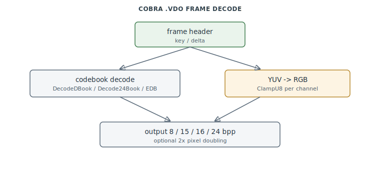

# FA.EXE Video Decode (Cobra / .VDO)

The **Cobra** full-motion-video codec — the in-engine decoder for the `.VDO` cutscenes.
A per-frame vector-quantization scheme: a 256-entry YUV 2×2 codebook rendered to 8/15/16/24
bpp with optional 2× pixel doubling, key + delta frames. `0x456300–0x45CDA0`.

> **Provenance:** Ghidra static analysis of FA.EXE with [FA.SMS](formats/SMS.md) symbols
> applied; recorded in the
> [symbol database](https://github.com/jomkz/fighters-codex/blob/main/db/symbols/video.csv)
> and applied to the Ghidra project. Progress: [reconstruction matrix](reconstruction.md).
> Markers follow [spec-authoring.md](../spec-authoring.md): confirmed · inferred · unknown.
> Coordinates with the [VDO format spec](formats/VDO.md) (epic #55).

## Vector-quantized YUV, four output depths

Each frame carries a **codebook** of 256 entries, each `4 luma + 2 chroma` decoded to four
RGB pixels (a 2×2 block). `DecodeDBook` builds the book at 15/16-bit (`5:5:5` or `5:6:5`
chosen per frame), `Decode24Book` at 24-bit; the YUV→RGB conversion uses the per-movie
scale/offset constants and saturates each channel through `ClampU8` (the one recovered leaf
in the range — the color clamp called from every book decoder). The 8-bit path
(`DecodeSVGA8Frame` / `DecodeDSVGA8Frame`) renders paletted output with an interpolated 2×2
dither built by `EDB` (expand-book), optionally 2× doubled.

Frames are **key (intra)** or **delta (inter)** — the dispatch keys on the frame header,
and the inter decoders are gated on the keyframe latch. `.VDO` audio is a separate `.11K`
track, not interleaved in this cluster.

## Functions

Full record: [`db/symbols/video.csv`](https://github.com/jomkz/fighters-codex/blob/main/db/symbols/video.csv).

| VA | Symbol | Role |
|----|--------|------|
| `0x457230` | `DecodeDBook` | decode the 15/16-bit YUV codebook |
| `0x456300` | `DecodeDSVGA8Frame` | key frame → 8bpp paletted, 2× doubled |
| `0x456EC0` | `DecodeSVGA8Frame` | key frame → 8bpp paletted |
| `0x456AD0` | `EDB` | expand-book: interpolated 2×2 dither pattern |
| `0x4575E0` | `ClampU8` | saturate a channel to `[0,255]` (YUV→RGB leaf) |

## Open Questions

### 1. VDO.md corrections

The trace found three [VDO.md](formats/VDO.md) inaccuracies to reconcile: the `DecodeFrame`
dispatch keys are on the **FrameHeader** (`+8` kind, `+9` submode), not the movie context;
the **frame-kind polarity is reversed** (0 = key/intra, 1 = inter/delta); and the `0xC14E`
canvas pointer belongs to `GlobalData`, not the movie context.

*Status: open — re-static (spec fix under #55).*

## Related

- [formats/VDO.md](formats/VDO.md) — the `.VDO` container/codec spec.
- [formats/CB8.md](formats/CB8.md) — the related 8-bit codebook image format.
- [renderer.md](renderer.md) — `DrawAcrossBank`, the VGA-bank span helper the 8bpp path uses.
