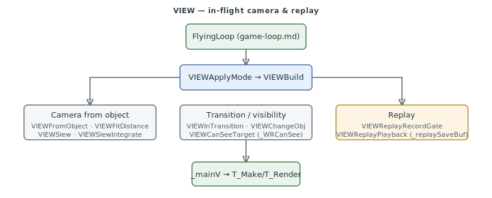

# VIEW — in-flight camera & replay

The **VIEW** subsystem (`0x40D7A0–0x40F6B0`) manages the in-flight camera — the external / spot
views, the slew (free-look) camera, view transitions, and the flight **replay** recorder — for
the main view struct `_mainV`. It was a gap in the original 19-subsystem map: `FlyingLoop` (see
[game-loop.md](game-loop.md)) calls into it every frame, but only four functions carried FA.SMS
names (`_VIEWSlew`, `_VIEWImmediateVisibility`, `_VIEWInTransition`, `_VIEWChangeObj`) and the
15 helpers between them were unnamed. This page names them — the discovery filed as
[#257](https://github.com/jomkz/fighters-codex/issues/257), the same class of gap as the `.SEQ`
player (#240) and the SPX path (#241).

> **Provenance:** Ghidra static analysis of the game executable with [FA.SMS](formats/SMS.md) seed symbols; the
> `VIEW*` helper names are recovered by this program from their behaviour. Confidence markers
> follow [spec-authoring.md](../spec-authoring.md): confirmed · inferred.

## How it works

Each frame `FlyingLoop` calls `VIEWApplyMode` (`0x40D7F0`): when the view-mode word (`_mainV[0x5A]`)
is set it delegates to the view builder **`VIEWBuild`** (`0x40EBC0`), which positions the
external / spot camera. The camera is derived from the tracked object — `VIEWFromObject`
(`0x40D810`) reads `_objPtrs[_mainV[0x0E]]`, `VIEWFitDistance` (`0x40E2C0`) sets the stand-off
from the object radius, and the slew path (`VIEWSlew` + `VIEWSlewIntegrate`, frame-rate-scaled by
`_systemFrameTicks`) applies free-look. `VIEWCanSeeTarget` (`0x40F5D0`) is the padlock visibility
test (`_WRCanSee`), gated on a `_gamePrefs` bit.

The **replay recorder** is an in-memory record/playback pair over a single saved-view buffer —
it does **not** serialize to disk ([#284](https://github.com/jomkz/fighters-codex/issues/284)).
`VIEWReplayRecordGate` (`0x40E960`) captures the live view into the 0x30-dword `_replaySaveBuf`
and interpolates the camera toward saved reference values (windowed `_GRSinCos`/`_InterpAngle`
blends) while `_timerTicks` is inside the capture window (`_replayWindowStart`/`End`), setting
`_replayActive`; `VIEWReplayPlayback` (`0x40EBA0`) copies `_replaySaveBuf` back into `_mainV`
on playback. The buffer (`0x522400`) is exactly one 0x30-dword (192-byte) view-state block —
it abuts `_replayActive` at `0x5224C0` — written and read only by this pair, both called only
from `FlyingLoop`; there is no growing/ring buffer, no file I/O on the path, and the executable
contains no replay/demo file strings. So the "replay" is a momentary in-RAM camera snapshot and
blend-back, not a mission recording, and there is no on-disk replay format to specify.

## Functions

| VA | Function | Role |
|----|----------|------|
| `0x0040D7A0` | `VIEWSlew` | slew (free-look) camera control |
| `0x0040D7F0` | `VIEWApplyMode` | dispatch to `VIEWBuild` when the view mode is set |
| `0x0040D810` | `VIEWFromObject` | position the camera from the tracked object |
| `0x0040E2C0` | `VIEWFitDistance` | camera stand-off from object radius |
| `0x0040E380` | `VIEWImmediateVisibility` | force immediate (no-transition) visibility |
| `0x0040E3A0` | `VIEWInit` | allocate / initialise a view slot |
| `0x0040E450` | `VIEWFree` | free the view's buffer |
| `0x0040E930` | `VIEWInTransition` | non-zero while the view is mid-transition |
| `0x0040E960` | `VIEWReplayRecordGate` | set `_replayActive` inside the capture window |
| `0x0040EBA0` | `VIEWReplayPlayback` | copy `_replaySaveBuf` back into the view |
| `0x0040EBC0` | `VIEWBuild` | build the external / spot view |
| `0x0040F2D0` | `VIEWSlewIntegrate` | frame-rate-scaled slew integration |
| `0x0040F590` | `VIEWChangeObj` | switch the view to a different tracked object |
| `0x0040F5D0` | `VIEWCanSeeTarget` | padlock visibility test (`_WRCanSee`) |

## Open Questions

### 1. View-mode enumeration

`_mainV[0x5A]` selects the view mode that `VIEWApplyMode` dispatches on, and `VIEWModeLookup`
(`0x40F230`) scans the `_viewModeTable` (`0x4EC420`); the exact mode enumeration (cockpit / spot /
padlock / fly-by / external) is not fully pinned. A short trace of the callers that write
`_mainV[0x5A]` would settle it.

*Status: open question — the view-mode enumeration is not fully pinned. The re-static pass that
raised it ([#262](https://github.com/jomkz/fighters-codex/issues/262)) is closed; this residual is
not currently tracked by an open issue.*

## Related

- [game-loop.md](game-loop.md) — `FlyingLoop`, which drives VIEW each frame.
- [renderer.md](renderer.md) / [render-core.md](render-core.md) — `T_Make` / `T_Render`, which draw `_mainV`.
- [objects.md](objects.md) — the tracked-object system the camera follows.
