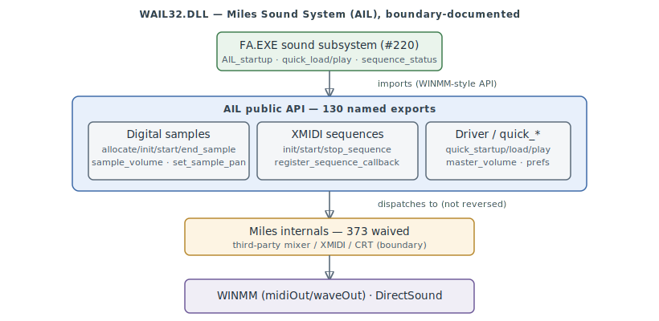

# WAIL32.DLL — Miles Sound System (AIL) audio driver

`WAIL32.DLL` (135 KB) is the audio library FA.EXE's [sound subsystem](sound.md) (#220) drives.
It is **not FA-authored code**: it is the **Miles Sound System** (the *Audio Interface Library*,
`AIL`) by Miles Design / RAD Game Tools — `WAIL32` = "Windows AIL, 32-bit". Its 130 public
exports are the documented Miles `AIL_*` API; the ~373 internal functions are Miles' own mixer,
XMIDI player, and statically-linked C runtime.

> **Provenance:** Ghidra static analysis of `WAIL32.DLL` (imported into the `fa-re` project,
> auto-analysed; public names from the PE export table). Third-party middleware, documented at
> the **boundary** per the license rule — the `AIL_*` API surface is named; Miles internals are
> waived, not reverse-engineered ([#247](https://github.com/jomkz/fighters-codex/issues/247) /
> [#253](https://github.com/jomkz/fighters-codex/issues/253)). Confidence markers follow
> [spec-authoring.md](../spec-authoring.md).

---

## Boundary treatment

Miles Sound System is licensed third-party middleware — the same category as the Microsoft
redistributables (DDraw / dsound / msapi) documented at the boundary rather than reversed. Its
internal mixer/sequencer implementation is not FA's IP and its public API is already documented
by Miles, so this page names the **exported `AIL_*` API** (the surface FA.EXE links against) and
**waives the internals**. Every one of the 503 functions is accounted for: 130 named exports,
373 waived (Miles internals + statically-linked CRT), and the 577 referenced data globals are
waived as Miles-internal state.

## The AIL API surface

The API splits into three groups, all reached from FA.EXE's sound path:

- **Digital samples** — PCM/`.11K` playback: `AIL_allocate_sample_handle` → `AIL_init_sample` →
  `AIL_start_sample`; `AIL_set_sample_volume` / `AIL_set_sample_pan`; `AIL_end_sample`.
- **XMIDI sequences** — music: `AIL_allocate_sequence_handle` → `AIL_init_sequence` →
  `AIL_start_sequence` / `AIL_stop_sequence`; `AIL_set_sequence_volume`,
  `AIL_register_sequence_callback`; masters `AIL_set_digital_master_volume` /
  `AIL_set_XMIDI_master_volume`.
- **Driver + quick API** — `AIL_startup` / `AIL_shutdown`, and the one-call
  `AIL_quick_startup` / `AIL_quick_load` / `AIL_quick_play` / `AIL_quick_load_and_play`.

## Functions

Representative exports (VAs from the [symbol DB](https://github.com/jomkz/fighters-codex/blob/main/db/symbols/wail32.csv);
all 130 are named there):

| VA | Export | Role |
|----|--------|------|
| `0x200019C0` | `AIL_startup` | initialise the AIL system |
| `0x20001CF0` | `AIL_shutdown` | tear down the AIL system |
| `0x20002D60` | `AIL_allocate_sample_handle` | reserve a digital-sample voice |
| `0x20003060` | `AIL_init_sample` | bind a sample voice to a format |
| `0x200033A0` | `AIL_start_sample` | begin playback |
| `0x200035B0` | `AIL_end_sample` | stop a sample voice |
| `0x20003710` | `AIL_set_sample_volume` | per-voice volume |
| `0x200037C0` | `AIL_set_sample_pan` | per-voice pan |
| `0x20004020` | `AIL_digital_master_volume` | read the digital master volume |
| `0x20005360` | `AIL_allocate_sequence_handle` | reserve an XMIDI sequence |
| `0x20005500` | `AIL_init_sequence` | load an XMIDI sequence |
| `0x20005630` | `AIL_start_sequence` | begin music playback |
| `0x200056C0` | `AIL_stop_sequence` | halt music |
| `0x20005910` | `AIL_set_sequence_volume` | music volume |
| `0x200067A0` | `AIL_register_sequence_callback` | per-sequence event callback |
| `0x20005E90` | `AIL_set_XMIDI_master_volume` | XMIDI master volume |
| `0x20008570` | `AIL_quick_startup` | one-call init |
| `0x200086B0` | `AIL_quick_shutdown` | one-call teardown |
| `0x20008730` | `AIL_quick_load` | one-call sample load |
| `0x200088D0` | `AIL_quick_play` | one-call sample play |
| `0x20008B90` | `AIL_quick_load_and_play` | one-call load + play |

## FA.EXE ↔ AIL boundary

FA.EXE's sound subsystem (#220) links `WAIL32.DLL` and calls into this API — confirmed call
sites include `AIL_startup` / `AIL_shutdown`, `AIL_set_preference`, `AIL_lock` / `AIL_unlock`,
`AIL_start_timer` / `AIL_stop_timer`, `AIL_end_sample`, `AIL_sequence_status`, and
`AIL_release_sequence_handle`. The pause/resume path (`PollMod`, see [sound.md](sound.md))
suspends and resumes the active XMIDI sequence through `AIL_stop_sequence` /
`AIL_resume_sequence`. On the far side, AIL drives **WINMM** (`midiOut*` / `waveOut*`) and
**DirectSound**.

## Open Questions

### 1. Internal mixer / XMIDI implementation

The 373 waived internals are Miles' private mixer, XMIDI interpreter, and CRT — deliberately
not reversed (third-party IP; the public API above is the documented boundary). No FA
understanding depends on them.

*Status: resolved — boundary-documented (third-party; internals out of scope by license).*

## Related

- [sound.md](sound.md) — FA.EXE's sound subsystem, the client of this API.
- [reconstruction.md](reconstruction.md) — the program this binary belongs to.
- [formats/11K.md](formats/11K.md) / [formats/XMI.md](formats/XMI.md) — the sample and music formats AIL plays.
