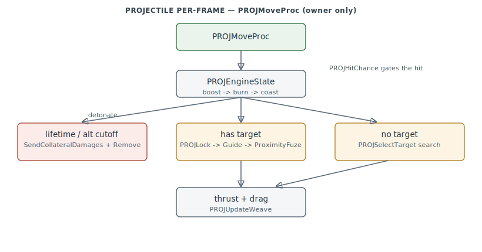

# Weapons — Projectiles, Seekers & ECM

The `PROJ_*` subsystem: everything a fired weapon does after it leaves the rail — guidance,
seeker lock, hit probability, detonation, and the countermeasure (ECM) interactions that
defeat it. `0x4C0690–0x4C5D30`.

> **Provenance:** Ghidra static analysis of the game executable with [FA.SMS](formats/SMS.md) symbols
> applied; every symbol is recorded in the
> [symbol database](https://github.com/jomkz/fighters-codex/blob/main/db/symbols/weapons.csv)
> and applied to the Ghidra project. Progress: [reconstruction matrix](reconstruction.md).
> Markers follow [spec-authoring.md](../spec-authoring.md): confirmed · inferred · unknown.

## A projectile is an entity with a seeker overlay

`PROJFire` (`0x4C2170`) launches: it resolves the hardpoint store, computes boresight
angles (`PROJAimAngles`), acquires a lock (`PROJLock`), and spawns one or more projectile
entities (`PROJAdd`, class 6) — cluster/ripple weapons loop. A projectile is a normal
entity whose tail carries the seeker/guidance state (target ids, launch/guidance timers,
weave and drag scratch); the weapon **type record** (`_cgt`) supplies the capability flags
(guided / ballistic / loft / powered / radar-IR-ARH seeker class / cluster / special
warhead) plus motor timing and the Pk-curve breakpoints.

## Per-frame guidance and detonation

`PROJMoveProc` (`0x4C11B0`, owner-computer only) runs each frame:

Engine state (`PROJEngineState`) advances boost→burn→coast; lifetime or altitude cutoff
detonates via `PROJSendCollateralDamages` + `RemoveCurObj`. With a target it re-validates
the lock and guides (`PROJGuideToTarget` / `PROJGuideLoft`), and `PROJProximityFuze` fires
at closest approach; without one it searches (`PROJSelectTarget` → `PROJScoreTarget`).
`PROJHitChance` is the probability-of-hit model — signal × range envelope (`PROJRangePk`) ×
ECM × flare/chaff × aspect/closure.

## ECM / countermeasures

Four defeat mechanisms: **jammers** (`PROJHitChance` calls `HARDFindECMForObj`, reducing Pk
in the seeker's band), **flares/chaff** (`PROJLaunchDevice` dispenses; `PROJRetargetMissilesOnDevice`
rolls seduction on each locked missile and steers seduced ones to the decoy via
`PROJGuideToDevice`), **notch/beaming** (`PROJInNotch` defeats pulse-doppler), and **sun
decoy** (`PROJSunInSeeker` / `PROJGuideToSun` for IR seekers).

## Functions

Full record: [`db/symbols/weapons.csv`](https://github.com/jomkz/fighters-codex/blob/main/db/symbols/weapons.csv).

| VA | Symbol | Role |
|----|--------|------|
| `0x4C2170` | `PROJFire` | master launch: aim → lock → spawn projectile(s) → fire sound |
| `0x4C0A90` | `PROJAdd` | spawn a projectile entity (class 6) |
| `0x4C11B0` | `PROJMoveProc` | per-frame guidance / detonation proc |
| `0x4C2F20` | `PROJLock` | seeker lock acquisition |
| `0x4C1630` | `PROJGuideToTarget` | proportional guidance to the lock target |
| `0x4C1660` | `PROJGuideLoft` | loft / high-trajectory guidance |
| `0x4C3250` | `PROJProximityFuze` | closest-approach detonation decision |
| `0x4C3380` | `PROJHitChance` | probability-of-hit model |
| `0x4C3890` | `PROJRangePk` | range→Pk envelope lookup |
| `0x4C39A0` | `PROJLaunchDevice` | dispense chaff / flare |
| `0x4C3AF0` | `PROJRetargetMissilesOnDevice` | countermeasure seduction roll + retarget |
| `0x4C2E40` | `PROJInNotch` | Doppler-notch / beaming detection |
| `0x4C17F0` | `PROJSunInSeeker` | IR sun-decoy check |
| `0x4C4100` | `PROJSelectTarget` | autonomous seeker target search |
| `0x4C1870` | `PROJDamageProc` | apply impact damage + kill scoring |
| `0x4C1F50` | `PROJProc` | class-proc selector (move/event/damage) |

## Open Questions

### 1. Lock-tone / RWR bookkeeping globals — resolved

They are a **multi-slot lock-timing table**, keyed on the mission clock `_currentT`. Two kinds
of field, all zeroed by `PROJInit` and read in the PROJ lock-state aggregation:

- **Expiry timestamps** tested `<= _currentT` — the track-lock group around `_trackLockEndT`
  (`0x58F100`): `0x58F102`/`104`/`106`/`108`; and the search-lock group around `_searchLockEndT`
  (`0x58F1C0`): `0x58F1C2`/`1C4`/`1C8`. Each marks when that lock slot's window elapses.
- **Active counters/flags** tested `< 1` — `0x58F1DC`/`1DE`/`1E0`, the "lock still up" gates.

A single compound predicate (near `0x4C…`) ANDs all of these together with
`_projLocksOnPlayer` to decide "no lock currently on the player" — i.e. this table is the state
behind RWR silence vs. the search/track **lock-tone**. So they are confirmed lock-timing slots,
not opaque: expiry stamps + active flags for the per-slot track/search locks.

*Status: resolved — re-static (lock-timing slots: `<=_currentT` expiry stamps + `<1` active flags).*

## Related

- [physics.md](physics.md) — the `HARD_*` stores management that arms the hardpoints and
  supplies seekers/ECM lookups.
- [objects.md](objects.md) — projectiles are entities; the mirror carries their state.
- [hud.md](hud.md) — the target box, gun reticle, and CCIP pipper that display lock state.
- [formats/JT.md](formats/JT.md) — the projectile type record.
