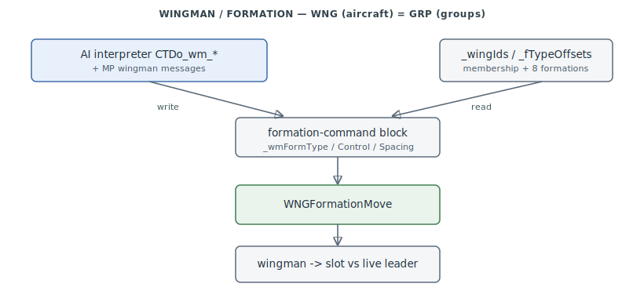

# Wingman / Group AI (WNG / GRP)

Formation and flight/group management: `WNG_*` manages **aircraft wings** (a leader plus up
to 9 wingmen), `GRP_*` the byte-identical twin for **ground/naval groups**. This is the
executor the AI interpreter's `wm_*` commands drive. `0x45E460–0x45FEC0`.

> **Provenance:** Ghidra static analysis of the game executable with [FA.SMS](formats/SMS.md) symbols
> applied; recorded in the
> [symbol database](https://github.com/jomkz/fighters-codex/blob/main/db/symbols/wingman.csv)
> and applied to the Ghidra project. FA.SMS exported the full `GRP` API but only part of
> `WNG`; every unnamed WNG function is the exact GRP twin (with `GRP`→`WNG`), which is how
> all 15 recovered names are pinned. Progress:
> [reconstruction matrix](reconstruction.md). Markers follow
> [spec-authoring.md](../spec-authoring.md): confirmed · inferred · unknown.

## Data model

A wing is `_wingIds[wing*10 + slot]` (ushort ids; slot 0 = leader, 1–9 = wingmen) with
`_wingSizes[wing]` the count — up to 10 wings, 10 groups. `GRP` is the same on
`_groupIds`/`_groupSizes`. There are 8 formation types (`_fTypeOffsets`, 8×10 slot offsets;
`_wmFormType` selects). The formation-command block (`_wmFormControl`/`_wmFormType`/
`_wmFormSpacingH`/`_wmFormSpacingV`, plus the shared target) is the control surface both the
AI interpreter and multiplayer messages write.

## Commands: AI interpreter → WNG/GRP

The [Chuck Talk AI interpreter](ai-interpreter.md)'s `wm_` opcodes map 1:1 onto the
formation surface: `CTDo_wm_hspacing`/`vspacing`/`formation`/`control` set it, and
`CTEval_wm_*_is` read it back. Execution reaches WNG/GRP two ways — direct calls on the
current object (`_GVEventProc` → `GRPSetType`/`SetControl`/…), or via `_MSGSend` wingman
messages (`0x8001`/`0x8002`) whose subcode dispatch in `_PLANEEventProc` calls the WNG
setters (7=SpacingH, 8=SpacingV, 9=Type, 10=Control, 0x0B=attack, 0x0C/0x0D=engage,
0x11=cover-me). `WNGSendWM(' ', target)` fans an attack order out to all qualifying wingmen.

## Formation-keeping

`WNGFormationMove` indexes `slot + formType*10` into `_fTypeOffsets` for a `(dx,dy,dz)` unit
vector; the target point = `(dx·spacingH + jitterX, dy·spacingV + jitterY, dz·spacingH +
jitterZ)` relative to the **live** leader (`WNGLeader` returns the first living member, so
formation survives leader loss), then `CreateMove` issues the move order. Jitter is
re-rolled on an interval for natural drift.

## Functions

Full record: [`db/symbols/wingman.csv`](https://github.com/jomkz/fighters-codex/blob/main/db/symbols/wingman.csv).

| VA | Symbol | Role |
|----|--------|------|
| `0x45E460` | `WNGInit` | zero all wing arrays and formation scalars |
| `0x45E490` | `WNGAdd` | add the current object to a wing slot |
| `0x45E710` | `WNGPart` | find id → (wing, slot); leader/wingman test |
| `0x45E630` | `WNGLeader` | first live member of a wing |
| `0x45E6E0` | `WNGWingmen` | the wingmen list (slots 1..n) |
| `0x45E970` | `WNGFormationMove` | position a wingman in formation vs the leader |
| `0x45ED90` | `WNGSendWM` | dispatch a wingman-message opcode (fan out orders) |
| `0x45EB30` | `WNGSetType` | set the formation type |
| `0x45EAC0` | `WNGSetControl` | set the formation control level |
| `0x45EBF0` | `WNGSetStateTarget` | enter a state + set the shared target |
| `0x45F190` | `GRPInit` | ground/naval-group twin of `WNGInit` |
| `0x45F1C0` | `GRPAdd` | group twin of `WNGAdd` |
| `0x45F440` | `GRPPart` | group twin of `WNGPart` |
| `0x45FC50` | `GRPAttackingObj` | count group members attacking a target |

## Open Questions

### 1. `_wmFormControl` semantics

Set to `1` on Add and clamped in `SetControl` with a two-sided comparison; `WNGSendWM`
early-outs when it is `> 1`. Whether it is a boolean "hold formation", a member count, or a
tightness level needs the CT `wm_control` argument range — a bench (`re-gameplay`) check.

*Status: open — re-gameplay ([#56](https://github.com/jomkz/fighters-codex/issues/56)).*

## Related

- [ai-interpreter.md](ai-interpreter.md) — the Chuck Talk `wm_*` opcodes that drive this.
- [objects.md](objects.md) — the entity/message system carrying wingman commands.
- [physics.md](physics.md) — `CreateMove` / the flight model that executes formation moves.
